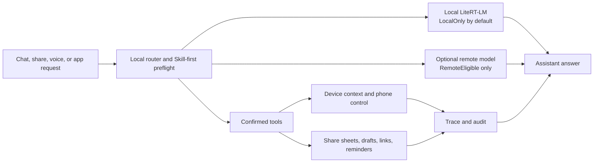
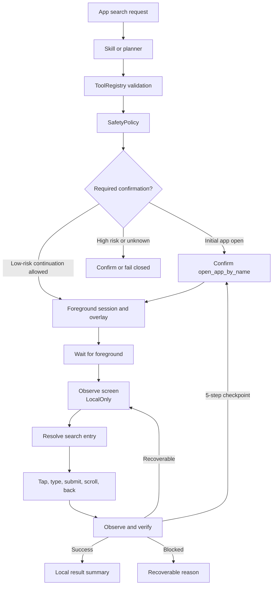

# PocketMind Android

PocketMind Android is a privacy-first phone-side AI assistant: it can run local
LiteRT-LM models on device, optionally use a user-configured remote multimodal
model, and control common phone flows through confirmed, audited tools.

The reason to install PocketMind is not "another chatbot". It is a phone-side
assistant for private, everyday context: basic questions can work locally after
a model is downloaded or imported, verified local vision models can handle
user-provided images on device, remote image/chat support is opt-in, and
contacts, calendar, screen, media, reminders, sharing, app opening, and
low-risk in-app search stay behind local permission, confirmation, and audit
boundaries.

The project is built with Kotlin, Jetpack Compose, Android Gradle Plugin, and
Google AI Edge LiteRT-LM.



## Product Contract

- **Local by default:** basic questions can run from a downloaded or imported
  local model, verified local vision models can process user-provided images on
  device, and chat history, memory, and local tool results stay on device unless
  the user chooses a remote path.
- **Remote is optional:** remote chat and image understanding require an
  explicitly configured OpenAI-compatible endpoint; every remote send shows
  what can leave the phone before it is sent.
- **Actions are confirmed:** contacts, calendar, screen, media, reminders,
  sharing, settings, and phone-control actions stay behind permission,
  disclosure, and confirmation gates. The "reduce phone-control confirmations"
  setting can continue low-risk navigation, search, tap, scroll, and back steps;
  sending, deleting, paying, ordering, publishing, sensitive input, and
  permission changes still require confirmation.
- **Capabilities are registry-owned:** broad Agent abilities such as public
  evidence search, device context, Accessibility screen observation, GUI
  gestures, Android runtime permissions, and special-access gates are declared
  as `ToolSpec` contracts. Software- or workflow-specific behavior is layered
  through tool providers and Skill manifests rather than hard-coded in the
  Agent loop.
- **Users stay in control:** privacy guidance is available in-app, remote keys
  can be cleared, conversations and memories can be deleted, and release gates
  track Play Data safety / privacy-policy consistency.

## Phone Control Scope

Current phone control is aimed at low-risk app navigation and search, not
arbitrary autonomous app use.

- Supported primitives: observe current screen, tap, type, submit search,
  scroll, press back, wait, open apps, open camera, and open selected settings.
- Supported app-search flow: open app -> observe -> find search entry -> type
  query -> submit -> verify result.
- App profiles improve search for Taobao, Pinduoduo, Amap/Gaode, JD, Google
  Maps, Chrome/Android Browser, Quark, UC, and Google App. Unknown apps use a
  generic resolver.
- While controlling the phone, PocketMind runs a short foreground control
  session and shows a translucent progress overlay at the top of the screen.
- Screen nodes, bounds, OCR text, and Accessibility text are `LocalOnly` by
  default and are not sent to a remote model automatically.



## Implementation Highlights

- On-device streaming chat with LiteRT-LM models.
- The local LiteRT runtime configures the current `.litertlm` chat assets at
  an app-level total window of `8k` input+output tokens for responsive
  on-device conversation restore, keeps a `6k` input budget, reserves `2k`
  output tokens, and displays the input/output/token boundary in the model UI.
- First-screen model path guidance for optional remote setup, local download,
  or trusted `.litertlm` import.
- Optional higher-quality chat model presets.
- Custom `.litertlm` download links and local file import.
- Model manager for switching downloaded or imported models.
- Configurable streaming remote chat backend for OpenAI-compatible `/v1/chat/completions` services.
- Local image input sends bounded user-provided image bytes directly to a
  verified local vision-capable LiteRT-LM chat model; the image bytes are not
  serialized into the prompt, history, audit, or receipt.
- Remote image sharing remains opt-in: image attachments are sent only to a
  configured vision-capable remote model after the remote-send preview is
  confirmed. If the local or remote profile disables image input, PocketMind
  records a LocalOnly notice and does not force OCR as a fallback.
- Lightweight local memory recall over previous conversation context.
- Local mobile action planning with deterministic rule fallback and
  confirmation-aware execution.
- Registry-driven tool architecture: `ToolRegistry` aggregates built-in and
  future provider `ToolSpec` values, exposes schema validation, result
  redaction, Android runtime permission descriptors, special-access tags,
  low-risk device-action tags, background-skill eligibility, and app-control
  continuation policy from the same contract the Agent loop executes.
- Action-model prompts are generated from the current Tool Registry JSON
  schemas and planning hints, so adding or removing a tool updates model
  planning without a second hard-coded function list.
- Accessibility-based app control tools:
  `observe_current_screen`, `ui_tap`, `ui_type_text`, `ui_submit_search`,
  `ui_scroll`, `ui_press_back`, and `ui_wait`. Each action observes again and
  returns a structured result.
- UI target resolution scores current-screen nodes for search entry, editable
  field, submit search, filter, result item, and scroll container targets; app
  profiles only adjust ranking and verification.
- App-search skills can continue from `open_app_by_name` into low-risk
  observe/action/verify steps. The loop checkpoints after a small step budget
  and keeps high-risk actions on the confirmation path.
- Schema-driven tool validation plus Agent run tracing for plan-confirm-observe execution, safety checks, read-only bounded retry, and persistent audit events.
- Public read-only search results are treated as Agent evidence: `web_search`
  does not open a browser, uses typed `general` / `weather_current` evidence
  requests, and returns public facts with source/freshness metadata to the model
  for comparison, summarization, or another public read-only lookup when needed.
  Queries that appear to contain personal data or secrets require confirmation
  before network access.
- Remote OpenAI-compatible `tool_calls` support both single calls and guarded
  public-evidence batches. In remote mode, direct built-in Skills still run as
  local preflight, while non-Skill requests can be planned by the model using
  safe planning tools; non-public execution still returns to local validation
  and confirmation. Multiple calls in one model turn are executed in parallel
  only when every tool is public, read-only, no-confirmation, non-private, and
  side-effect free; mixed batches fail closed before any tool is run. The
  remote-model system prompt and `web_search` tool description explicitly tell
  the model to split multi-evidence comparison questions into independent
  public read-only calls when appropriate; the app does not hard-code
  weather- or city-specific decomposition. Public-evidence follow-up turns keep
  the remote tool schema restricted to public read-only tools, and remote plain
  text cannot trigger the local inline `call:tool{...}` parser.
- Value-free Skill checkpoint persistence records only run/request/step ids,
  manifest identity, output keys, and private-output refs for pending Skill
  confirmations; raw continuation outputs and executable payload values stay
  out of Room and fail closed on mismatch. Restored Skill confirmations can use
  the checkpoint's completed-step frontier to satisfy later step dependencies
  without restoring any prior output values.
- JVM tool executor matrix tests cover registry validation, routing, permission
  failures, provider failures, structured error codes, and LocalOnly device
  context outputs.
- Release-only gates use machine-readable artifacts for capability matrix
  drift, release record completeness, store policy/data-safety disclosure,
  rollout monitoring/rollback readiness, release validation matrix evidence,
  privacy scanning, privacy notice review, APK/AAB scanning, model license
  review, and physical-device perf baselines; run
  `scripts/collect_perf_baseline.sh` from measured RC values, then run
  `scripts/verify_release_gate.sh` with `PERF_BASELINE_FILE=...` for release
  candidates. Perf baselines must come from non-emulator `arm64-v8a` hardware,
  bind to the release artifact SHA-256 and current Gradle `versionName`, and
  carry a fresh non-future UTC `recordedAt`. Public distribution should set
  `PUBLIC_RELEASE=1` plus
  `EXPECTED_SIGNING_CERT_SHA256=<production upload cert>`; that profile enables
  release record, store policy review, rollout monitoring/rollback readiness,
  release validation matrix, privacy review, structured model license review,
  AAB, signed-artifact, certificate fingerprint, and release mapping checks.
- Minimal device context snapshots plus confirmed clipboard, calendar, contact,
  current-app notification summary, foreground-app usage-stats estimates,
  recent-file metadata, and
  recent-screenshot OCR, recent-image OCR, one-shot current-screen screenshot
  OCR, and current-screen Accessibility text/screen-state snapshots for
  controlled local context access.
- Confirmed Android runtime permission requests for tools that need calendar,
  contact, media, or reminder notification posting access, including Android
  14+ selected visual media access when the user grants only chosen photos or
  videos.
- Runtime permission denial is observed as a structured tool failure without
  executing or automatically retrying the tool.
- Confirmed external navigation for safe HTTPS deep links, package-level app
  launches, camera launch, and allowlisted app details settings. Low-risk
  app-control sessions can continue after app launch; share sheets, drafts,
  high-risk, and unknown external actions still ask the user to record the
  external outcome.
- Versioned built-in skill manifests for email drafts, calendar drafts, map
  search, information lookup, device settings including Usage Access settings,
  local reminders, local periodic reminder checks, calendar
  availability, clipboard context, contact lookup, current foreground app
  context, current-app notification summaries, current-screen Accessibility
  text context, recent media metadata, HTTPS link navigation, app navigation,
  and system sharing, with manifest input schemas enforced before confirmation
  or execution.
- Skill-first routing for explicit clipboard context, current-app notification
  summary, current-screen Accessibility text, clipboard-summary-share, and
  current-screen-text-summary-share requests, plus explicit local periodic
  reminder check configuration, that do not need action-planner parameter
  extraction.
- Conservative clipboard-summary-share and current-screen-text-summary-share
  composite flows that keep summarization local and ask again before opening
  the Android share sheet.
- AlarmManager-backed local reminder scheduling with a dedicated notification channel.
- Running background task review for still-scheduled reminders and periodic checks, including explicit cancellation.
- Recent tool audit review from the background task entry, limited to redacted event metadata.
- Android share-target and in-app attachment picker entries for bounded shared text,
  bounded local `text/*` plus JSON/XML/YAML text-like application excerpts,
  RTF/PDF text-layer, PDF scanned-page OCR fallback, and Office Open XML
  excerpts, plus bounded local image bytes for verified local vision models;
  audio, video, legacy Office, and binary attachments remain metadata-only, plus
  confirmed outbound system sharing for text.
- GPU backend with CPU fallback when GPU initialization is unavailable.
- Local chat sessions with create, switch, and delete actions.
- Stop button while a response is being generated.
- JVM tool and skill contract tests for registry schemas, skill manifest input
  schemas, executor routing, permission/failure paths, audit redaction, and
  skill gates.
- Instrumented smoke tests for first launch and model manager entry points.

## First Screen And Trust Flow

PocketMind opens directly into the assistant surface. The first screen explains
the promise before asking for model setup: local basic chat is available after a
model download/import, remote multimodal use is optional, and remote sends or
high-risk device actions still require confirmation.

1. Choose the local path by downloading or importing a trusted `.litertlm`
   model, or choose the remote path by configuring a compatible endpoint.
2. Review the in-app privacy guidance from the top bar whenever model,
   attachment, voice, memory, or device-action behavior is unclear.
3. Chat once the selected backend reports ready.
4. Confirm remote sends after reviewing the destination, history, and attached
   images that can leave the phone.
5. Confirm or cancel any device action after reviewing its purpose, permission
   needs, and data destination.

Model selection itself does not immediately reload the runtime. This keeps the
model manager responsive while browsing models or switching CPU/GPU; use
**Load model** when you are ready to initialize the selected model.

Remote chat uses the same conversation and action routing surface as local
chat, but private local context is stricter: memory recall, device context,
clipboard, recent-screenshot OCR, recent-image OCR, current-screen screenshot
OCR continuations, Android share-intent text, generated shared-input text
excerpts, current-screen Accessibility text snapshots, and attachment metadata
are not automatically sent to the configured backend. HTTPS is
required except for local debug hosts such as `localhost`, `127.0.0.1`, and
Android emulator `10.0.2.2`.
The current remote prompt also passes a conservative outbound privacy gate:
personal identifiers, contact details, and token/API-key-like content are kept
LocalOnly with a prompt to switch local or remove sensitive content.
API keys are stored with Android Keystore-backed encryption and are removed
when the user clears the key field.
When the remote model requests tools, PocketMind still routes the request
through the local Agent runtime. Remote mode first lets explicit built-in
Skills handle local-owned commands such as clipboard, contacts, screen text,
OCR, settings, and direct search; prompts that are not recognized as direct
Skills can then be planned by the remote model with the safe model-planning
tool schema. A single low-risk public evidence tool such as `web_search` can
execute without confirmation for public queries, and a batch of such public
evidence tools can run concurrently. Queries that appear to contain personal
data or secrets are moved back to the confirmation path before network access.
External navigation, sharing, drafts, and local reminder-style tools may be
visible to the remote model as planning options, but are still validated
locally and require the same confirmation gates as local-model requests. Any
batch containing private local reads, runtime-permission tools, external
navigation, sharing, drafts, scheduling, or other side-effect tools is rejected
as a whole rather than executing a safe subset.

Memory recall is currently a lightweight on-device token/hash index over saved
sessions, with a conservative in-memory alias index for explicit
`Preference`/structured `TaskState` records. Alias terms help local hash recall
answer-style preferences and active background task state without changing Room
record text or memory context output. Long-term memory now supports reviewing
saved records, forgetting a single record, and clearing explicit memory records.
Its persisted scope is only explicit preference and task-state records stored
locally in Room; ordinary conversation recall is still rebuilt from saved
chat-session history. Forgotten auto-managed task-state records stay suppressed
so background task refreshes do not recreate them in long-term memory.
`记住：...` / `remember ...` is handled as a local memory-control command: it
updates local long-term preferences, records only `LocalOnly` control/status
messages if visible in the session, and is not sent to a remote model as
ordinary chat. Explicit response-length and response-language preferences replace
older conflicting preferences instead of accumulating contradictory records.
`忘记：...` / `forget ...` can delete the matching explicit preference through
the same local-only command path without invoking the chat/action router or a
remote model. For answer-style preferences, family targets such as "回答语言偏好"
or "answer length preference" remove the matching response-language or
response-length preference without deleting unrelated memories.
The semantic-memory boundary verifies the recommended self-contained
MemoryEmbedding `.tflite` model and production wires a local MediaPipe Text
Embedder runtime. Semantic recall is enabled only after runtime
probe returns a non-empty normalized vector with a stable dimension; otherwise
memory falls back to the lightweight local index. Only explicit long-term
`Preference`, `UserFact`, and `TaskState` records enter the semantic index.
Mobile actions can use the verified action model as a bounded planner; if it is
missing or does not produce a supported `call:function {...}` draft,
PocketMind falls back to deterministic local rules. The planner and replanner
consult the current `ToolRegistry` instead of a separate action-function list:
tool schemas shape model output, `ToolSpec.tags` decide low-risk phone-control
continuations, and `SkillManifest` metadata decides whether a Skill may
continue after an unverified app launch. Drafts, HTTPS links, share sheets,
high-risk actions, and unknown external actions stay on the confirmation or
external-outcome path. When the verified action model is used for observation
replanning, it can only propose one next supported tool draft after a
successful observed tool result; unsupported or malformed drafts fail closed,
and every proposed tool still requires explicit confirmation. After confirmation,
Android execution returns a structured tool result that is written back to the
Agent run trace and audit log. The chat surface only shows a safe result
summary; structured fields and allowlisted completion metadata are inspected
through the trace/audit surfaces, not a typed chat card.
Reminder requests such as “提醒我 15 分钟后喝水” become confirmed
`schedule_reminder` tool calls and are persisted before being handed to Android
AlarmManager. Pending reminders are restored after device reboot; reminders
that became due while the device was off are rescheduled with a short catch-up
delay. Alarm delivery re-checks the local task record and only posts
still-`Scheduled` reminders, using the stored title/body instead of trusting
alarm extras. The running background tasks view lists still-scheduled tasks;
canceling one cancels the pending AlarmManager or WorkManager work, marks the
local record as `Cancelled`, and removes it from the running list.
Requests such as “取消提醒 task-123” use the skill-first path and become
confirmed `cancel_reminder` tool calls only when the request explicitly
mentions a reminder and a `task-*` id. Requests without a task id, API or
implementation discussions, negated commands, and non-reminder cancellations
are not routed to the tool. The tool declares the background scheduling
boundary in its permission metadata so audit and safety policy treat reminder
cancellation as a local scheduling mutation, not as a parameter-free read.
Requests such as “开启周期检查，每 2 小时” or “关闭周期检查” become confirmed
`configure_periodic_check` tool calls. The tool only enables or disables the
local reminder patrol policy through WorkManager; it does not run background
chat, read screens, scan files, or execute arbitrary periodic tasks.
Requests such as “查看后台任务” or “周期检查状态” become confirmed
`query_background_tasks` tool calls. The tool only reads the local scheduled
task store and periodic-check policy; it does not schedule, cancel, or
reconfigure background work, and it omits reminder bodies from the local-only
result.
The same entry also exposes recent persisted tool audit events for review. The
audit list shows only event time, event type, tool name, status, risk,
permission names, and a parameter-free generated summary; it does not show tool
arguments, prompts, remote responses, raw clipboard text, Authorization
headers, or API keys. The local audit table is pruned to the most recent 500
events.
Clipboard requests such as “读取剪贴板” become confirmed `read_clipboard`
tool calls. After confirmation, clipboard text is used only for the immediate
local follow-up answer and is redacted from trace, audit, and persisted chat
tool-observation messages. Both successful and failed clipboard tool results
carry `privacy=LocalOnly` and `requiresLocalModel=true` metadata, so remote
model mode does not automatically receive clipboard content or clipboard read
observations.
Tools that declare private outputs use the same LocalOnly metadata for
failed, rejected, and cancelled results; declared private output fields are
removed from those non-success tool results, unknown data keys are dropped,
and only allowlisted permission-recovery metadata is kept before the result
can enter trace, audit, or follow-up model routing.
Explicit requests such as “识别最近 1 张截图文字” or “OCR 最近截图” use the
skill-first path and become confirmed `read_recent_screenshot_ocr` tool calls.
Requests to OCR multiple screenshots are rejected. After confirmation,
PocketMind reads only the most recent screenshot through Android media
permissions, extracts a bounded local OCR text excerpt, and does not persist
the image URI, path, raw pixels, or OCR text in trace/audit. The permission
boundary is `READ_MEDIA_IMAGES` on Android 13+, plus
`READ_MEDIA_VISUAL_USER_SELECTED` on Android 14+ when the system grants only
selected photos/videos, or legacy storage read permission on older Android
versions; this is not current-screen capture, visual understanding, arbitrary
media OCR, or multi-screenshot OCR. The OCR excerpt
may preserve recognized block and line order from ML Kit, but it does not add
coordinates, labels, captions, or image semantics. Remote model mode
stops before automatic continuation and asks the user to switch local or
manually provide content they are willing to upload.
Explicit requests such as “识别最近图片文字” use the skill-first path and become
confirmed `read_recent_image_ocr` tool calls. After confirmation, PocketMind
scans up to 3 recent images through Android media permissions, extracts the
first bounded local OCR text excerpt, and uses the same LocalOnly, trace/audit
redaction, and remote-mode protection as screenshot OCR. Plain “最近图片”
requests use a skill-first, metadata-only `query_recent_files(kind="images")`
path and do not read image pixels or OCR text. Android 13+ non-media recent
files (`documents`, `downloads`, `others`) are not directly queryable by this
tool; those files must come from the system picker or share input. Requests for
all/many/more than 3 images, implementation/API/permission discussion,
negated reads, or visual/semantic image understanding such as describing what
is in an image are rejected from image OCR routing.
Requests such as “最近通知” become confirmed `query_recent_notifications`
tool calls. The tool reads only PocketMind/current-app active notification
metadata, defaults to 5 entries, caps requests at 20, and returns LocalOnly
minimal summaries without notification body text, extras, unread state,
notification shade contents, other apps, or Notification Listener data. This
query does not request Android notification runtime permission; if app
notifications are disabled, it returns a structured permission-denied result.
Requests such as “查联系人 Alice” become confirmed `query_contacts` tool
calls. The tool requests `READ_CONTACTS` only after confirmation, searches by
the explicit query, defaults to 5 entries, caps requests at 20, and returns
LocalOnly minimal `name`/`phone` summaries. It does not return email, avatar,
address, notes, contact IDs, or full address-book exports; the contact query and
result JSON are redacted from trace and audit summaries.
Requests such as “新建联系人 Alice” use the skill-first path and become
confirmed `create_contact_draft` tool calls. The tool opens the system contacts
insert page and pre-fills only draft `name`/`email`/`phone` fields; it does not
read the address book, request `READ_CONTACTS`, save the contact, or submit the
system form for the user.
Requests such as “查忙闲 2026-06-01T09:00:00Z 到 2026-06-01T10:00:00Z”
become confirmed `query_calendar_availability` tool calls. The tool requires
`READ_CALENDAR` after confirmation, accepts only explicit timezone-qualified
ISO start/end windows, and returns LocalOnly busy/free blocks without event
titles, locations, attendees, notes, or calendar IDs.
Requests such as “读取当前屏幕文字” become confirmed skill-first
`read_current_screen_text` tool calls. After confirmation, the tool may read
only the current Accessibility text-node snapshot exposed by Android
accessibility services, mark the result `LocalOnly`, and use it only for
immediate local continuation. It is not screenshot capture, OCR, pixel
analysis, or semantic screen understanding; raw `screenText` must not enter
trace, audit, persisted tool-observation messages, or remote model requests.
Accessibility access is modeled as special access, not an Android runtime
permission. Ambiguous screen-understanding requests such as “总结当前屏幕内容”,
“summarize current screen content”, “summarize this page”, or “describe current
screen” do not trigger this tool unless the user explicitly asks for current
screen text / visible text / Accessibility text.
Explicit requests such as “OCR 当前屏幕截图文字” become confirmed
`capture_current_screenshot_ocr` tool calls. After the normal tool confirmation,
PocketMind asks Android for a foreground MediaProjection consent result, consumes
that request-bound token once in memory before a short TTL expires, captures one
current-screen frame, runs local ML Kit OCR, and returns only bounded OCR text
plus included/truncated flags. It does not persist pixels, URI/path data, file
names, window titles, coordinates, or visual descriptions, and it does not
perform semantic screen understanding.
Cancelling the MediaProjection consent is observed as a structured LocalOnly
tool failure.
Requests such as “总结当前屏幕文字并分享” use one constrained composite flow:
after the user confirms the current-screen Accessibility text read, PocketMind
summarizes locally, then opens a second confirmation for `share_text` with the
generated summary. The raw `screenText` cannot be bound directly to
`share_text`, and a restarted app fails closed at the payload-bearing share
confirmation instead of restoring or sending the summary.
Requests such as “总结剪贴板并分享” use one constrained composite flow: after
the user confirms the clipboard read, PocketMind summarizes locally, then opens
a second confirmation for `share_text` with the generated summary. The share
sheet is never opened without this second confirmation.
Requests such as “分享这段文字...” open Android's system share panel through
`share_text`; destination selection stays with the user.
Shared text or attachments from other Android apps, as well as files selected
through the in-app attachment picker, are staged as explicit composer drafts
before any model call. PocketMind records bounded user-visible shared text, may produce
bounded local text excerpts for `text/*` plus JSON/XML/YAML text-like
application documents, bounded local text-layer excerpts for user-provided RTF,
PDF text layers, and `.docx` / `.xlsx` / `.pptx` files, may pass bounded
user-provided `image/*` bytes to a verified local vision model, and may fall
back to bounded scanned-page OCR for user-provided PDFs with no readable text
layer.
When a provider returns no MIME type or only `application/octet-stream`,
PocketMind uses the display-name extension to recover common image, text, PDF,
RTF, and Office Open XML types before deciding whether a bounded local excerpt
is possible.
It keeps attachment metadata for local processing. Binary, audio, video, legacy
Office, and other unsupported attachments remain metadata-only. Automatically
generated shared-input excerpts and metadata are
marked `LocalOnly`. In local mode, user-provided `image/*` attachments are read
only when the active installed model is a verified recommended profile that
declares vision input; each image is bounded to 8 MB and sent to LiteRT-LM as an
image content part, not as base64 or metadata in the prompt. In remote mode,
user-provided `image/*` attachments are read only after the provider identifies
them as images, bounded to an 8 MB data URL, and sent directly to the remote
vision model request without local OCR. If the local or remote model/API rejects
image input, PocketMind reports that image input failed instead of falling back
to OCR. Remote mode still protects shared text, non-image attachments,
attachment text excerpts, and OCR excerpts at the reader boundary: it does not
read or automatically send those contents before showing a local privacy notice.
Local mode also requires the user to tap send before the staged shared-input
prompt enters chat generation. LocalOnly
conversation text is excluded from automatic memory recall and from verbatim
session-title derivation; explicit long-term facts/preferences still use their
own memory controls.
Voice input uses Android system speech recognition and inserts the transcript
into the compose box only; sending remains explicit, and PocketMind does not
read audio files for this path. The composer keeps a non-modal voice capture bar
visible while recording and while Android is transcribing, with waveform levels
driven by recognition RMS updates during recording.
Automatically generated shared-input and clipboard-derived messages are marked
local-only, filtered from remote history, and rejected as current prompts before
any remote model request is made.

Agent and skill module responsibilities are documented in
`docs/agent_core_modules.md`. The current code includes the Tool Registry,
single-run Agent planning, confirmation, tool observation, remote public
evidence tool-call batching, built-in one-step,
skill-first information lookup/recent-media-metadata/calendar-availability/
contact-lookup/current-app-notification-summary/foreground-app/
HTTPS-link-navigation/device-settings/map/email/calendar/text sharing/local
periodic reminder checks/background-task queries, and one conservative
clipboard-summary-share
composite flow,
conservative observe-after-success replanning for explicit next actions plus
bounded model-backed next-tool drafts behind validation and confirmation, a
gated skill-run executor, minimal device context
snapshots, safety policy, persistent tool audit, long-term memory controls,
local reminder scheduling, confirmed periodic reminder-check configuration,
running background task review/cancellation/read-only Agent queries,
run-level Agent cancellation and hard budgets before additional tool
confirmations/retries/model continuations,
confirmed clipboard/device-context reads, outbound text sharing, safe HTTPS
deep-link navigation, package-level app launches, Android share intent and
in-app picker text plus bounded `text/*` and JSON/XML/YAML document excerpt
ingestion, bounded RTF/PDF text-layer, PDF scanned-page OCR fallback, and
Office Open XML excerpts, local vision image input for verified chat models,
system speech-recognition input,
confirmed recent screenshot/image OCR, confirmed one-shot current-screen
screenshot OCR, and restart restoration for the latest pending tool confirmation
without auto-execution, value-free completed-step frontier recovery for restored
Skill confirmations, plus confirmed current-screen Accessibility text snapshot
reads, current-screen text summary sharing, and user-confirmed external Activity
outcome recording before completion-dependent next-tool planning.
Broad semantic screen understanding, arbitrary argument-bearing typed run recovery, complete
document parsing, current-screen semantic understanding, continuous screen
capture, PDF layout parsing, legacy Office parsing, full rich-text fidelity,
arbitrary-media OCR beyond user-provided PDF fallback and confirmed
recent/current-screen image reads, and media content understanding are tracked
there as pending core modules. Local image understanding is limited to
user-provided images sent to verified local vision chat models.

## Recommended Models

The app includes model-neutral capability presets. Chat/action upstream files
are hosted on Hugging Face as LiteRT-LM `.litertlm` assets; the memory model is
the original gated EmbeddingGemma LiteRT bundle and requires user Hugging Face
authorization before download:

- [基础对话模型 E2B](https://huggingface.co/litert-community/gemma-4-E2B-it-litert-lm)
- [本地记忆模型 EmbeddingGemma 300M](https://huggingface.co/litert-community/embeddinggemma-300m)
- [设备动作模型 270M](https://huggingface.co/litert-community/functiongemma-mobile-actions_q8_ekv1024.litertlm)
- [高质量对话模型 E4B](https://huggingface.co/litert-community/gemma-4-E4B-it-litert-lm)

The downloaded files are large, and the recommended local chat path currently
starts with the E2B model. The verified E2B and E4B chat profiles are declared
as local text+vision models and can receive bounded user-provided images on
device. Users who want to try the app before downloading a multi-GB local chat
model can configure an OpenAI-compatible remote model, or import a trusted
compatible `.litertlm` file. Custom and unverified imports remain text-only
until a catalog profile explicitly declares vision support. The smaller
memory/action assets are not chat-model substitutes.

| Capability | File | Size |
| --- | --- | --- |
| 基础对话 E2B | upstream `.litertlm` chat model | about 2.59 GB |
| 本地记忆模型 | upstream gated EmbeddingGemma `.tflite` + tokenizer | about 184 MB |
| 设备动作模型 | upstream `.litertlm` action model | about 284 MB |
| 高质量对话 E4B | upstream `.litertlm` chat model | about 3.66 GB |

The memory embedding model is active only when the `.tflite` file is present,
verified, and the runtime probe succeeds.
Deleting the memory model removes the model files and semantic vector cache but
does not delete long-term memory text.
Use Wi-Fi and keep enough free device storage for the model and runtime cache.
Model files are intentionally not committed to this repository and should not
be bundled into the APK.

Recommended downloads are pinned to immutable Hugging Face revisions and include
expected byte size plus SHA-256 metadata. See `docs/model_manifest.md`.

## Requirements

Local verification:

- Android SDK 36.
- JDK 17 or newer.

Device or emulator validation:

- Android Studio or command-line Android SDK with platform-tools/adb.
- An arm64-v8a Android device for model execution.
- USB debugging enabled for device installation and instrumentation tests.

Emulators are useful for UI checks, but they usually do not expose a usable
OpenCL GPU backend. Use a physical device for realistic LiteRT-LM validation.

## Quick Start

Clone the repository:

```bash
git clone https://github.com/William-zgx/pocketmind-android.git
cd pocketmind-android
```

If your Android SDK is not in the default location, set it before building:

```bash
export ANDROID_HOME=/path/to/android-sdk
export ANDROID_SDK_ROOT="$ANDROID_HOME"
```

Build a debug APK:

```bash
./gradlew :app:assembleDebug
```

Install it on a connected device:

```bash
adb install -r app/build/outputs/apk/debug/app-debug.apk
```

Or let Gradle install it:

```bash
./gradlew :app:installDebug
```

After launch, choose one start path from the first screen: configure an
OpenAI-compatible remote model for the fastest start, download the recommended
local E2B model for offline basic chat, or import a trusted `.litertlm` file.

## Testing

Run local verification:

```bash
scripts/doctor.sh
scripts/verify_local.sh
```

`scripts/doctor.sh` checks the local JVM/Android SDK/Gradle toolchain by
default and does not require `adb`. Device or emulator validation uses the
stricter device mode, which verifies the SDK `adb` binary but does not prove a
device is connected:

```bash
scripts/doctor.sh --device
```

Recommended model URL provenance is checked only when explicitly requested:

```bash
VERIFY_MODEL_URLS=1 scripts/verify_local.sh
```

Run instrumented tests on one connected Android device with the helper script:

```bash
adb devices
scripts/install_and_test_device.sh
```

Run focused phone-control checks on a connected device:

```bash
ANDROID_SERIAL=<device> scripts/run_device_control_debug_eval.sh
ANDROID_SERIAL=<device> scripts/run_real_app_search_eval.sh
```

`run_real_app_search_eval.sh` uses the debug eval receiver to drive installed
real apps. The latest recorded physical-device run passed Taobao, Pinduoduo,
and Amap/Gaode search; Chrome was skipped because it was not installed.

Run emulator-only validation without accidentally selecting a physical device:

```bash
ANDROID_SERIAL=emulator-5554 scripts/verify_emulator.sh
```

The emulator helper can also start an AVD before running the shared install and
instrumentation flow:

```bash
AVD_NAME=focus_agent_api36_arm64 scripts/verify_emulator.sh
```

When `AVD_NAME` is set and `EMULATOR_ARGS` is not provided, the helper starts
the AVD with deterministic headless defaults including `-wipe-data`,
`-no-window`, and `-no-snapshot-save`. Set `EMULATOR_ARGS` explicitly only when
you need a different launch profile.

For release-candidate style emulator regression, use the stricter artifact
gate. It forces `CLEAN_DEVICE=1`, runs the emulator helper, verifies both
machine-readable reports, and fails if the runner reports fewer AndroidTest
cases than the current `app/src/androidTest` source count:

```bash
AVD_NAME=focus_agent_api36_arm64 scripts/regression_emulator.sh
```

When more than one authorized device is connected, select the target explicitly:

```bash
ANDROID_SERIAL=emulator-5554 scripts/install_and_test_device.sh
```

Convenience scripts are also available:

```bash
scripts/verify_local.sh
scripts/install_and_test_device.sh
```

`scripts/install_and_test_device.sh` leaves the debug app installed after a
successful run and clears app data before the final manual launch by default, so
instrumentation state cannot leak into acceptance. Set
`RESET_APP_DATA_AFTER_TESTS=0` only when you intentionally want to inspect the
post-test app state. Use `CLEAN_DEVICE=1 scripts/install_and_test_device.sh`
when you also want to uninstall any old debug package before validation.
If there is no authorized device, or if multiple authorized devices are
connected without `ANDROID_SERIAL`, the script exits before Gradle build, APK
install, or instrumentation. Record the instrumentation runner's reported test
count together with the device serial/API/ABI in full regression reports; the
device report records this as `instrumentation_test_count`.
`install_and_test_device.sh` writes a machine-readable
`device-verification.properties` report, and `verify_emulator.sh` writes an
`emulator-verification.properties` report plus the nested device report under
`build/verification/` by default; release records should link those artifacts.
For complete emulator regression, the artifact of record is the
`regression-emulator.properties` file written by `scripts/regression_emulator.sh`;
record the regression as passed only when that file contains `status=passed`.
Scripted regression and manual acceptance must be recorded separately. Voice
recognition, the Android system document picker, and the foreground
MediaProjection consent sheet are system-mediated flows; a script, direct
reader/ViewModel call, or mocked intent cannot be used as a substitute for
manual acceptance of those entry points.

Avoid `./gradlew :app:connectedDebugAndroidTest` when you need to keep the app
installed on the device. The Android Gradle Plugin may clean up test packages
after instrumentation runs.

For an internal ad hoc release install that preserves app data, build release,
sign the generated unsigned APK outside source control, then install the signed
APK with `adb install -r`. The release Gradle build in this repository does not
commit signing credentials; local debug-keystore signing is only for internal
device checks and is not a distribution signing process. When production
keystore material is available in a private environment,
`scripts/sign_release_artifacts.sh` can sign the release APK/AAB and generate
certificate reports without storing secrets in the repository. The helper
rejects Android debug keystores by default; set `ALLOW_DEBUG_KEYSTORE=1` only
for explicit local signing smoke checks. Production signing requires
`EXPECTED_SIGNING_CERT_SHA256`; release artifact scanning also rejects Android
Debug certificates unless `--allow-debug-certificate` is passed for a smoke-only
scan.

After debug-only device evaluation, reinstall the signed release APK with
`adb install -r` to preserve downloaded model data while restoring the formal
package.

## Production Release Readiness

Use `docs/release_checklist.md` as the release-candidate gate before any Play
or broader production distribution. It covers production signing versus local
debug keystores, AAB and Play App Signing, versioning, privacy/Data safety
forms, sensitive permission disclosures, device and emulator test matrix,
crash/ANR monitoring, and rollback.

## Project Structure

```text
app/
  src/main/java/com/bytedance/zgx/pocketmind/
    MainActivity.kt          Activity wiring
    PocketMindViewModel.kt   Coordinates UI state and use cases
    ModelCatalog.kt          Model metadata and validation helpers
    action/                  Mobile action planning and execution boundary
    audit/                   Tool audit event models and Room-backed sink
    background/              Alarm-backed reminders and scheduled task store
    data/                    Model and session persistence
    device/                  Minimal non-secret device context snapshots
    download/                DownloadManager boundary
    memory/                  Local memory indexing and search
    multimodal/              Shared/picked text, local image payloads, and attachment metadata ingestion
    orchestration/           Chat, memory, and action route selection
    runtime/                 LiteRT-LM runtime boundary
    safety/                  Tool safety policy and confirmation decisions
    skill/                   Built-in skill manifests and skill-to-tool plans
    tool/                    Tool registry, schemas, results, and executor API
    ui/                      Compose chat, model, session, and message UI
  src/test/                 JVM unit tests
  src/androidTest/          Device smoke tests
docs/
  model_manifest.md        Pinned recommended model provenance, hashes, and license checklist
  agent_core_modules.md    Agent core module ownership and status
  phone_acceptance.md       Manual device acceptance checklist
  privacy_notice.md        Local/remote privacy boundary summary for release review
  release_checklist.md     Production readiness and release candidate checklist
  release_readiness.md      External distribution checklist
  validation_report.md      Recent validation notes
scripts/
  doctor.sh                 Local Android/JDK environment checker
  verify_local.sh           Local build/test helper
  verify_emulator.sh        Emulator-only install and smoke-test helper
  regression_emulator.sh    Emulator regression artifact gate
  install_and_test_device.sh Device install and smoke-test helper
  live_remote_emulator.sh   Optional live remote model emulator check
  test_validation_scripts.sh Shell preflight regression tests
```

## Development Notes

- Keep model binaries out of Git and out of the APK.
- Prefer a physical arm64-v8a device for runtime validation.
- Run unit tests after changing model rules, download logic, remote config, or formatting.
- Run connected tests after changing first-launch UI, model manager UI, or
  session navigation.
- Treat GPU fallback behavior as device-dependent; always keep the CPU path
  working.
- Chat sessions, model registry, and download records use Room. Non-secret
  settings use DataStore; API keys use Android Keystore-backed encrypted prefs.

## Contributing

Issues and pull requests are welcome. A good contribution should include:

- A short explanation of the user-facing problem.
- Focused code changes with unrelated refactors kept separate.
- Tests or a manual validation note for UI and device behavior.
- Screenshots or logs when reporting device-specific runtime issues.

Before opening a pull request, run:

```bash
scripts/verify_local.sh
```

The local verification gate runs unit tests, lint, debug/androidTest APK
assembly, release assembly, APK content checks, and a 75 MB release APK budget.

If the change affects real-device flows, also run:

```bash
scripts/install_and_test_device.sh
```

## License

PocketMind Android app code is distributed under the MIT License. See
`LICENSE`. Recommended model downloads are third-party artifacts governed by
their upstream licenses; see `docs/model_manifest.md` for provenance and the
release license checklist.
