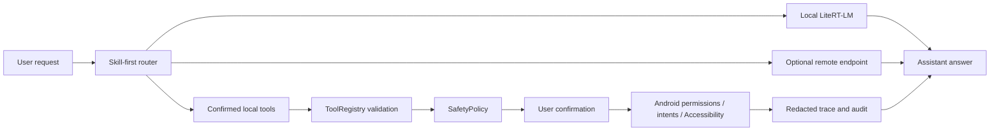
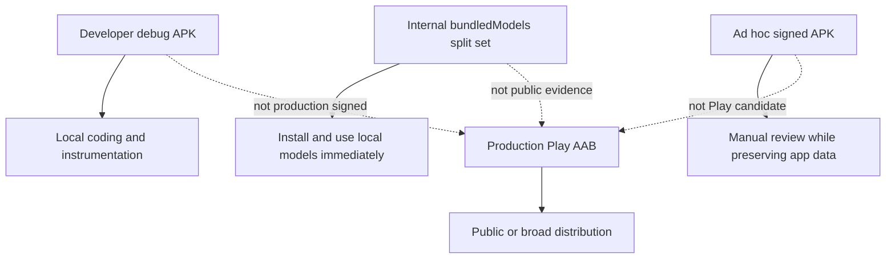

# PocketMind Android

PocketMind is a privacy-first Android assistant. It can answer with local
LiteRT-LM models, use a user-configured OpenAI-compatible remote endpoint, and
run confirmed phone-side tools such as reminders, sharing, app navigation,
screen text reads, OCR, contacts, calendar, and low-risk app search.


_Cartoon-style GPT Image 2 illustration of PocketMind's local-first model path,
optional remote endpoint, and confirmed phone-side tools._

## Product Contract

- Local by default: chat history, memory, private tool results, screen text,
  OCR excerpts, and attachment excerpts stay on device as `LocalOnly` unless
  the user chooses a remote path.
- Remote is optional: remote chat works only after an endpoint is configured
  and remote mode is selected. Images, suspected sensitive text, and configured
  remote sends require the documented preview/confirmation policy.
- Actions are confirmed: device actions are validated locally and stay behind
  permission, disclosure, confirmation, audit, and fail-closed boundaries;
  high-risk device actions still require confirmation.
- Models explicit: local chat needs a downloaded, imported, or bundled
  `.litertlm` model. Memory/action assets do not replace a chat model.
- Users stay in control: keys can be cleared, conversations and memories can
  be deleted, and release records track privacy/Data safety consistency.



## Implementation Highlights

- LiteRT-LM local chat with GPU/CPU fallback and explicit model loading.
- OpenAI-compatible remote chat with local filtering of `LocalOnly` context.
- Registry-driven tools, built-in Skills, local safety policy, redacted trace,
  and audit records.
- The chat surface only shows a safe result summary; structured tool fields
  stay available through the trace/audit surfaces, not a typed chat card.
- Internal `bundledModels` packaging can build a same-signature split set with
  pinned recommended model assets for lab validation.

## First Screen And Trust Flow

PocketMind opens into the assistant surface. The first-run path asks the user
to choose remote setup, recommended local download, trusted model import, or an
internal bundled-model package. Local model setup, remote sends, attachments,
voice, memory, and tool execution remain visible user choices.

Scripted regression and manual acceptance must be recorded separately. Voice
input, the Android system document picker, foreground prompts, and the
MediaProjection consent sheet are system-mediated flows and need real device
acceptance.

## Phone Control Scope

Phone control is limited to low-risk navigation and search. The supported
continuation path is observe, tap, type, submit search, scroll, back, and wait.
PocketMind checkpoints low-risk app control, including a 5-step checkpoint, and
keeps sending, deleting, paying, ordering, publishing, sensitive input, and
permission changes on the confirmation path.

## Current Status

PocketMind is an experimental open-source Android project. It is suitable for
local development, personal evaluation, and controlled tester builds. It is not
yet ready for broad app-store or production distribution.

Important open-source boundaries:

- The repository contains app source code, tests, scripts, and documentation.
  It does not contain model weights, API keys, keystores, or release secrets.
- Recommended model downloads are third-party artifacts. Their upstream
  licenses, access rules, and redistribution terms must be reviewed separately.
- Bundled-model packages contain third-party model bytes. Keep them internal
  until model license, redistribution, attribution, and notice approvals are
  recorded in `docs/model_license_review.json`.
- Phone-control and private-context tools are intentionally conservative. New
  capabilities should preserve confirmation, audit, and fail-closed behavior.
- Public distribution still needs production signing, store/privacy/legal/model
  license approval, physical-device instrumentation, arm64 emulator matrix
  evidence, and RC performance data on real arm64 hardware.

Use these entry points:

- Developer overview: `README.md`
- Documentation map: `docs/index.md`
- Agent architecture reference: `docs/agent_core_modules.md`
- Device acceptance: `docs/phone_acceptance.md`
- Release readiness: `docs/release_readiness.md`
- Release checklist: `docs/release_checklist.md`

## Quick Start

Requirements:

- Android SDK 36.
- JDK 17 or newer.
- A physical arm64-v8a Android device for realistic LiteRT-LM validation.

Clone the project:

```bash
git clone https://github.com/William-zgx/pocketmind-android.git
cd pocketmind-android
```

If your Android SDK is not in the default location, set it before building:

```bash
export ANDROID_HOME=/path/to/android-sdk
export ANDROID_SDK_ROOT="$ANDROID_HOME"
```

Build a debug APK:

```bash
./gradlew :app:assembleDebug
```

Install it on one connected device:

```bash
adb install -r app/build/outputs/apk/debug/app-debug.apk
```

Or let Gradle install it:

```bash
./gradlew :app:installDebug
```

After launch, choose one start path:

- Configure an OpenAI-compatible remote endpoint for the fastest first answer.
- Download the recommended local E2B model for offline basic chat.
- Import a trusted compatible `.litertlm` model.
- Install the internal bundled-model experience package when you need an
  installable build that works locally immediately.

## Recommended Models

Recommended model metadata is pinned in `docs/model_manifest.md`. Downloads are
registered only after size and SHA-256 verification.

| Capability | Artifact | Approximate size | Purpose |
| --- | --- | ---: | --- |
| Basic chat E2B | `.litertlm` chat model | 2.59 GB | Default local chat path |
| Local memory | EmbeddingGemma `.tflite` + tokenizer | 184 MB | Semantic memory index when runtime probe succeeds |
| Device action | `.litertlm` action model | 284 MB | Bounded action planning with rule fallback |
| High-quality chat E4B | `.litertlm` chat model | 3.66 GB | Higher quality local chat option |

Model files are not committed to Git. Ordinary Play/public release artifacts do
not bundle model files. The internal `bundledModels` package is the documented
exception for quick experience and lab validation; see
`docs/bundled_model_package.md`.

## Validation

Local verification:

```bash
scripts/doctor.sh
scripts/verify_local.sh
```

Device or emulator verification:

```bash
scripts/doctor.sh --device
ANDROID_SERIAL=<device-or-emulator> scripts/install_and_test_device.sh
```

Real-device workflows can delete app data if you choose the wrong helper.
Follow `docs/phone_acceptance.md` when you need to preserve downloaded models,
remote configuration, sessions, or manual acceptance state.

Full emulator regression uses the stricter artifact gate:

```bash
AVD_NAME=focus_agent_api36_arm64 scripts/regression_emulator.sh
```

Record emulator regression as passed only when
`regression-emulator.properties` contains `status=passed`.

x86_64 emulator setup for local UI review on an x86 Linux workstation:

```bash
scripts/check_x86_emulator_host.sh
APPLY=1 scripts/prepare_x86_emulator.sh
scripts/capture_x86_release_screenshots.sh
```

The x86_64 path is for developer simulation and screenshot review. Public
release evidence still requires the documented arm64 emulator and physical
arm64 device gates.

Recommended model URL provenance is checked only when requested:

```bash
VERIFY_MODEL_URLS=1 scripts/verify_local.sh
```

Internal bundled-model package validation:

```bash
export POCKETMIND_BUNDLED_MODELS_DIR=/path/to/verified/model/files
./gradlew checkBundledModelsPackageOutputs
ALLOW_DEBUG_KEYSTORE=1 scripts/package_bundled_models.sh
```

Add `INSTALL_ON_DEVICE=1 ANDROID_SERIAL=<device>` to overwrite-install the
signed split set with `adb install-multiple --no-incremental -r`.
Before sharing bundled-model artifacts outside local lab validation, refresh
model license metadata and pass
`VERIFY_MODEL_LICENSES=1 scripts/verify_release_gate.sh`.

## Release Paths

There are four distribution shapes:



Before public or broad production distribution, use
`docs/release_checklist.md`. It covers signing, AAB, Play policy, privacy,
model license, screenshots, validation, performance, monitoring, rollback, and
final release-gate evidence.

## Documentation Map

Start with `docs/index.md`. It explains which document owns which topic and how
to keep docs short when the project changes.

Common destinations:

- Product and trust boundary: this README, `docs/privacy_notice.md`
- Architecture and module ownership: `docs/agent_core_modules.md`
- Model provenance and bundled package: `docs/model_manifest.md`,
  `docs/bundled_model_package.md`
- Device/manual acceptance: `docs/phone_acceptance.md`
- Release readiness and release execution: `docs/release_readiness.md`,
  `docs/release_checklist.md`
- Evidence log: `docs/validation_report.md`

## Project Layout

```text
app/src/main/java/com/bytedance/zgx/pocketmind/
  action/          Mobile action planning and Android execution boundary
  audit/           Redacted tool audit storage
  background/      Reminders and scheduled task state
  data/            Model/session persistence and bundled model import
  device/          Local device context snapshots
  download/        DownloadManager boundary
  memory/          Local memory indexing and semantic memory runtime
  multimodal/      Share/picker text, image payload, and OCR boundaries
  orchestration/   Chat, memory, tool, and action routing
  resource/        Device resource sampling
  runtime/         LiteRT-LM and remote runtime boundaries
  safety/          Tool risk, confirmation, and privacy decisions
  skill/           Built-in skill manifests and execution
  tool/            Tool registry, schemas, results, and providers
  ui/              Compose surfaces

docs/              Project, architecture, validation, privacy, and release docs
scripts/           Local, device, release, and evidence helpers
```

## Development Notes

- Keep model binaries out of Git and ordinary release artifacts.
- Use a physical arm64-v8a device for model runtime and performance evidence.
- Prefer `adb install -r` or the documented split install path when preserving
  local model data.
- Run focused JVM tests for small changes and `scripts/verify_local.sh` before
  handing off broader changes.
- Do not commit API keys, Hugging Face tokens, keystores, bearer tokens, or
  generated release secrets.

## Contributing

Contributions are welcome. A useful change usually includes:

- A short explanation of the user-facing problem or developer need.
- Focused code or documentation changes without unrelated refactors.
- Tests or a manual validation note for changed behavior.
- Screenshots, UI dumps, logs, or report paths for device-specific issues.

Before opening a pull request, run:

```bash
scripts/verify_local.sh
```

For changes that touch device flows, also follow `docs/phone_acceptance.md`.
Security-sensitive reports should avoid public issue details that include
tokens, private endpoints, screenshots with personal data, or model/license
material that cannot be redistributed.

## License

PocketMind Android app code is distributed under the MIT License. Recommended
model downloads are third-party artifacts governed by their upstream licenses;
see `docs/model_manifest.md` and the release license checklist.
