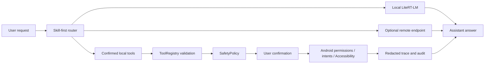

# Solin Android

[](https://github.com/William-zgx/solin-android/actions/workflows/android.yml)
[](LICENSE)
[](https://developer.android.com)
[](#current-status)

<p align="center">
  English | <a href="README.zh-CN.md">简体中文</a>
</p>

<p align="center">
  
</p>

Solin Android, shown in the app as `栖知 Solin`, is an experimental
privacy-first Android assistant. It can answer with local LiteRT-LM
Text+Vision models, use an optional OpenAI-compatible remote endpoint, and run
confirmed phone-side tools such as reminders, sharing, app navigation, screen
text reads, OCR, contacts, calendar, and low-risk app search.

## Table Of Contents

- [Product Contract](#product-contract)
- [Implementation Highlights](#implementation-highlights)
- [First Screen And Trust Flow](#first-screen-and-trust-flow)
- [Phone Control Scope](#phone-control-scope)
- [Current Status](#current-status)
- [Quick Start](#quick-start)
- [Configuration And Secrets](#configuration-and-secrets)
- [Recommended Models](#recommended-models)
- [Validation](#validation)
- [Project Layout](#project-layout)
- [Documentation](#documentation)
- [Contributing](#contributing)
- [Security](#security)
- [License](#license)

## Product Contract

- Local by default: chat history, memory, private tool results, screen text,
  OCR excerpts, local image inputs, and attachment excerpts stay on device as
  `LocalOnly` unless the user chooses a remote path.
- Remote is optional: remote chat works only after an endpoint is configured
  and remote mode is selected. Images, suspected sensitive text, and configured
  remote sends require preview or confirmation.
- Actions are confirmed: device actions are validated locally and stay behind
  permission, disclosure, confirmation, audit, and fail-closed boundaries;
  high-risk device actions still require confirmation.
- Models explicit: local chat needs a downloaded, imported, or bundled
  `.litertlm` chat model. Memory and action assets do not replace a chat
  model.
- Users stay in control: keys can be cleared, conversations and memories can
  be deleted, and privacy-sensitive behavior is documented before release.



## Implementation Highlights

- LiteRT-LM local chat with GPU/CPU fallback and explicit model loading.
- Local memory indexing with runtime probes before semantic recall is treated
  as available.
- Bounded local image input for verified local chat models; unsupported models
  fail closed instead of silently OCRing or uploading images.
- OpenAI-compatible remote chat with local filtering of `LocalOnly` context.
- Registry-driven tools, built-in Skills, local safety policy, redacted trace,
  and audit records.
- The chat surface only shows a safe result summary; structured tool fields
  stay available through the trace/audit surfaces, not a typed chat card.

## First Screen And Trust Flow

Solin opens into the assistant surface. On first run, the user chooses remote
setup, recommended local model download, trusted model import, or model
management. Local setup, remote sends, attachments, voice, memory, and tool
execution remain visible user choices.

Scripted regression and manual acceptance must be recorded separately. Voice
input, the Android system document picker, foreground prompts, and the
MediaProjection consent sheet are system-mediated flows and need real device
acceptance.

## Phone Control Scope

Phone control is limited to low-risk navigation and search. The supported
continuation path is observe, tap, type, submit search, scroll, back, and wait.
Solin checkpoints low-risk app control, including a 5-step checkpoint, and
keeps sending, deleting, paying, ordering, publishing, sensitive input, and
permission changes on the confirmation path.

## Current Status

Solin is suitable for local development, personal evaluation, and controlled
tester builds. It is not ready for broad app-store or production distribution.

Open-source boundaries:

- The repository contains source code, tests, scripts, documentation, and small
  project assets.
- The repository does not contain model weights, API keys, keystores, signing
  passwords, user data, or generated release artifacts.
- Recommended model downloads are third-party artifacts. Their upstream
  licenses, access rules, and redistribution terms must be reviewed separately.
- Bundled-model packages are internal lab artifacts until model license,
  redistribution, attribution, and notice approvals are complete.
- New phone-control or private-context features must preserve confirmation,
  audit, privacy classification, and fail-closed behavior.

## Quick Start

Requirements:

- JDK 17 or newer.
- Android SDK 36. The app targets SDK 36 and supports API 28+.
- A physical arm64-v8a Android device for realistic LiteRT-LM validation.

Clone and build:

```bash
git clone https://github.com/William-zgx/solin-android.git
cd solin-android
export ANDROID_HOME=/path/to/android-sdk
export ANDROID_SDK_ROOT="$ANDROID_HOME"
./gradlew :app:assembleDebug
```

Install on one connected device:

```bash
adb install -r app/build/outputs/apk/debug/app-debug.apk
```

After launch, choose one start path:

- Configure an OpenAI-compatible remote endpoint for the fastest first answer.
- Download the recommended local E2B model for offline basic chat.
- Import a trusted compatible `.litertlm` model.

## Configuration And Secrets

Solin works without committed secrets. Configure remote endpoints in the app or
use environment variables for local validation.

| Variable | Used by | Notes |
| --- | --- | --- |
| `ANDROID_HOME` / `ANDROID_SDK_ROOT` | Gradle and scripts | Android SDK location. |
| `ANDROID_SERIAL` | Device scripts | Select one authorized phone or emulator. |
| `SOLIN_HF_TOKEN` | Bundled-model build | Download credential for gated Hugging Face artifacts; not license approval. |
| `SOLIN_LIVE_REMOTE_BASE_URL` | Remote debug helper | Redacted in reports. |
| `SOLIN_LIVE_REMOTE_MODEL` | Remote debug helper | Redacted in reports. |
| `SOLIN_LIVE_REMOTE_API_KEY` | Remote debug helper | Must never be committed or recorded. |
| `RELEASE_KEYSTORE` and related signing variables | Signing scripts | Use only from a private signing environment. |

Run a local secret scan before committing sensitive changes:

```bash
scripts/privacy_scan.sh --report build/verification/privacy-scan.properties README.md README.zh-CN.md docs app/src/main scripts
```

If a token or signing secret lands in Git history, treat it as compromised,
revoke it first, then clean the history and rotate dependent credentials.

## Recommended Models

Recommended model metadata is pinned in `docs/model_manifest.md`. Downloads are
registered only after size and SHA-256 verification.

| Capability | Artifact | Approximate size | Purpose |
| --- | --- | ---: | --- |
| Basic chat E2B | `.litertlm` chat model | 2.59 GB | Default local Text+Vision chat path |
| Local memory | EmbeddingGemma `.tflite` + tokenizer | 184 MB | Semantic memory index after runtime probe |
| Device action | `.litertlm` action model | 284 MB | Bounded action planning with rule fallback |
| High-quality chat E4B | `.litertlm` chat model | 3.66 GB | Higher quality local Text+Vision chat option |

Model files are not committed to Git. Ordinary public release artifacts do not
bundle model files. The internal `bundledModels` package is the documented
exception for quick experience and lab validation; see
`docs/bundled_model_package.md`.

## Validation

Local verification:

```bash
scripts/doctor.sh
scripts/verify_local.sh
```

Device or emulator verification:

```bash
scripts/doctor.sh --device
ANDROID_SERIAL=<device-or-emulator> scripts/install_and_test_device.sh
```

Full emulator regression uses the stricter artifact gate:

```bash
AVD_NAME=focus_agent_api36_arm64 scripts/regression_emulator.sh
```

Record emulator regression as passed only when
`regression-emulator.properties` contains `status=passed`.

README and documentation contract tests:

```bash
./gradlew --no-daemon :app:testDebugUnitTest \
  --tests com.bytedance.zgx.solin.docs.AgentCoreDocumentationTest \
  --tests com.bytedance.zgx.solin.docs.ReleaseBlockerDashboardScriptTest
```

Use `docs/phone_acceptance.md` for flows that need real device behavior or
must preserve downloaded models, remote configuration, sessions, or manual
acceptance state.

## Project Layout

```text
app/src/main/java/com/bytedance/zgx/solin/
  action/          Mobile action planning and Android execution boundary
  audit/           Redacted tool audit storage
  background/      Reminders and scheduled task state
  data/            Model/session persistence and bundled model import
  device/          Local device context snapshots
  download/        DownloadManager boundary
  memory/          Local memory indexing and semantic memory runtime
  multimodal/      Share/picker text, image payload, and OCR boundaries
  orchestration/   Chat, memory, tool, and action routing
  resource/        Device resource sampling
  runtime/         LiteRT-LM and remote runtime boundaries
  safety/          Tool risk, confirmation, and privacy decisions
  skill/           Built-in skill manifests and execution
  tool/            Tool registry, schemas, results, and providers
  ui/              Compose surfaces

docs/              Architecture, privacy, validation, model, and release docs
scripts/           Local, device, release, and evidence helpers
```

## Documentation

- Simplified Chinese README: `README.zh-CN.md`
- Architecture and module ownership: `docs/agent_core_modules.md`
- Privacy boundary: `docs/privacy_notice.md`
- Model provenance: `docs/model_manifest.md`
- Bundled-model lab package: `docs/bundled_model_package.md`
- Device/manual acceptance: `docs/phone_acceptance.md`
- Release readiness: `docs/release_readiness.md`
- Documentation index: `docs/index.md`

## Contributing

Contributions are welcome. Useful changes usually include a focused problem
statement, scoped code or documentation updates, tests or validation notes, and
safe logs or screenshots for device-specific issues.

Before opening a pull request:

```bash
scripts/verify_local.sh
```

For changes that touch device flows, also follow `docs/phone_acceptance.md`.
Please avoid unrelated rewrites. New tools, Skills, model paths, and
phone-control behavior need schema validation, privacy classification,
confirmation policy, audit coverage, and tests.

Good first contribution areas:

- Documentation corrections that keep owner docs focused.
- Tests around tool schemas, safety policy, model capability profiles, and
  validation scripts.
- Replay fixtures for low-risk app search and screen-observation regressions.
- UI accessibility fixes that preserve existing `testTag` values.

## Security

Do not open public issues that include secrets, private endpoints, personal
data, sensitive screenshots, unpublished signing details, or
redistribution-restricted model files.

Preferred disclosure flow:

1. Reproduce the issue without exposing private payloads.
2. Capture the smallest safe logs, stack traces, or validation reports.
3. Contact the repository owner privately before publishing details.
4. Include affected commit, Android version, device or emulator type, and the
   affected area.

Security-sensitive fixes should keep the default fail-closed behavior and add a
regression test where practical.

## License

Solin Android app code is distributed under the MIT License. Recommended model
downloads are third-party artifacts governed by their upstream licenses; see
`docs/model_manifest.md` and `docs/model_license_review.json`.
