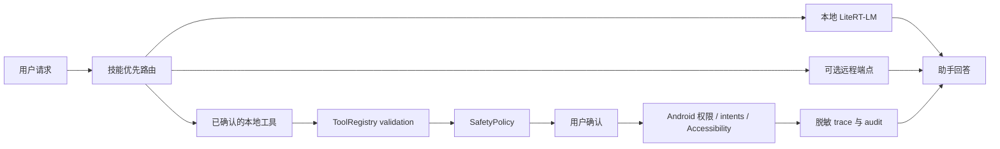

# Solin Android

[](https://github.com/William-zgx/solin-android/actions/workflows/android.yml)
[](LICENSE)
[](https://developer.android.com)
[](#当前状态)

<p align="center">
  <a href="README.md">English</a> | 简体中文
</p>

<p align="center">
  
</p>

Solin Android 在应用中显示为 `栖知 Solin`，是一个实验性的隐私优先
Android 助手。它可以使用本地 LiteRT-LM Text+Vision 模型回答问题，也可以接入
可选的 OpenAI 兼容远程端点，并在用户确认后执行手机侧工具，例如提醒、分享、
应用导航、屏幕文本读取、OCR、联系人、日历和低风险应用搜索。

## 目录

- [产品契约](#产品契约)
- [实现要点](#实现要点)
- [首次打开与信任流程](#首次打开与信任流程)
- [手机控制范围](#手机控制范围)
- [当前状态](#当前状态)
- [快速开始](#快速开始)
- [配置与密钥](#配置与密钥)
- [推荐模型](#推荐模型)
- [验证](#验证)
- [项目结构](#项目结构)
- [文档](#文档)
- [贡献](#贡献)
- [安全](#安全)
- [许可证](#许可证)

## 产品契约

- 默认本地优先：聊天历史、记忆、私有工具结果、屏幕文本、OCR 摘要、本地图片输入
  和附件摘要默认都保留在设备上，并以 `LocalOnly` 处理，除非用户主动选择远程路径。
- 远程能力可选：远程聊天只有在配置端点并选择远程模式后才会启用。图片、疑似敏感
  文本以及已配置的 `remote sends` 需要预览或确认。
- 动作必须确认：设备动作会在本地经过权限、披露、确认、审计和 fail-closed 边界；
  高风险设备动作仍然需要确认。
- 模型显式可见：本地聊天需要下载、导入或随包提供 `.litertlm` 聊天模型。
  记忆模型和动作模型不能替代聊天模型。
- 用户保持控制：用户可以清除密钥、删除会话和记忆；涉及隐私的行为必须在发布前
  文档化。



## 实现要点

- LiteRT-LM 本地聊天，支持 GPU/CPU 回退和显式模型加载。
- 本地记忆索引在语义召回可用前会先做运行时探测。
- 本地图片输入只对已验证的本地聊天模型开放；不支持的模型会 fail closed，而不是
  静默 OCR 或上传图片。
- OpenAI 兼容远程聊天，并在本地过滤 `LocalOnly` 上下文。
- 基于注册表的工具、内置 Skills、本地安全策略、脱敏 trace 和 audit 记录。
- model-driven 应用搜索可以用已校验的本地 Chat 或动作规划模型做 bootstrap；
  本地规划不可用时回退到静态 Skill 路径。
- 聊天界面只展示安全结果摘要；结构化工具字段通过 trace/audit surface 查看，而
  不是直接插入 `typed chat card`。

## 首次打开与信任流程

Solin 启动后直接进入助手界面。首次使用时，用户可以选择远程配置、推荐本地模型
下载、受信任模型导入或模型管理。本地设置、远程发送、附件、语音、记忆和工具执行
都会保持为可见的用户选择。

脚本回归和手工验收必须分开记录。Voice 输入、Android system document picker、
foreground 提示和 MediaProjection consent sheet 都是系统介导流程，需要真实设备
验收。

## 手机控制范围

手机控制仅限低风险导航和搜索。支持的连续动作路径是 observe、tap、type、
submit search、scroll、back 和 wait。Solin 会对低风险应用控制设置检查点，包括
5-step checkpoint；发送、删除、支付、下单、发布、敏感输入和权限修改都必须走确认
路径。

## 当前状态

Solin 适合本地开发、个人评估和受控测试构建。它尚未准备好用于大规模应用商店发布
或生产分发。

开源边界：

- 仓库包含源码、测试、脚本、文档和少量项目资源。
- 仓库不包含模型权重、API key、keystore、签名密码、用户数据或生成的发布产物。
- 推荐模型下载是第三方产物，必须分别检查其上游许可证、访问规则和再分发条款。
- bundled-model 包是内部实验室产物，直到模型许可证、再分发、署名和 notice 审批
  完成前都不应作为公共发布路径。
- 新增手机控制或私有上下文能力时，必须保留确认、审计、隐私分级和 fail-closed
  行为。

## 快速开始

要求：

- JDK 17 或更新版本。
- Android SDK 36。应用 target SDK 为 36，支持 API 28+。
- 用于真实 LiteRT-LM 验证的 arm64-v8a Android 真机。
  model-driven 应用搜索 instrumentation 是可选设备级 smoke 检查，需要设备上
  预装并校验过本地规划模型；它不是普通 CI 的硬前提。

克隆并构建：

```bash
git clone https://github.com/William-zgx/solin-android.git
cd solin-android
export ANDROID_HOME=/path/to/android-sdk
export ANDROID_SDK_ROOT="$ANDROID_HOME"
./gradlew :app:assembleDebug
```

安装到一台已连接设备：

```bash
adb install -r app/build/outputs/apk/debug/app-debug.apk
```

启动后选择一种开始方式：

- 配置 OpenAI 兼容远程端点，以最快获得首条回复。
- 下载推荐的本地 E2B 模型，用于离线基础聊天。
- 导入受信任且兼容的 `.litertlm` 模型。

## 配置与密钥

Solin 不依赖提交到仓库的密钥。远程端点可在应用内配置，也可以用环境变量进行本地
验证。

| 变量 | 用途 | 说明 |
| --- | --- | --- |
| `ANDROID_HOME` / `ANDROID_SDK_ROOT` | Gradle 和脚本 | Android SDK 位置。 |
| `ANDROID_SERIAL` | 设备脚本 | 选择一台已授权手机或模拟器。 |
| `SOLIN_HF_TOKEN` | bundled-model 构建 | 用于下载 gated Hugging Face 产物的凭据；不代表许可证审批。 |
| `SOLIN_LIVE_REMOTE_BASE_URL` | 远程调试辅助 | 报告中会脱敏。 |
| `SOLIN_LIVE_REMOTE_MODEL` | 远程调试辅助 | 报告中会脱敏。 |
| `SOLIN_LIVE_REMOTE_API_KEY` | 远程调试辅助 | 不能提交或写入记录。 |
| `RELEASE_KEYSTORE` 和相关签名变量 | 签名脚本 | 只应来自私有签名环境。 |

提交敏感变更前，请先运行本地密钥扫描：

```bash
scripts/privacy_scan.sh --report build/verification/privacy-scan.properties README.md README.zh-CN.md docs app/src/main scripts
```

如果 token 或签名密钥进入 Git 历史，应先视为已泄露并撤销，然后清理历史并轮换相关
凭据。

## 推荐模型

推荐模型元数据固定在 `docs/model_manifest.md`。下载内容只有在大小和 SHA-256 校验
通过后才会登记。

| 能力 | 产物 | 约略大小 | 用途 |
| --- | --- | ---: | --- |
| 基础聊天 E2B | `.litertlm` 聊天模型 | 2.59 GB | 默认本地 Text+Vision 聊天路径 |
| 本地记忆 | EmbeddingGemma `.tflite` + tokenizer | 184 MB | 运行时探测通过后的语义记忆索引 |
| 设备动作 | `.litertlm` 动作模型 | 284 MB | 带规则回退的受限动作规划 |
| 高质量聊天 E4B | `.litertlm` 聊天模型 | 3.66 GB | 更高质量的本地 Text+Vision 聊天选项 |

模型文件不会提交到 Git。普通公共发布产物不打包模型文件。内部 `bundledModels` 包是
快速体验和实验室验证的文档化例外，详见 `docs/bundled_model_package.md`。

## 验证

本地验证：

```bash
scripts/doctor.sh
scripts/verify_local.sh
```

设备或模拟器验证：

```bash
scripts/doctor.sh --device
ANDROID_SERIAL=<device-or-emulator> scripts/install_and_test_device.sh
```

model-driven 应用搜索 eval 属于 debug/device 检查，需要显式设置
`RUN_MODEL_DRIVEN_APP_SEARCH_EVAL=1`。mock 和 real app 模式都通过
`verifySearchQuery`、`expectedPackageName`、`expectedAppName` 校验结果，并要求
`searchVerificationStatus=verified`。

完整模拟器回归使用更严格的产物门禁：

```bash
AVD_NAME=focus_agent_api36_arm64 scripts/regression_emulator.sh
```

只有当 `regression-emulator.properties` 包含 `status=passed` 时，才能把模拟器回归
记录为通过。

README 与文档契约测试：

```bash
./gradlew --no-daemon :app:testDebugUnitTest \
  --tests com.bytedance.zgx.solin.docs.AgentCoreDocumentationTest \
  --tests com.bytedance.zgx.solin.docs.ReleaseBlockerDashboardScriptTest
```

需要真实设备行为，或需要保留已下载模型、远程配置、会话和手工验收状态的流程，请
参考 `docs/phone_acceptance.md`。

## 项目结构

```text
app/src/main/java/com/bytedance/zgx/solin/
  action/          手机动作规划与 Android 执行边界
  audit/           脱敏工具审计存储
  background/      提醒与定时任务状态
  data/            模型、会话持久化与 bundled model 导入
  device/          本地设备上下文快照
  download/        DownloadManager 边界
  memory/          本地记忆索引与语义记忆运行时
  multimodal/      分享、选择器文本、图片 payload 和 OCR 边界
  orchestration/   聊天、记忆、工具和动作路由
  resource/        设备资源采样
  runtime/         LiteRT-LM 与远程运行时边界
  safety/          工具风险、确认和隐私决策
  skill/           内置技能 manifest 与执行
  tool/            工具注册表、schema、结果和 provider
  ui/              Compose 界面

docs/              架构、隐私、验证、模型和发布文档
scripts/           本地、设备、发布和证据辅助脚本
```

## 文档

- English README: `README.md`
- 架构与模块归属：`docs/agent_core_modules.md`
- 隐私边界：`docs/privacy_notice.md`
- 模型来源：`docs/model_manifest.md`
- bundled-model 实验室包：`docs/bundled_model_package.md`
- 设备/手工验收：`docs/phone_acceptance.md`
- 发布就绪状态：`docs/release_readiness.md`
- 自适应端云推理阶段一状态：
  [`status.md`](docs/specs/20260718-adaptive-edge-inference/status.md) —
  实施中，尚未发布。
- 文档索引：`docs/index.md`

## 贡献

欢迎贡献。一个有用的变更通常应包含清晰的问题陈述、聚焦的代码或文档修改、测试或
验证说明，以及用于设备相关问题的安全日志或截图。

发起 pull request 前请运行：

```bash
scripts/verify_local.sh
```

如果变更涉及设备流程，也请遵循 `docs/phone_acceptance.md`。请避免无关重写。新增
工具、Skills、模型路径和手机控制行为需要 schema 校验、隐私分级、确认策略、审计
覆盖和测试。

适合入门的贡献方向：

- 保持 owner docs 聚焦的文档修正。
- 围绕工具 schema、安全策略、模型能力 profile 和验证脚本的测试。
- 低风险应用搜索和屏幕观察回归的 replay fixture。
- 保持现有 `testTag` 的 UI 可访问性修复。

## 安全

请不要在公开 issue 中包含密钥、私有端点、个人数据、敏感截图、未发布的签名细节
或受再分发限制的模型文件。

建议披露流程：

1. 在不暴露私有 payload 的前提下复现问题。
2. 捕获最小化的安全日志、堆栈或验证报告。
3. 在公开细节前，先私下联系仓库所有者。
4. 附上受影响 commit、Android 版本、设备或模拟器类型以及受影响区域。

安全敏感修复应保持默认 fail-closed 行为，并在可行时加入回归测试。

## 许可证

Solin Android 应用代码基于 MIT License 发布。推荐模型下载是第三方产物，受其上游
许可证约束；请参考 `docs/model_manifest.md` 和 `docs/model_license_review.json`。
