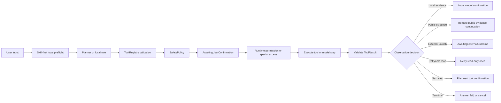

# Solin Agent Core Modules

This is the current architecture reference for Solin's end-side Agent.
Keep it about module ownership, boundaries, current status, and regression
coverage. Historical command output and validation notes belong in
`docs/validation_report.md`.



## Tool Layer

Code:

- `app/src/main/java/com/bytedance/zgx/solin/tool/`
- `app/src/main/java/com/bytedance/zgx/solin/action/ActionExecutor.kt`

Responsibilities:

- Describe every device capability as a `ToolSpec`.
- Validate tool names, arguments, permissions, risk, confirmation policy, and
  successful output data before the Agent observes a result.
- Expose provider-owned tool sets through `ToolRegistry` so the Agent loop does
  not keep parallel allowlists.

Boundaries:

- Tools do not decide conversation flow.
- Tools do not bypass confirmation for medium or higher risk work.
- Private output tools must be `LocalOnly` and `requiresLocalModel=true`.

Current status:

- `ToolRegistry` is provider-backed and covers web search, device context,
  Android Intent/draft/navigation tools, alarm/timer/reminder tools,
  `cancel_reminder`, current-page and current-app UI search, open-app UI
  search, phone-control primitives, background tasks, sharing, OCR, and
  settings entry points.
- Input schemas reject unknown tools, unknown fields, missing required values,
  bad enums, regex mismatches, and numeric bounds failures. Output schemas are
  also enforced for successful `ToolResult.data`.
- `ToolSpec.tags` owns runtime policy categories that previously lived as
  scattered tool-name lists: device-control sessions, low-risk app-control
  continuations, UI checkpoints, app-launch continuation, and local-model
  requirements.
- `ToolSpec.resultContinuationPolicy` separates tool safety from answer
  synthesis. `PublicEvidence` tools such as `web_search` can continue through
  the configured model; `LocalEvidence` tools such as contacts, calendar,
  files, notifications, clipboard, screen text, and OCR require local synthesis.
- Concurrent remote execution is intentionally narrow. A batch is accepted only
  when every tool is public, read-only, no-confirmation, has no private output,
  and declares no device-context, runtime-permission, scheduling,
  notification, navigation, share, or other side-effect boundary.
- `web_search` uses typed evidence requests. `searchMode=general` stays on
  public search; `searchMode=weather_current` is the only weather endpoint.
- Phone-control tools return `LocalOnly` observations and structured
  `UiActionResult` values. `UiTargetResolver` ranks Accessibility nodes for
  search/edit/submit/filter/result/scroll targets; app profiles improve
  ranking, not safety policy.
- UI control tools remain unavailable to remote model planning. App-search
  observation is `LocalOnly` and can only feed the local action-planning model.

Tests:

- `ToolRegistryTest`
- `ToolSchemaContractTest`
- `RoutingAndValidatingToolExecutorTest`
- `WebSearchProviderTest`
- `ActionExecutorTest`

## Agent Loop

Code:

- `app/src/main/java/com/bytedance/zgx/solin/orchestration/`

Responsibilities:

- Own the run state machine, step budgets, cancellation, retry, and restore
  rules.
- Load local context, plan chat/tool/skill work, request confirmation, observe
  results, and decide whether to continue or finish.
- Keep model output, remote tool calls, local rule plans, and Skill-first plans
  behind one validation and safety boundary.

Boundaries:

- The loop does not start Android activities directly.
- The loop does not persist raw prompts, private tool data, full remote error
  bodies, or arbitrary next-action payloads.
- Restored state is UI recovery only unless the current request is explicitly
  reconfirmed by the user.

Current status:

- The loop supports chat-only runs, direct Skill-first plans, local
  `call:function{...}` parsing, OpenAI-compatible remote `tool_calls`, and
  conservative rule replanning.
- Explicit built-in Skills run before remote model planning. Clipboard,
  contacts, files, calendar details, notifications, screen text, OCR, settings,
  and direct search workflows stay local unless the user supplies uploadable
  content.
- Observation produces a typed decision: complete, local/remote model
  continuation, retry a read-only tool once, plan the next confirmation, await
  an external outcome, fail, or cancel.
- Remote models may request multiple tool calls in one turn only for eligible
  public evidence batches. Mixed public/private/action batches are rejected as
  a whole before any tool starts.
- Remote send disclosure policy is explicit: `OnRemoteModeSwitch`,
  `EveryMessage`, `OncePerSession`, or `OnlyWhenSensitive`. Suspected
  sensitive content is always forced through confirmation with mask-and-send,
  send-anyway, and cancel choices; image sends always require confirmation.
- Pending remote sends fail closed after restart; they are not replayed without
  a fresh user action.
- Private observations are synthesized locally and take precedence over generic
  replanning. Unknown privacy metadata fails closed as `LocalOnly`.
- Low-risk phone-control replanning can use a verified local Chat or
  action-planning model. Verified E2B/E4B Chat models are preferred for
  observation-to-action planning; the `mobile-action-270m` model is only a
  low-resource experimental fallback. If the selected model is missing, fails,
  or produces no valid draft, the runtime falls back to conservative rule
  planning.
- App search has two modes: static Skill fallback, and model-driven bootstrap
  when a verified local Chat/action-planning model is available. The bootstrap
  only opens, waits, and observes; `ModelObservationReplanner` then plans one UI
  tool per observation, capped at five replans. A verified search result
  completes the run without asking a model for another step.
- Model-driven app-search verification is explicit. Mock and real device evals
  must pass query/package/app guards into the debug receiver before claiming
  `searchVerificationStatus=verified`; device instrumentation that needs a
  preinstalled verified local planning model is optional smoke coverage and
  skips when that model is absent.
- Pending confirmations, redacted Skill plan shapes, value-free Skill
  checkpoints, and selected no-payload continuation cursors can restore after
  process death. Raw tool arguments, model output, private payload, and
  arbitrary sequence text are not restored.
- External Activity launches move to `AwaitingExternalOutcome` when Solin
  can prove only that the external UI opened. Follow-up planning waits for the
  user to record whether the target-side outcome completed.
- Run-level step and observation budgets fail closed before another pending
  confirmation, retry, replan, or model continuation is saved.
- **Concurrency safety**: All 8 internal `mutableMapOf` fields in `AgentLoopRuntime` are now `ConcurrentHashMap` for safe multi-coroutine access.

Tests:

- `AgentLoopRuntimeTest`
- `AssistantOrchestratorTest`
- `ToolExecutionBoundaryTest`
- `SolinViewModelTest`

## Skill Framework

Code:

- `app/src/main/java/com/bytedance/zgx/solin/skill/`

Responsibilities:

- Declare reusable, versioned task flows with `SkillManifest`.
- Convert Skill steps into Tool Registry requests.
- Validate Skill structure, argument bindings, required tools, risk, and restore
  authorization before confirmation or execution.

Boundaries:

- Skills do not call Android APIs directly.
- Skills do not define private tool names outside the registry.
- Private tool outputs cannot bind directly into later external tool arguments.

Current status:

- Built-in Skills live in a `SkillCatalog` with manifests, trigger examples,
  parser-backed planning, direct tool mappings, and planner metadata in one
  contract.
- `SkillManifest.authorizationContractHash()` covers id/version/risk,
  low-risk app-control eligibility, unverified launch continuation eligibility,
  background metadata, required tools, and canonical input schema. Display text
  and trigger examples do not authorize execution.
- Declarative Skill plans support stable step ids, dependencies,
  tool-to-tool bindings, local model transform steps, and bounded progression.
- `SkillRunProgressor` is the shared pure Kotlin boundary for structure
  validation, public-output binding, private-output fences, model-output to tool
  progression, and current-process tool-result progression.
- `SkillRunExecutor` can execute multi-step Skills until a confirmation
  boundary, resume from a confirmed result, cancel pending work, and revalidate
  successful tool output before any model step consumes it.
- Current built-ins cover drafts, maps/search, device settings, app navigation,
  reminders, periodic-check configuration, background-task queries, web search,
  clipboard context, summary-and-share flows, foreground/current-app context,
  contacts, calendar availability, recent media metadata/OCR, current-screen
  text/OCR, static and model-driven App search, and system sharing.
- Model-driven App search manifests are limited to existing low-risk tools:
  open app, observe screen, tap, type, submit search, scroll, wait, and back.
  V1 does not cover sending, payment, deletion, order placement, authorization,
  or public posting.

Tests:

- `BuiltInSkillRuntimeTest`
- `SkillRunExecutorTest`
- `SkillRunProgressorTest`
- `MainActivitySkillUiTest`

## Device Context

Code:

- `app/src/main/java/com/bytedance/zgx/solin/device/`
- `app/src/main/java/com/bytedance/zgx/solin/resource/`
- `MemoryRepository`, `SessionRepository`, and `ChatUiState` context snapshots

Responsibilities:

- Provide minimal local context to the loop and planner.
- Represent tool readiness without exposing private values.
- Keep private device data out of remote prompts unless the user explicitly
  provides uploadable content.

Boundaries:

- Device context is not a general screen, file, contact, calendar, or media
  scraping layer.
- Accessibility text reads do not capture screenshots, pixels, node ids, full
  hierarchy, or semantic screen understanding.
- Recent-file tools return metadata only unless the user confirms an OCR tool
  with a narrow scope.

Current status:

- `DeviceContextSnapshot` records non-secret runtime state: inference mode,
  installed capability classes, memory toggle, storage estimate, active-session
  presence, pending confirmation state, and per-tool readiness.
- Readiness entries describe available, runtime-permission blocked,
  special-access blocked, foreground-consent required, and unavailable states.
  Prompts include tool names and state/reason metadata only.
- Confirmed `LocalOnly` device-context tools cover clipboard reads, foreground
  app metadata, current-app notifications, contacts, calendar busy/free blocks,
  recent file metadata, recent screenshot OCR, recent image OCR, current-screen
  Accessibility text, current-screen observation, and one-shot current
  screenshot OCR through MediaProjection consent.
- Remote mode filters local memory, shared-input generated text, device
  context, and `LocalOnly` history from automatic requests. Unknown stored
  message privacy restores as `LocalOnly`.
- Resource monitoring samples PSS/heap, available RAM, CPU, and thermal state
  for UI pressure only; it does not read user content.
- Pending areas remain intentionally outside this module: broad screen semantic
  understanding, complete document parsing, arbitrary media understanding, and
  uncontrolled screenshot capture.

Tests:

- `DeviceContextModelsTest`
- `DeviceContextToolExecutorTest`
- `ForegroundAppProviderTest`
- `CalendarAvailabilityProviderTest`
- `RecentFileCollectorTest`

## Execution Boundary

Code:

- `app/src/main/java/com/bytedance/zgx/solin/action/ActionExecutor.kt`
- `PendingAgentConfirmation`
- `SolinViewModel.confirmAgentConfirmation`

Responsibilities:

- Convert confirmed `ToolRequest` values into Android Intents, system sheets,
  scheduler calls, or special consent flows.
- Return execution success, cancellation, rejection, or failure as structured
  `ToolResult` values.
- Surface safe execution summaries to the UI while structured result details
  remain in Agent trace and audit.

Boundaries:

- Confirmation is required before Android execution, runtime permission prompts,
  or special-access dependent tool execution.
- Share sheets, drafts, app launches, and deep links prove only that the
  external UI opened unless the user later records the outcome.
- Arbitrary Intent actions, activities, extras, non-HTTPS links, and
  non-allowlisted app targets are not exposed.

Current status:

- Intent-backed tools cover settings, drafts, safe HTTPS deep links, app
  launchers, fixed app deep targets, camera launch, maps, email/calendar/contact
  drafts, and system sharing.
- Runtime permission prompts are issued only after the user confirms the Agent
  request. Denial returns through the normal tool-result path and is not
  auto-retried.
- Usage Access and Accessibility are modeled as special app access. Returning
  from settings updates status; it does not execute the pending tool.
- External launch results carry allowlisted completion metadata:
  `completionState`, `completionVerified=false`, `externalOutcome=Unknown`,
  `externalOutcomeSource=Unknown`, target kind, and safe target identifiers.
- `AwaitingExternalOutcome` can restore from allowlisted trace metadata for the
  active session. Restore does not replay the tool or recover raw payload.
- Android share-target ingestion and the in-app picker are handled before chat
  generation; generated prompts are staged as user-visible local drafts.

Tests:

- `ActionExecutorTest`
- `AgentRuntimePermissionPolicyTest`
- `SolinViewModelTest`
- `MainActivitySpecialAccessUiTest`

## Safety And Audit

Code:

- `app/src/main/java/com/bytedance/zgx/solin/safety/`
- `app/src/main/java/com/bytedance/zgx/solin/audit/`
- `AgentTraceStore`
- `tool_audit_events` Room table

Responsibilities:

- Make capability risk, permission boundaries, and confirmation policy explicit
  in code.
- Persist enough trace/audit metadata to explain what happened.
- Minimize retained private data and fail closed when policy metadata is
  missing or malformed.

Boundaries:

- Audit does not store tool arguments, prompts, remote responses, raw
  clipboard/screen/OCR text, bearer values, API keys, or full errors.
- Trace summaries are for diagnosis, not a second chat transcript.
- Recovery actions still re-enter validation, safety, audit, and user
  confirmation before execution.

Current status:

- `SafetyPolicy` rejects registered boundary tools that would cross execution
  or privacy boundaries without mandatory confirmation.
- Persistent audit records include time, event type, tool name, status, risk,
  permission names, and sanitized summaries. The Room repository keeps the most
  recent 500 records.
- Pending confirmations are stored separately from trace/audit and may include
  only `ToolSpec`-allowlisted structural arguments.
- Startup repair fails non-restorable in-flight runs closed while preserving
  recoverable pending confirmations.
- Reminder scheduling can expose a typed recovery action
  `cancel_reminder(taskId)`, but tapping it creates a fresh pending tool
  confirmation instead of cancelling directly.

Tests:

- `SafetyPolicyTest`
- `ToolAuditEventTest`
- `ToolAuditRepositoryTest`
- `AgentTraceStoreTest`

## Memory

Code:

- `app/src/main/java/com/bytedance/zgx/solin/memory/`
- `memory_records` and `memory_embeddings` Room tables

Responsibilities:

- Recall relevant local context when memory is enabled.
- Persist explicit preferences, user facts, and bounded task-state records until
  the user forgets or clears them.
- Keep memory-derived context local unless the user manually provides it.

Boundaries:

- Memory control commands are local commands, not chat or remote model
  requests.
- Background task memory records omit reminder title/body, prompts, arguments,
  and remote responses.
- Semantic recall is available only after verified model assets and runtime
  probes succeed.

Current status:

- The default runtime uses a lightweight token/hash index over saved sessions
  and explicit memory records. It adds non-persisted alias terms only for answer
  style preferences and active task-state records.
- Explicit `remember`/`forget` commands upsert or delete deterministic
  `Preference` and `UserFact` records while storing control/status messages as
  `LocalOnly`.
- Active reminders and periodic-check state sync into deterministic
  `TaskState` records. User forget/clear creates suppression markers so refresh
  does not recreate deliberately removed records.
- A semantic runtime controller can switch to verified EmbeddingGemma
  `.tflite` plus `sentencepiece.model` assets, persist vectors by
  `recordId + modelId`, and degrade back to lexical recall if probing,
  indexing, or query embedding fails.
- UI state distinguishes installed memory assets from active semantic recall,
  so a downloaded model is not presented as usable until probe/index succeeds.

Tests:

- `MemoryRepositoryTest`
- `ModelRepositoryPathTest`
- `SolinViewModelTest`
- `MainActivityLongTermMemoryUiTest`

## Background Tasks

Code:

- `app/src/main/java/com/bytedance/zgx/solin/background/`
- `scheduled_tasks` Room table
- `ReminderAlarmReceiver`

Responsibilities:

- Persist scheduled Agent tasks before handing them to Android.
- Use Android scheduling primitives instead of foreground coroutines.
- Keep background scheduling separate from conversation planning.

Boundaries:

- Background skills must be explicitly user configured, frequency bounded,
  local-only, and limited to local read-only state or notification work.
- Outbound or execution follow-up must return to foreground confirmation.
- Periodic checks are for local reminder patrol only; they are not background
  chat, screen scanning, file scanning, or arbitrary automation.

Current status:

- `schedule_reminder`, `cancel_reminder`, `configure_periodic_check`, and
  `query_background_tasks` are registered tools with Skill-first paths.
- Reminders use opaque task ids, `AlarmManager.setAndAllowWhileIdle`, data-URI
  `PendingIntent` identity, conditional state transitions, boot/package-update
  rescheduling, and structured failure when Android scheduling cannot be
  restored.
- Periodic checks are backed by WorkManager and a singleton
  `periodic-check-local` task. Worker state uses conditional
  `Scheduled -> Running -> Scheduled/Failed` transitions so disable/cancel
  cannot be overwritten by stale completion.
- `query_background_tasks` is a confirmed read-only local context tool. It is
  `LocalOnly`, `requiresLocalModel=true`, never calls schedule/cancel/set/disable,
  and returns private `tasksJson` / `policyJson` metadata with reminder
  title/body omitted.
- The background task surface shows active scheduled tasks, read-only terminal
  history, and periodic-check policy state. Running internals stay available to
  memory/recovery logic but are not shown as user-cancellable work.

Tests:

- `ScheduledTaskRepositoryTest`
- `PeriodicCheckSchedulerTest`
- `ReminderAlarmReceiverTest`
- `ActionExecutorTest`
- `DeviceContextToolExecutorTest.backgroundTasksQueryReturnsLocalOnlyTaskAndPolicyMetadataWithoutReminderContent`
- `AgentLoopRuntimeTest.backgroundTasksObservationRedactsTaskAndPolicyJson`

## Multimodal Inputs

Code:

- `app/src/main/java/com/bytedance/zgx/solin/multimodal/`
- `MainActivity` share intent handling
- `MainActivity` in-app attachment picker handling

Responsibilities:

- Accept user-initiated shared text, attachments, picked documents/images, and
  voice transcripts as composer drafts.
- Extract bounded local text or image inputs only through supported, explicit
  paths.
- Keep source ingestion separate from chat generation and tools.

Boundaries:

- Share/picker input is staged; it does not auto-send or auto-route.
- Remote image sends require a preview confirmation and a configured
  image-capable OpenAI-compatible endpoint.
- Unsupported media remains metadata-only.

Current status:

- Share intents and picker selections support text, JSON/XML/YAML text-like
  application files, images, audio, video, PDF, RTF, and Office MIME types.
- Local extraction covers bounded direct text, strict UTF-8 text-like files,
  PDF/RTF/Office Open XML text layers, scanned-PDF OCR fallback, and bounded
  image bytes for verified local vision-capable chat models.
- Remote mode uses a protected read path before parsing shared values or URIs;
  it shows a local privacy notice instead of reading/uploading content
  automatically.
- Voice input launches Android speech recognition and stages the transcript as
  a one-shot draft. It does not read audio files, auto-send, or create chat
  messages until the user taps send.
- OCR outside shared-input scanned-PDF fallback remains a confirmed tool flow:
  recent screenshot OCR, recent image OCR, and one-shot current screenshot OCR
  all return bounded text excerpts only.

Tests:

- `SharedInputTest`
- `CurrentScreenshotOcrContractTest`
- `SolinViewModelTest`
- `MainActivitySharedIntentTest`

## Structured Logging

Code:

- `app/src/main/java/com/bytedance/zgx/solin/logging/SolinLog.kt`
- `app/src/main/java/com/bytedance/zgx/solin/logging/SolinLogTags.kt`

Responsibilities:

- Provide a test-safe logging facade that does not directly reference `android.util.Log`.
- Route log calls through `SolinLogHolder.current` (default: `AndroidSolinLog` in debug, `NoOpSolinLog` in release).
- Define 12 standard tag constants so log filtering is consistent across modules.

Boundaries:

- `AndroidSolinLog` wraps every `android.util.Log` call in `runCatching` so unit tests never crash from unmocked Log.
- Top-level `solinD/solinI/solinW/solinE` functions are the preferred entry point; avoid raw `android.util.Log` in production code.
- Tests may swap the implementation via `setSolinLog()` to capture or silence output.

Current status:

- `SolinViewModel` emits structured logs for model load, message send, and tool execution.
- `RemoteModelRepository` uses `solinW(TAG_REMOTE, ...)` for migration warnings.
- Log facade is used across Agent loop, tool execution, and model runtime layers.

Tests:

- `SolinViewModelTest` exercises log-emitting code paths indirectly through ViewModel operations.

## Centralized Constants

Code:

- `app/src/main/java/com/bytedance/zgx/solin/SolinConstants.kt`

Responsibilities:

- Hold all magic numbers and tuning parameters in one typed, documented location.
- Expose nested objects: `Network`, `AgentLoop`, `Ui`, `Embedding`.

Boundaries:

- Prefer `SolinConstants.X.Y` over scattered `private const val`.
- Each value carries KDoc explaining its purpose and units.

Current status:

- `SolinConstants` centralizes timeouts, retry counts, UI thresholds, and embedding parameters previously scattered across multiple files.

Tests:

- `AgentLoopRuntimeTest` validates behavior that depends on `SolinConstants.AgentLoop` values.

## Memory Controller

Code:

- `app/src/main/java/com/bytedance/zgx/solin/memory/MemoryController.kt`

Responsibilities:

- Encapsulate memory index rebuild, long-term memory load, and explicit memory commands (preference, fact, remember, forget).
- Coordinate between `MemoryIndex`, `LongTermMemoryControls`, `SessionStore`, `ModelRepository`, and `BackgroundTaskScheduler`.

Boundaries:

- Returns `MemoryControllerResult` / `MemoryCommandResult` data classes; does not directly mutate UI state.
- Runs on an injected `ioDispatcher`.

Current status:

- Memory controller handles `remember`/`forget` commands and coordinates semantic embedding runtime when available.

Tests:

- `MemoryRepositoryTest` covers memory persistence and retrieval that the controller orchestrates.
- `SolinViewModelTest` exercises memory command flows through the ViewModel boundary.

## Evidence Encryption

Code:

- `app/src/main/java/com/bytedance/zgx/solin/evidence/OnDeviceEvidenceBlobStore.kt`

Responsibilities:

- Encrypt evidence blobs at rest using AES/CBC/PKCS5Padding with an AndroidKeyStore key (`solin_evidence_key`).
- Prepend a 16-byte IV to each ciphertext blob.
- Auto-migrate legacy plaintext blobs on read (decrypt failure → fall back to plaintext).

Boundaries:

- Encryption is enabled only when a valid `Context` is provided; test constructors pass `null` to disable.
- Meta files include an `encrypted=true/false` line.

Current status:

- Evidence encryption protects agent trace and audit blobs stored on device.
- Legacy plaintext migration ensures backward compatibility for existing installations.

Tests:

- `OnDeviceEvidenceBlobStoreTest`
- `EvidenceBoundsTest`

## Network Security

Code:

- `app/src/main/res/xml/network_security_config.xml`
- Referenced from `AndroidManifest.xml` via `android:networkSecurityConfig`

Responsibilities:

- Enforce HTTPS for all outbound traffic by default (`cleartextTrafficPermitted="false"`).
- Allow cleartext only for loopback addresses: localhost, 127.0.0.1, 10.0.2.2 (emulator), ::1.
- Trust anchors: system certificates only.

Boundaries:

- Cleartext is limited to loopback for local development and emulator testing.
- No user-installed certificate authorities are trusted.

Current status:

- Network security config is active in debug and release builds.
- Remote model repositories and web search providers use HTTPS exclusively.

Tests:

- `RemoteModelRepositoryTest` validates HTTPS endpoint configuration.

## Regression Strategy

Local verification:

```bash
./gradlew :app:testDebugUnitTest
./gradlew :app:assembleDebug
scripts/test_validation_scripts.sh
```

Script contract gate:

- `scripts/test_validation_scripts.sh` covers fake-SDK validation contracts for
  local, device, emulator, and regression-emulator helpers. Run it whenever
  validation script behavior or documentation contracts change.

Documentation coverage:

- `AgentCoreDocumentationTest` enforces this document's top-level section order,
  required module anchors, existing test references, key boundary phrases, and
  the `query_background_tasks` privacy contract.

AI behavior evidence:

```bash
scripts/verify_ai_behavior_eval.sh --require-boundary-map
scripts/collect_ai_behavior_actual_trace.sh
```

- `docs/ai_behavior_eval_plan.md` owns fixture taxonomy, actual-trace
  provenance, allowed-failure rules, and public release behavior-eval gates.

Emulator regression:

```bash
adb devices -l
ANDROID_SERIAL=emulator-5554 scripts/verify_emulator.sh
AVD_NAME=focus_agent_api36_arm64 scripts/regression_emulator.sh
```

- Use `AVD_NAME=<name> scripts/verify_emulator.sh` when the helper should
  launch an AVD first.
- Use `ANDROID_SERIAL=<serial> scripts/install_and_test_device.sh` for physical
  device validation.
- Treat `device-verification.properties`,
  `emulator-verification.properties`, and `regression-emulator.properties` as
  evidence artifacts, not prose summaries.
- Full physical-device validation remains required before claiming release
  LiteRT-LM model execution because emulator GPU/backend behavior is not
  representative. The model-driven app-search instrumentation smoke is narrower:
  it is optional, requires a preinstalled verified local planning model, and
  should not be treated as an ordinary CI prerequisite.
