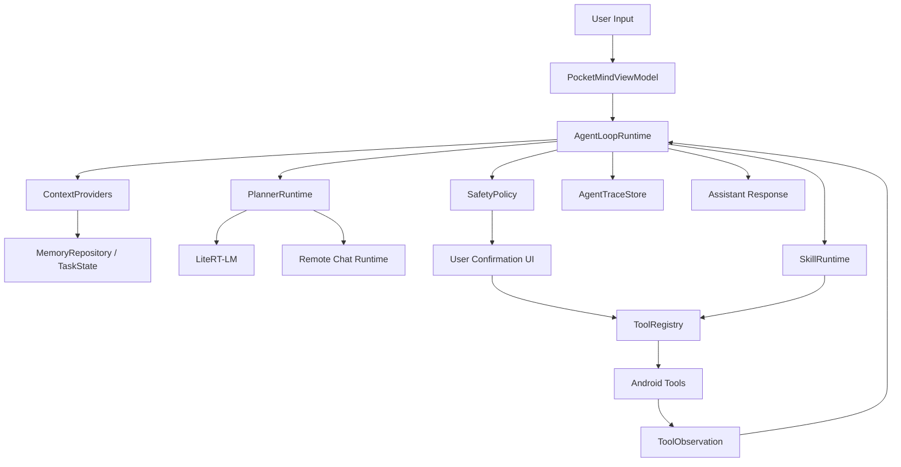

# PocketMind Agent Loop 与多 Agent 协同开发技术方案

## 状态说明

本文保留端侧 Agent Loop 迁移初期的技术方案和拆解口径，其中“当前事实”
章节描述的是立项时的历史基线，不再代表当前实现状态。现行模块边界、
已完成能力、仍未完成能力和验证清单以 `docs/agent_core_modules.md`、
`docs/validation_report.md` 和 `docs/release_readiness.md` 为准。

截至 2026-06-03，现行实现已经超过本文早期“第一阶段只做串行循环”的约束：
Agent Loop 仍禁止任意并行或后台自主执行，但允许远程模型在单轮中返回多个
公开只读 evidence tool call。只有全批工具都满足 public evidence eligibility
时才会并发执行；混入本地私密读取、外部动作或副作用工具时整批拒绝。

截至 2026-06-14，现行实现也已经超过本文早期“不做无障碍自动点击或跨 App
深度自动化”的非目标：PocketMind 支持低风险 App 内搜索闭环，但仍不自动完成
发送、删除、支付、下单、发布、权限授权等高风险动作。

截至 2026-06-17，远程运行时也已经超过本文早期“只发送 messages”的历史基线：
远程 chat completion 配置可以填写 base URL，运行时会在需要时补
`/chat/completions`；远程 OpenAI-compatible `tool_calls` 会经过本地
Tool Registry 和隐私边界重新校验；远程图片输入仅在配置显式开启图片输入且
endpoint/model 支持 OpenAI-compatible `image_url` 内容块时成立。

## 结论

PocketMind 在迁移初期已经有本地/远程聊天、轻量记忆检索、动作草稿和确认后 Intent 执行能力，但还不是完整端侧 Agent。第一阶段最重要的不是继续堆更多手机动作，而是把 **Agent 循环** 做成稳定的运行时边界：

```text
用户输入 -> 意图判断 -> 计划 -> 工具/Skill 调用 -> 观察结果 -> 更新记忆/状态 -> 继续或回答
```

这个循环要先支持可中断、可恢复、可审计、可测试。工具和 Skill 都应该接入这个循环，而不是绕过它直接从 `ViewModel` 打开系统页面。

## 初始事实

基于立项时的代码，项目已有这些基础：

- `AssistantOrchestrator` 负责单次路由：动作请求走 `AssistantRoute.Action`，否则走聊天。
- `HybridActionPlanningRuntime` 可以用动作模型把用户输入转成 `call:function {...}`，失败时走规则回退。
- `ActionExecutor` 将 6 个白名单动作映射为 Android `Intent`，确认后执行。
- `RemoteChatRuntime` 当时只向固定 Chat Completions endpoint 发送 `messages`，没有 `tools`/`tool_calls` 协议。
- `MemoryRepository` 是本地轻量检索，不是语义记忆或任务状态记忆。
- UI 有 `pendingActionDraft` 的确认链路，但没有 Agent run timeline、工具结果、重试、恢复。

因此立项时的能力可以称为 “本地聊天助手 + 动作草稿器”。要成为端侧 Agent，需要把单次 route 升级为 Agent run。

## 目标与非目标

### 目标

1. 建立统一 Agent Loop，承载聊天、工具调用、Skill 执行和结果观察。
2. 建立 Tool Registry，让所有端侧能力以声明式工具接入。
3. 建立 Skill Runtime，让复杂任务由多个工具步骤组成，并支持用户确认。
4. 建立安全边界：能力分级、确认策略、审计日志、敏感数据最小化。
5. 建立多 Agent 协同开发方式，确保不同开发 Agent 改的是同一套核心契约。

### 非目标

- 第一阶段不做开放插件市场。
- 第一阶段不做无障碍自动点击或跨 App 深度自动化。
- 第一阶段不追求完全自主执行高风险操作。
- 第一阶段不把所有 Android 系统能力一次性接完。

原因：端侧 Agent 的风险来自 “能做什么” 和 “为什么做” 之间的断裂。先把循环、边界、日志和测试做稳，再扩能力。

## 目标架构



核心原则：`ViewModel` 不直接决定工具执行细节，只负责启动 run、展示 run 状态、处理用户确认和取消。所有行为经过 `AgentLoopRuntime`。

## Agent Loop 设计

### 运行状态

`AgentRunState` 建议从这些状态开始：

```kotlin
enum class AgentRunState {
    Created,
    LoadingContext,
    Planning,
    AwaitingUserConfirmation,
    ExecutingTool,
    Observing,
    GeneratingAnswer,
    Completed,
    Cancelled,
    Failed,
}
```

第一阶段只做串行循环，不做并行工具调用。每个 run 限制最大 step 数，例如 4 步，避免模型陷入循环。

### 核心数据模型

```kotlin
data class AgentRun(
    val id: String,
    val sessionId: String,
    val userMessageId: String,
    val input: String,
    val state: AgentRunState,
    val createdAtMillis: Long,
    val updatedAtMillis: Long,
)

sealed class AgentStep {
    data class ContextLoaded(val memoryHits: List<MemoryHit>) : AgentStep()
    data class ModelPlanned(val plan: AgentPlan) : AgentStep()
    data class ToolRequested(val request: ToolRequest) : AgentStep()
    data class UserConfirmed(val requestId: String) : AgentStep()
    data class ToolObserved(val result: ToolResult) : AgentStep()
    data class AssistantResponded(val text: String) : AgentStep()
    data class Failed(val reason: String) : AgentStep()
}

sealed class AgentPlan {
    data class Answer(val prompt: String) : AgentPlan()
    data class UseTool(val request: ToolRequest) : AgentPlan()
    data class RunSkill(val skillId: String, val arguments: Map<String, String>) : AgentPlan()
}
```

这些模型需要能落 Room 表，至少用于调试和恢复。早期可以只持久化 trace 摘要，不必保存所有模型 token。

### 循环伪代码

```kotlin
suspend fun run(input: String, session: ChatSession): AgentRunResult {
    val run = traceStore.createRun(input, session.id)

    repeat(MAX_STEPS) {
        val context = contextProvider.load(input, session)
        traceStore.append(run.id, AgentStep.ContextLoaded(context.memoryHits))

        val plan = planner.plan(
            input = input,
            context = context,
            availableTools = toolRegistry.specs(),
            availableSkills = skillRegistry.specs(),
            observations = traceStore.observations(run.id),
        )
        traceStore.append(run.id, AgentStep.ModelPlanned(plan))

        when (plan) {
            is AgentPlan.Answer -> return answer(run, plan.prompt)
            is AgentPlan.UseTool -> {
                val decision = safetyPolicy.evaluate(plan.request)
                if (decision.requiresConfirmation) {
                    return awaitConfirmation(run, plan.request)
                }
                val result = toolExecutor.execute(plan.request)
                traceStore.append(run.id, AgentStep.ToolObserved(result))
                if (result.shouldContinue) continue
                return summarize(run, result)
            }
            is AgentPlan.RunSkill -> {
                val result = skillRuntime.run(plan.skillId, plan.arguments)
                traceStore.append(run.id, AgentStep.ToolObserved(result.asToolResult()))
                if (result.shouldContinue) continue
                return summarize(run, result)
            }
        }
    }

    return fail(run, "Agent reached max step limit")
}
```

### 与现有代码的迁移关系

- `AssistantOrchestrator.route()` 先保留，但内部改为调用 `AgentLoopRuntime` 的单步兼容模式。
- `ActionDraft` 迁移为 `ToolRequest` 的一种展示模型。
- `ActionExecutor` 迁移为多个 `ToolExecutor`。
- `pendingActionDraft` 迁移为 `pendingConfirmation: PendingAgentConfirmation?`。
- `RemoteChatRuntime` 增加 tool-aware 扩展，但兼容当前纯聊天模式。

## Tool 层设计

### ToolSpec

工具必须声明它能做什么、需要什么参数、风险等级、确认策略和结果格式。

```kotlin
data class ToolSpec(
    val name: String,
    val title: String,
    val description: String,
    val inputSchemaJson: String,
    val outputSchemaJson: String,
    val capability: ToolCapability,
    val permissions: Set<ToolPermission>,
    val riskLevel: RiskLevel,
    val confirmationPolicy: ConfirmationPolicy,
    val pendingArgumentAllowlist: Set<String>,
    val privateOutputKeys: Set<String>,
    val resultContinuationPolicy: ToolResultContinuationPolicy,
    val planningPromptHint: String?,
    val tags: Set<ToolCapabilityTag>,
    val androidRuntimePermissions: List<AndroidRuntimePermissionSpec>,
)

fun interface ToolProvider {
    fun specs(): List<ToolSpec>
}

data class ToolRequest(
    val id: String,
    val toolName: String,
    val arguments: Map<String, String>,
    val reason: String,
)

data class ToolResult(
    val requestId: String,
    val status: ToolStatus,
    val summary: String,
    val data: Map<String, String> = emptyMap(),
    val userVisible: Boolean = true,
)
```

### 初始工具清单

第一阶段只迁移现有 6 个动作，避免扩大风险面：

现状更新：工具层已经从固定动作清单演进为 provider-backed
`ToolRegistry`。Web search、设备上下文、Accessibility GUI primitives、Android
Intent、后台任务和未来软件专属工具都通过 `ToolSpec` 声明；Agent loop 只查询
registry 的 schema、risk、permission、tag 和 continuation policy，不再维护
平行的工具 allowlist。

| Tool | 当前来源 | 确认策略 | 结果 |
| --- | --- | --- | --- |
| `open_wifi_settings` | `ActionExecutor` | 必须确认 | 系统设置页打开成功/失败 |
| `search_maps` | `ActionExecutor` | 必须确认 | 地图 Intent 打开成功/失败 |
| `compose_email` | `ActionExecutor` | 必须确认 | 邮件草稿页打开成功/失败 |
| `create_calendar_event` | `ActionExecutor` | 必须确认 | 日历新建页打开成功/失败 |
| `create_contact_draft` | `ActionExecutor` / skill-first | 必须确认 | 联系人草稿页打开成功/失败；不读取通讯录 |
| `open_flashlight_settings` | `ActionExecutor` | 必须确认 | 设置页打开成功/失败 |

之后再补：

- `read_clipboard`：只读，敏感，需显式授权。
- `share_text`：中风险，必须确认。
- `save_note`：低风险，可配置是否确认。
- `query_calendar_availability`：敏感，只读，需权限与最小字段返回。

### Tool 调用协议

内部统一为 `ToolRequest`。模型输出可以有两种来源：

1. 本地动作模型输出 `call:function {"arg":"value"}`，解析后转 `ToolRequest`。
2. 远程模型输出 OpenAI-style `tool_calls`，解析后转 `ToolRequest`。

无论来源如何，进入执行前都必须走：

```text
ToolRequest -> Schema validation -> SafetyPolicy -> Confirmation -> ToolExecutor -> ToolResult -> AgentLoop
```

不要让远程模型响应直接触发 Android Intent。

## Skill 层设计

Tool 是原子能力，Skill 是可复用任务流程。Skill 不应绕过 Tool Registry。

### SkillManifest

```kotlin
data class SkillManifest(
    val id: String,
    val version: Int,
    val title: String,
    val description: String,
    val triggerExamples: List<String>,
    val requiredTools: List<String>,
    val inputSchemaJson: String,
    val riskLevel: RiskLevel,
    val lowRiskAppControlEligible: Boolean,
    val continuesAfterUnverifiedOpenAppLaunch: Boolean,
    val backgroundExecution: SkillBackgroundExecution?,
)
```

`SkillManifest.authorizationContractHash()` 绑定 id/version/risk、低风险 App
控制资格、未验证 App launch 后续资格、后台执行元数据、required tools 和输入
schema。标题、描述和 trigger examples 不参与恢复时的执行授权。

### SkillRun

```kotlin
data class SkillRun(
    val id: String,
    val skillId: String,
    val state: SkillRunState,
    val currentStepIndex: Int,
    val arguments: Map<String, String>,
)
```

第一阶段 Skill 可以是 Kotlin 内置，不做外部 DSL。等 loop、trace、policy 稳定后，再考虑声明式 DSL。

### 初始 Skill

| Skill | 目标 | 依赖工具 | 验收 |
| --- | --- | --- | --- |
| `email_draft_skill` | 根据自然语言生成邮件草稿 | `compose_email` | 展示主题/正文，确认后打开邮件 App |
| `calendar_draft_skill` | 根据自然语言生成日程草稿 | `create_calendar_event` | 支持标题/描述，确认后打开日历 |
| `map_search_skill` | 提取地点并打开地图搜索 | `search_maps` | 能从中文请求提取 query |
| `device_settings_skill` | 打开 Wi-Fi/Usage Access/系统设置 | `open_wifi_settings`, `open_usage_access_settings`, `open_flashlight_settings` | 不直接修改系统开关 |
| `app_navigation_skill` | 打开应用启动页或白名单应用详情页 | `open_app_intent`, `open_app_deep_target` | 不接受任意 Intent、Activity、URI、extras 或未白名单应用内目标 |

## Context 与记忆

Agent Loop 需要区分三类上下文：

1. **对话上下文**：当前 session 的最近消息。
2. **本地记忆**：跨 session 的用户偏好和历史事实。
3. **运行上下文**：当前 run 已经做过的计划、工具请求、工具结果。

第一阶段继续使用当前 `MemoryRepository`，但新增 `TaskState`/`AgentTraceStore`，避免把工具结果混进普通聊天文本里。

建议新增：

```kotlin
interface ContextProvider {
    suspend fun load(request: ContextRequest): AgentContext
}

data class AgentContext(
    val recentMessages: List<ChatMessage>,
    val memoryHits: List<MemoryHit>,
    val observations: List<ToolResult>,
)
```

## 安全策略

端侧 Agent 的安全边界必须在代码里，不依赖 prompt。

### 风险等级

```kotlin
enum class RiskLevel {
    LowReadOnly,
    MediumDraftOrNavigation,
    HighExternalSend,
    CriticalDeviceOrPayment,
}
```

第一阶段所有 Android Intent 工具都设为 `MediumDraftOrNavigation`，必须确认。

### 确认策略

确认 UI 必须展示：

- 工具/Skill 名称。
- 将要传递给外部 App 或系统页面的参数。
- 为什么要执行。
- 执行后无法由 PocketMind 保证的部分。

工具结果不得包含 API key、Authorization、完整远程错误体或不必要的联系人/日历隐私字段。

## UI 方案

当前 UI 只展示一个动作确认 bottom sheet。Agent Loop 需要展示 run 过程，但不能变成开发日志。

第一阶段 UI 最小改动：

- Composer 上方保留一个 `AgentStatusStrip`。
- 有待确认工具时展示 `AgentConfirmationSheet`。
- 助手气泡中展示简短状态，例如：
  - “已读取相关记忆”
  - “准备打开地图搜索”
  - “已打开系统确认页”
- 失败时给出可操作原因：
  - “没有找到可处理这个请求的工具”
  - “工具参数缺少地点”
  - “用户已取消”

后续再做完整 timeline。

## 多 Agent 协同开发方案

多个开发 Agent 并行工作时，最大风险是各自定义一套概念。必须先锁定核心契约，再分工。

### 协同原则

1. 契约优先：先合入 `AgentRun`、`ToolSpec`、`ToolRequest`、`ToolResult`、`SkillManifest` 的接口和测试桩。
2. 小步集成：每个开发 Agent 的改动必须能独立编译和测试。
3. 不跨层抢职责：UI Agent 不实现工具执行；Tool Agent 不改模型下载；Memory Agent 不改确认策略。
4. 任何新能力必须接入 `SafetyPolicy` 和 trace。
5. 每个 PR 必须说明它改变了 Agent Loop 哪个状态或哪个契约。

### 开发 Agent 分工

| 开发 Agent | 负责范围 | 主要文件 | 交付物 |
| --- | --- | --- | --- |
| Architect Agent | 核心接口、状态机、迁移顺序 | `orchestration/`, `action/` | 契约接口、ADR、单元测试 |
| Loop Runtime Agent | `AgentLoopRuntime`、run/step trace、取消恢复 | `orchestration/`, `data/` | 可运行的串行 loop |
| Tool Agent | `ToolRegistry`、现有动作迁移、schema 校验 | `action/` 或新 `tool/` | 6 个工具的 executor |
| Skill Agent | 内置 Skill runtime 和初始 skill | 新 `skill/` | 4 个内置 skill |
| Model Integration Agent | 本地/远程 tool call 解析与 planner | `runtime/`, `action/` | 统一 `PlannerRuntime` |
| Safety Agent | 风险等级、确认策略、隐私过滤 | 新 `safety/` | policy tests |
| UI Agent | 状态条、确认弹窗、错误展示 | `ui/`, `ChatModels.kt` | Agent run UI |
| QA Agent | 单测、AndroidTest、验收清单 | `src/test`, `src/androidTest`, `docs/` | 覆盖核心路径的测试 |

### 推荐开发顺序

#### Phase 1: Loop MVP

目标：把单次 `AssistantOrchestrator.route()` 升级成可跟踪的 `AgentLoopRuntime`。

任务：

- 新增 `AgentRun`, `AgentStep`, `AgentPlan`, `AgentRunResult`。
- 新增内存版 `AgentTraceStore`，先不落库。
- `PocketMindViewModel.sendMessage()` 通过 loop 获取结果。
- 保持现有用户体验不变：聊天还能流式生成，动作仍需确认。

验收：

- 纯聊天请求生成 `AgentPlan.Answer`。
- Wi-Fi 请求生成 `AgentPlan.UseTool` 并进入 `AwaitingUserConfirmation`。
- Stop generation 仍可取消当前 run。
- `AssistantOrchestratorTest` 或新增 `AgentLoopRuntimeTest` 覆盖上述路径。

#### Phase 2: Tool Registry

目标：把现有 hardcoded action 迁移成工具。

任务：

- 新增 `ToolSpec`, `ToolRequest`, `ToolResult`, `ToolExecutor`, `ToolRegistry`。
- 把 `MobileActionFunctions.supported` 替换为 registry 来源。
- `ActionExecutor` 拆为多个 executor 或一个 `AndroidIntentToolExecutor`。
- 增加 schema 校验，拒绝未知工具和未知字段。

验收：

- 6 个现有动作全部通过 Tool Registry 执行。
- 未注册工具返回结构化失败，不会执行。
- 参数缺失有明确错误。
- 确认前不会调用 `context.startActivity()`。

#### Phase 3: Planner 与 Tool Call 统一

目标：本地动作模型、规则回退、远程 tool call 都转为统一 `AgentPlan`。

任务：

- 新增 `PlannerRuntime`。
- 本地 `call:function` parser 输出 `ToolRequest`。
- 远程 chat runtime 支持可选 tool specs 和 tool call 解析。
- 保持不支持 tool call 的远程后端仍能纯聊天。

验收：

- 本地模型输出、规则回退、远程 tool call 走同一条执行链。
- 远程模型不能绕过 schema 和 safety。
- 解析失败回到普通回答或结构化错误。

#### Phase 4: Skill Runtime

目标：让复杂任务以 Skill 形式运行。

任务：

- 新增 `SkillManifest`, `SkillRun`, `SkillRuntime`。
- 内置 `email_draft_skill`, `calendar_draft_skill`, `map_search_skill`, `device_settings_skill`。
- Skill 步骤调用 Tool Registry，不直接执行 Intent。
- Skill run 写入 trace。

验收：

- “帮我写封邮件给张三说明明天延期” 进入邮件 Skill，展示草稿参数。
- “明天下午提醒我开会” 进入日程 Skill，展示日程草稿。
- 取消确认后 Skill 状态为 cancelled。

#### Phase 5: 持久化与恢复

目标：App 被杀或旋转屏幕后，不丢待确认 run。

任务：

- Room 新增 `agent_runs`, `agent_steps`, `tool_invocations`, `skill_runs`。
- UI state 从持久化 run 恢复 `pendingConfirmation`。最新待确认工具的恢复快照
  已落地；完整 typed run timeline 恢复仍待后续扩展。
- trace 可被导出为调试文本，默认不含敏感字段。

验收：

- 待确认 bottom sheet 出现后杀 App，重启还能恢复。
- 已完成 run 能看到摘要。
- 删除会话会清理相关 run/step。

#### Phase 6: 上下文与记忆升级

目标：Agent 能利用记忆，但不会误用隐私。

任务：

- 将 memory hits 作为 `AgentContext` 字段，而不是拼接字符串的唯一方式。
- 增加工具结果观察到上下文的能力。
- 新增用户可控的记忆开关和清理入口。

验收：

- 记忆关闭时 planner 不看到 memory hits。
- 工具结果可被后续 step 使用。
- 高风险上下文不会发给远程后端，除非用户明确允许。

## 测试策略

### 单元测试

- `AgentLoopRuntimeTest`
  - chat-only path
  - tool request path
  - confirmation path
  - max step failure
  - cancellation
- `ToolRegistryTest`
  - unknown tool rejection
  - schema validation
  - risk policy routing
- `SkillRuntimeTest`
  - skill step ordering
  - cancellation
  - tool failure propagation
- `RemoteToolCallParserTest`
  - streaming chunk tool call
  - JSON malformed fallback
  - normal content compatibility

### Android instrumentation

- 首屏和模型管理现有测试保留。
- 新增动作确认测试：
  - 输入 Wi-Fi 请求。
  - 出现确认弹窗。
  - 点取消后不会打开系统设置。
- 新增持久化测试：
  - 创建 pending confirmation。
  - 重启 Activity。
  - 确认 UI 恢复。

### 手动验收

把 `docs/phone_acceptance.md` 的 “记忆与动作验收” 扩展为 “Agent Loop 验收”：

- 纯聊天不触发工具。
- 支持动作进入确认。
- 取消动作不会执行。
- 工具执行失败给出明确原因。
- 远程模型不支持 tool call 时仍可聊天。
- App 重启后 pending run 可恢复。

## 文件落点建议

```text
app/src/main/java/com/bytedance/zgx/pocketmind/
  orchestration/
    AgentLoopRuntime.kt
    AgentModels.kt
    AgentTraceStore.kt
    PlannerRuntime.kt
  tool/
    ToolModels.kt
    ToolRegistry.kt
    ToolExecutor.kt
    AndroidIntentTools.kt
  skill/
    SkillModels.kt
    SkillRuntime.kt
    BuiltInSkills.kt
  safety/
    SafetyPolicy.kt
    RiskModels.kt
```

保留 `action/` 一段时间作为兼容层，迁移完成后再删除或收敛到 `tool/`。

## 关键技术决策

### 决策 1: 先做串行 loop

并行工具调用会放大 UI、权限、失败恢复和日志复杂度。端侧第一阶段场景以 “单请求、单动作、少量步骤” 为主，串行 loop 足够。

### 决策 2: Skill 先用 Kotlin 内置

外部 DSL 或动态 Skill 需要签名、沙箱、权限和升级机制。当前项目还没有这些基础。Kotlin 内置 Skill 更容易测试和审计。

### 决策 3: 所有工具默认显式确认

端侧 Agent 直接影响真实设备。第一阶段宁可多确认，也不能让模型输出直接导致外部 App 行为。

### 决策 4: Tool call 是内部协议，不绑定某个模型供应商

本地模型、远程 OpenAI-compatible 后端、规则回退都转为内部 `ToolRequest`。这样不会被某一种响应格式锁死。

## 风险与缓解

| 风险 | 影响 | 缓解 |
| --- | --- | --- |
| 模型输出非法工具参数 | 执行错误或隐私泄露 | schema 校验 + 白名单 registry |
| 循环失控 | 卡住、耗电、消耗 token | 最大 step 数 + cancellation |
| UI 状态和 run 状态不一致 | 重启后待确认丢失 | Phase 5 落库恢复 |
| 远程模型看到敏感上下文 | 隐私风险 | ContextPolicy + 远程发送前过滤 |
| 多 Agent 并行改出重复抽象 | 架构分裂 | 契约优先 + 文件归属 + 集成测试 |

## 里程碑

| 里程碑 | 推荐周期 | 完成标准 |
| --- | --- | --- |
| M1 Loop MVP | 1 周 | 聊天/动作都走 `AgentLoopRuntime`，测试通过 |
| M2 Tool Registry | 1 周 | 6 个现有动作工具化，确认链路不变 |
| M3 Planner Unification | 1 周 | 本地/规则/远程 tool call 统一成 `AgentPlan` |
| M4 Built-in Skills | 1 周 | 4 个内置 Skill 可运行，可取消 |
| M5 Persistence | 1 周 | pending run 重启恢复，trace 可审计 |
| M6 Context Upgrade | 1-2 周 | 上下文策略、记忆开关、工具观察闭环 |

## 最小可交付版本

如果要最快看到 “真正 Agent Loop” 的效果，MVP 只需要交付：

1. `AgentLoopRuntime` 串行状态机。
2. `ToolRequest`/`ToolResult`。
3. 现有 6 个 action 迁入 Tool Registry。
4. 用户确认后执行工具，并把 `ToolResult` 回写到 loop。
5. 单元测试覆盖聊天、动作、确认、取消、未知工具。

这个版本完成后，PocketMind 的架构就从 “聊天中夹了动作草稿” 变为 “聊天、动作、Skill 都是 Agent Loop 的一种 step”。后续核心能力都可以在这个框架里继续生长。
