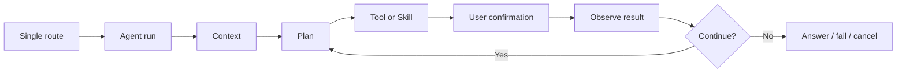

# Solin Agent Loop 与多 Agent 协同历史方案

## 历史说明

本文是历史设计案，记录 Solin 从“聊天 + 动作草稿”迁移到统一 Agent Loop
的早期思路。它不是当前架构合同。

当前模块职责、已完成能力、待补边界和回归命令以这些文档为准：

- `docs/agent_core_modules.md`
- `docs/intent_routing_skill_arbitration.md`
- `docs/validation_report.md`
- `docs/release_readiness.md`

## 为什么保留

这份方案仍有价值，因为它解释了几个根决策的来源：

- 所有手机能力必须先进入统一 Agent Loop。
- Tool 是原子能力，Skill 是可复用流程。
- 模型、本地规则、远程 `tool_calls` 都只能生成内部 `ToolRequest`。
- 执行前必须经过 schema validation、`SafetyPolicy`、用户确认和审计。
- 多个开发 Agent 只能围绕同一组核心契约并行，不能各自发明状态机。

## 历史基线

立项时的系统更接近“本地聊天助手 + 动作草稿器”：

- `AssistantOrchestrator` 做单次路由：动作请求走 action draft，其它走聊天。
- `HybridActionPlanningRuntime` 把少量自然语言动作转成 `call:function {...}`。
- `ActionExecutor` 只处理少数白名单 Android `Intent`。
- `RemoteChatRuntime` 只发送 `messages`，没有 tool-aware 协议。
- UI 有动作确认，但没有 Agent run timeline、工具观察、恢复或重试语义。

## 当时的迁移目标

当时建议的最小闭环是：

1. 新增 `AgentRun`、`AgentStep`、`AgentPlan`、`ToolRequest`、`ToolResult`。
2. 把现有 action 迁入 `ToolRegistry`。
3. 让确认、执行、观察、取消都回到 `AgentLoopRuntime`。
4. 先用 Kotlin 内置 Skill，不做开放插件或外部 DSL。
5. 用 Room 恢复 pending confirmation，但不恢复可执行私密 payload。

## 已被现行实现超越的假设

这些早期限制不再代表当前状态：

| 早期假设 | 当前状态 |
| --- | --- |
| 第一阶段只做串行循环 | 仍禁止任意后台自主执行，但允许 eligible public evidence tool batch 并发。 |
| 不做无障碍自动点击或跨 App 深度自动化 | 已支持低风险 App 内搜索闭环；高风险发送、删除、支付、发布、授权仍 fail closed。 |
| 远程运行时只发送 `messages` | 已支持 OpenAI-compatible `tool_calls`，本地重新校验 registry、隐私和安全边界。 |
| Tool 清单以少数 Intent 为主 | 现有 registry 已覆盖公开 evidence、本地设备上下文、背景任务、分享、OCR、App navigation、UI primitives 等。 |
| Pending restore 只需恢复一个动作草稿 | 现行恢复还覆盖 redacted Skill plan shape、value-free checkpoint、部分 no-payload continuation cursor 和 external outcome sheet。 |

## 仍然有效的原则

- `ViewModel` 只启动 run、展示状态、处理确认/取消，不直接决定工具执行细节。
- 所有 Android 行为必须从 `ToolRequest` 进入 registry、policy、confirmation、executor、observation 链路。
- Skill 不绕过 Tool Registry；复杂流程只是在多个工具和模型步骤之间组织依赖。
- 远程模型永远不能直接触发 Android Intent。
- 默认显式确认是端侧 Agent 的安全基线；低风险免确认必须由 tool/skill contract 明确声明。
- Trace/audit 只保存解释执行所需的最小元数据，不保存私密 payload。

## 多 Agent 协同教训

历史分工仍可作为协作原则，而不是当前任务清单：

| 协作原则 | 当前含义 |
| --- | --- |
| 契约优先 | 先改 `ToolSpec`、`SkillManifest`、`AgentRun` 等公共边界，再改具体能力。 |
| 小步集成 | 每个改动应能独立编译、测试、回滚。 |
| 不跨层抢职责 | UI 不实现工具执行；Tool 不决定对话流；Memory 不改确认策略。 |
| 新能力接入 policy 和 trace | 没有 `SafetyPolicy`、schema、trace/audit 的能力不算接入 Agent。 |
| 历史方案不覆盖当前事实 | 新事实写入 owner doc；这页只解释来源。 |

## 不再作为路线图使用

旧文中的 Phase 1 到 Phase 6、初始 6 个工具、初始 4 个 Skill、Room 表建议、
里程碑周期和 MVP 清单已经完成、替换或拆分。不要从这份文档派生新开发任务。

如果要判断“现在应该做什么”，从 `docs/agent_core_modules.md` 的模块状态和
`docs/release_readiness.md` 的 release blocker 开始。
