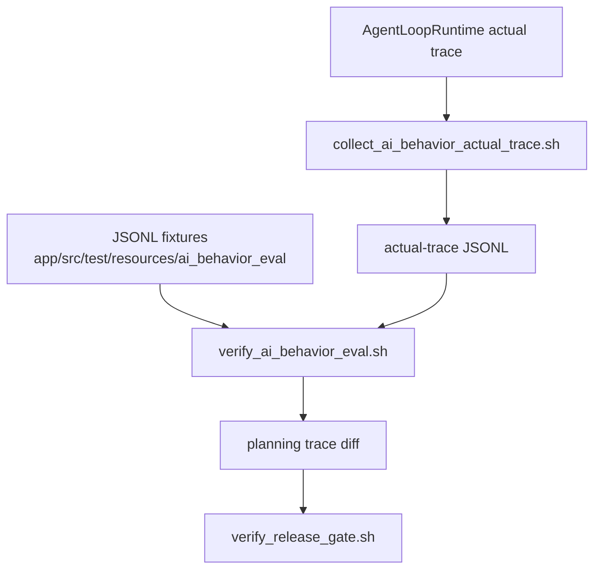

# AI Behavior Eval Plan

This document owns the behavior-evidence contract for Solin Agent routing,
privacy, tool planning, and fail-closed behavior. It complements
`docs/agent_core_modules.md`; it is not a substitute for physical-device,
manual-acceptance, performance, store, privacy, or release-owner evidence.

## Evidence Flow



## Fixture Taxonomy

The fixture set must keep stable ASCII `id` values and cover these categories:

- `memory_recall`: local memory use and forget/clear boundaries.
- `planner_false_positive`: requests that should remain plain chat or no-action.
- `tool_sequence`: valid tool chains and confirmation boundaries.
- `ocr_noise`: noisy screen/OCR inputs that must not weaken target grounding.
- `runtime_failure`: permission denial, real-app page-not-changed, and other
  fail-closed runtime paths.
- `privacy_boundary`: `LocalOnly`, `RemoteEligible`, public evidence, remote
  confirmation, and mixed-batch rejection.
- `restart_recovery`: restored confirmations, external outcome waits, and
  payload-bearing state that must fail closed after process death.

Every case records expected tools, confirmation class, risk level, privacy
level, routing path, owner agent, MVP scenario, and allowed failure modes.
`allowedFailureModes` are for local/debug diagnosis only; public release gates
reject unresolved allowed failures.

## Actual Trace Contract

Strict release evidence must use an actual trace collected from
`agent_loop_runtime`. The trace must bind:

- current fixture directory SHA-256;
- current capability matrix and action-model/profile hashes;
- UTC `recordedAt` values within the configured max age;
- one row per known fixture case, with no unknown or duplicate case ids;
- actual tools, actual confirmation, actual risk/privacy, routing path, trace
  source, and fail-closed failure mode when applicable.

The public release gate requires zero mismatches and zero unresolved allowed
failures. It also requires remote send confirmation cases to remain
`RemoteEligible`, and fail-closed cases to keep explicit failure modes rather
than silently degrading to a successful action.

## Commands

Fixture-only contract:

```bash
scripts/verify_ai_behavior_eval.sh --require-boundary-map
```

Collect runtime actual trace and diff:

```bash
scripts/collect_ai_behavior_actual_trace.sh
```

Strict public-style verification:

```bash
scripts/verify_ai_behavior_eval.sh \
  --require-boundary-map \
  --actual-trace <actual-trace.jsonl> \
  --require-actual-trace \
  --require-runtime-trace-source \
  --require-agent-loop-runtime-trace-source \
  --reject-allowed-failures
```

Final public release gate:

```bash
PUBLIC_RELEASE=1 \
AI_BEHAVIOR_ACTUAL_TRACE_FILE=<actual-trace.jsonl> \
PERF_BASELINE_FILE=<rc-perf-baseline.properties> \
EXPECTED_SIGNING_CERT_SHA256=<production-upload-cert-sha256> \
scripts/verify_release_gate.sh
```

## Boundaries

- Behavior eval proves planner/routing contracts. It does not prove UI,
  Android permission dialogs, device performance, model license approval, or
  store-policy approval.
- Public evidence batches are allowed only when every tool in the batch is
  public, read-only, no-confirmation, no-private-output, and free of Android
  permission, navigation, scheduling, notification, sharing, or other
  side-effect boundaries.
- Private tool results, screen/OCR evidence, local memory, attachments, and
  device context stay `LocalOnly` and must not become remote trace input.
