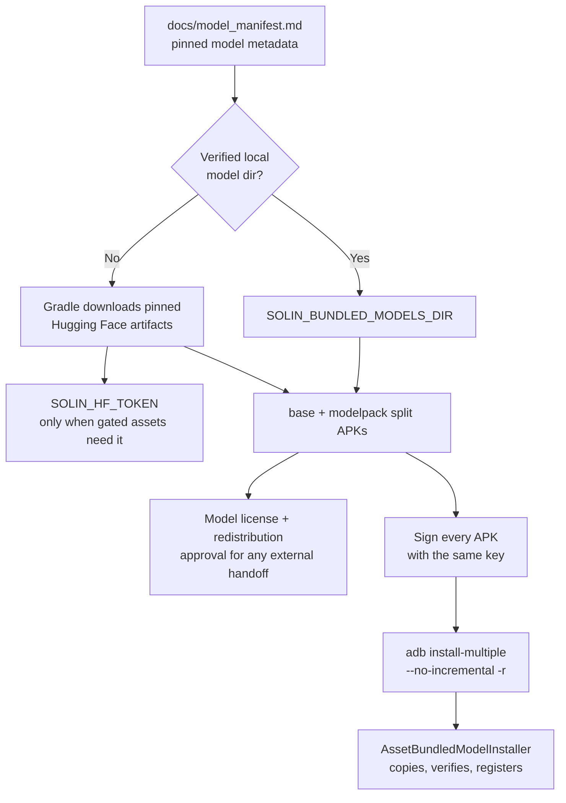

# Bundled Model Quick-Experience Package

The `bundledModels` package is an internal quick-experience build for lab
validation and trusted team testing. It produces an installable app that can
work locally immediately after install. It is separate from the ordinary
Play/public `release` path.

This file owns build, signing, and install rules for that package. Model
provenance and license review stay in `docs/model_manifest.md`; runtime privacy
behavior stays in `docs/privacy_notice.md`.



## Authorization And Compliance Gate

The `bundledModels` split set contains third-party model bytes. Treat any copy
of those signed APKs as a model redistribution artifact unless legal/release
approval says otherwise.

- Local build, SHA-256 verification, Android signing, and `SOLIN_HF_TOKEN`
  prove only build access and package identity. They do not approve model
  licensing, redistribution, attribution, notice, store-policy, or public use.
- Until every recommended model in `docs/model_license_review.json` is reviewed
  with `status=approved` and `redistributionDecision=approved`, bundled-model
  artifacts are internal lab artifacts only.
- Do not upload, mirror, attach to public release notes, send to customers,
  submit to app stores, or broadly share bundled-model artifacts without
  approved model license evidence and a release-owner decision.
- If a build moves from local lab validation to any external tester, customer,
  or public channel, refresh model license metadata and pass:

```bash
scripts/collect_model_license_metadata.sh
scripts/verify_model_license_review.sh
# Or, when testing through the focused release gate:
VERIFY_PERF_BASELINE=0 VERIFY_MODEL_LICENSES=1 scripts/verify_release_gate.sh
```

## Contents

The package includes the pinned recommended model set from
`docs/model_manifest.md`:

- `chat-e2b`: `gemma-4-E2B-it.litertlm`
- `memory-embedding-gemma-300m`:
  `embeddinggemma-300M_seq256_mixed-precision.tflite` plus
  `sentencepiece.model`
- `mobile-action-270m`: `mobile-actions_q8_ekv1024.litertlm`
- `chat-e4b`: `gemma-4-E4B-it.litertlm`

On first launch, `AssetBundledModelInstaller` reads
`assets/solin-bundled-models/manifest.json`, copies bundled assets into the
repository download-file location under the app's external files Downloads
area, verifies size and SHA-256 against the catalog, registers the models as
recommended verified models, and selects the default local E2B chat model when
no previous active chat model exists.

Already verified recommended models are skipped rather than overwritten. A
failure for one recommended model does not stop the installer from attempting
the remaining models; partial results are surfaced through the installer result
and `failedModelIds`.

Overwrite install preserves app data. If the user previously selected remote
mode, that mode can remain active until the user switches back to local mode in
Model Manager.

## Split Shape

E2B + E4B + memory + action assets are larger than a single APK can safely
carry. The APK ZIP32/packaging toolchain hits the 4 GB payload-offset limit, so
the installable artifact is a same-signature split set:

- `base.apk`
- `split_modelpackE2b.apk`
- `split_modelpackE2bExtra.apk`
- `split_modelpackE4b.apk`
- `split_modelpackE4bExtra.apk`

The base APK contains only the bundled-model manifest. Large model bytes live in
install-time dynamic feature APKs. Chat models are chunked and reconstructed at
install-copy time before final SHA-256 verification.

## Build Inputs And Tokens

Prefer a local directory that already contains verified model files:

```bash
export SOLIN_BUNDLED_MODELS_DIR=/path/to/verified/model/files
./gradlew checkBundledModelsPackageOutputs
```

If that directory is absent, Gradle downloads the pinned Hugging Face artifacts
into `app/build/bundled-model-cache`. Set `SOLIN_HF_TOKEN` only for this
build invocation when gated model assets are needed. Do not place tokens in
`gradle.properties`, source files, commit messages, screenshots, build reports,
or release notes.

`SOLIN_HF_TOKEN` is a download credential, not a license approval. It is
also separate from the in-app Hugging Face read token saved in encrypted local
storage for user-initiated gated model downloads, and separate from any remote
model API key.

Developer-visible Gradle entry points:

```bash
./gradlew assembleBundledModelsPackage
./gradlew bundleBundledModelsPackage
./gradlew checkBundledModelsPackageOutputs
```

Raw split APK outputs:

```text
app/build/outputs/apk/bundledModels/app-bundledModels-unsigned.apk
modelpackE2b/build/outputs/apk/bundledModels/modelpackE2b-bundledModels.apk
modelpackE2bExtra/build/outputs/apk/bundledModels/modelpackE2bExtra-bundledModels.apk
modelpackE4b/build/outputs/apk/bundledModels/modelpackE4b-bundledModels.apk
modelpackE4bExtra/build/outputs/apk/bundledModels/modelpackE4bExtra-bundledModels.apk
```

The AAB output is:

```text
app/build/outputs/bundle/bundledModels/app-bundledModels.aab
```

Direct lab installs should use the signed split APK set. Bundletool
universal/fused APK paths are not reliable for this model size.

## Signing And Install

For a local lab check with the Android debug keystore:

```bash
ALLOW_DEBUG_KEYSTORE=1 scripts/package_bundled_models.sh
```

For a same-key team distribution from a private signing environment:

```bash
RELEASE_KEYSTORE=/secure/path/upload.jks \
RELEASE_KEY_ALIAS=<alias> \
RELEASE_KEYSTORE_PASSWORD=<store-password> \
RELEASE_KEY_PASSWORD=<key-password> \
scripts/package_bundled_models.sh
```

Password files are preferred in private signing environments when available:

```bash
RELEASE_KEYSTORE=/secure/path/upload.jks \
RELEASE_KEY_ALIAS=<alias> \
RELEASE_KEYSTORE_PASSWORD_FILE=/secure/path/store-password.txt \
RELEASE_KEY_PASSWORD_FILE=/secure/path/key-password.txt \
scripts/package_bundled_models.sh
```

To overwrite-install on one authorized device while preserving app data and
downloaded model data:

```bash
ALLOW_DEBUG_KEYSTORE=1 \
INSTALL_ON_DEVICE=1 \
ANDROID_SERIAL=<physical-device-serial> \
scripts/package_bundled_models.sh
```

The install path intentionally uses:

```bash
adb install-multiple --no-incremental -r <signed split APKs...>
```

Do not use `adb install-multiple -r` without `--no-incremental` for this
package. A fast incremental `Success` is not sufficient for this large split
set; treat the install as accepted only after PackageManager lists the base APK
and all four modelpack splits.

Signing boundary:

- All five APKs must be signed by the same key.
- The signing key must match the currently installed package for overwrite
  install.
- Debug signing is only for local lab checks and cannot overwrite a
  production-signed install.
- Signing does not approve model license, redistribution, attribution, store
  policy, or remote model access.

The script writes:

```text
build/verification/bundled-models/package.properties
```

That report records the compliance boundary, whether external distribution
requires model-license approval, and the raw/signed SHA-256 values for the base
APK plus four modelpack split APKs.

## Expected Device State

After a successful install:

```bash
adb -s "$ANDROID_SERIAL" shell pm path com.bytedance.zgx.solin
```

should list the base APK plus all four modelpack splits.

Model Manager should show the four recommended models as SHA-256 verified:

- 基础对话 E2B
- 本地记忆模型
- 可选实验低资源动作模型
- 高质量对话 E4B

For a fresh or local-selected state, the home screen should show
`本机模型已就绪`; the current model card should show `基础对话 E2B` and a loaded
backend such as `backend=GPU` or a CPU fallback if the GPU backend fails.

The semantic memory status is separate from file verification. The memory asset
can be present and SHA-256 verified while the UI still reports `已安装待探测`,
`RuntimeUnavailable`, `ProbeFailed`, or `已回退轻量索引` if the embedding runtime
probe fails.

## Boundaries

- This package is for internal quick experience and lab validation.
- It is not the ordinary Play/public release artifact.
- It must not be uploaded as the public Play AAB without model license,
  redistribution, attribution, store-policy, signing, and release-owner
  approvals.
- Modelpack splits reuse the manifest-pinned artifacts; they do not create a
  new recommended model source.
- Overwrite install preserves existing app data. Do not run `pm clear`,
  uninstall, `CLEAN_DEVICE=1`, or instrumentation helpers that clear data when
  the goal is to preserve local model data.
- Model assets are intentionally not committed to Git. They live under ignored
  build/cache/output directories.

## Troubleshooting

- **Package not visible after install:** rerun with
  `adb install-multiple --no-incremental -r`; do not trust a fast incremental
  success for this large split set.
- **Signature mismatch:** all five APKs must be signed by the same key, and the
  key must match the currently installed package for overwrite install. Do not
  uninstall unless the validation plan explicitly allows losing app data.
- **Model Manager stays in remote mode:** overwrite install preserved previous
  DataStore state. Switch to local mode in Model Manager; the bundled E2B model
  can already be installed and selected.
- **Not enough storage:** keep space for the installed split APKs and the
  first-launch model copy. Expect roughly 5.8 GB / 5.4 GiB of signed split
  APKs; exact sizes come from
  `build/verification/bundled-models/package.properties`. Keep additional app
  data storage for first-launch model import.
- **Token leakage concern:** run `rg -n 'hf_|sk-'` over changed source/docs.
  Build reports must record only variable names and artifact hashes, never the
  token value.
