# Documentation Index

This directory separates product intent, architecture, validation, and release
evidence. Use this page to choose the right document before adding new text.

```mermaid
flowchart TD
    Need["What do you need?"] --> Run["Run or build the app"]
    Need --> Explain["Understand product or privacy behavior"]
    Need --> Architecture["Change Agent/tool/runtime code"]
    Need --> ScreenOps["Improve screen understanding or phone operation"]
    Need --> Models["Work with model assets"]
    Need --> Device["Validate on phone or emulator"]
    Need --> Release["Prepare a release"]
    Need --> Evidence["Record verification evidence"]

    Run --> Readme["README.md"]
    Explain --> Privacy["privacy_notice.md"]
    Architecture --> Core["agent_core_modules.md"]
    Architecture --> Routing["intent_routing_skill_arbitration.md"]
    ScreenOps --> ScreenPlan["screen_ocr_agent_optimization_plan.md"]
    Models --> Manifest["model_manifest.md"]
    Models --> Bundled["bundled_model_package.md"]
    Device --> Phone["phone_acceptance.md"]
    Release --> Readiness["release_readiness.md"]
    Release --> Checklist["release_checklist.md"]
    Evidence --> Validation["validation_report.md"]
```

## Document Roles

| Document | Role | Keep it focused on |
| --- | --- | --- |
| `../README.md` | Project entrance | What PocketMind is, how to build, where to go next |
| `agent_core_modules.md` | Agent architecture reference | Current module ownership, boundaries, status |
| `agent_loop_multi_agent_plan.md` | Historical design note | Early migration intent and what has changed since then |
| `screen_ocr_agent_optimization_plan.md` | Optimization plan | Next-stage screen observation, OCR grounding, phone-control eval, and multi-agent work split |
| `intent_routing_skill_arbitration.md` | Routing contract | Priority rules and evidence fields for route-sensitive behavior |
| `model_manifest.md` | Model provenance | Pinned upstream revisions, bytes, hashes, license-review status |
| `bundled_model_package.md` | Internal model-included package | Split package build/sign/install contract and caveats |
| `phone_acceptance.md` | Device acceptance | Commands and checks that require a phone or emulator |
| `privacy_notice.md` | Privacy boundary | Local storage, remote sends, tools, attachments, retention |
| `release_readiness.md` | Current release status | What is complete, what blocks release, next owner actions |
| `release_checklist.md` | RC execution checklist | Item-by-item release candidate evidence requirements |
| `release_blocker_dashboard.md` | Generated blocker view | Compact status generated from roadmap/release readiness inputs |
| `validation_report.md` | Append-only evidence log | Dated commands, results, artifacts, and known gaps |

JSON files in `docs/` are machine-readable records or capability matrices. They
are inputs to verifier scripts and should stay structured rather than become
narrative documentation.

## Editing Rules

- Put a fact in one owner document, then link to it elsewhere.
- Keep README short. If a section needs release evidence, it belongs in
  `release_checklist.md` or `release_readiness.md`.
- Keep `validation_report.md` factual and dated. It is not a roadmap, product
  pitch, or replacement for release-owner approval.
- Never include real API keys, Hugging Face tokens, bearer tokens, keystore
  material, private hostnames, or user data.
- Prefer a small Mermaid diagram for flows with three or more steps.
- When product wording changes, check `privacy_notice.md`,
  `release_checklist.md`, and `store_policy_record.json` for matching language.

## High-Value Diagrams

- Trust boundary: README.
- Agent/tool lifecycle: `agent_core_modules.md`.
- Bundled model split install: `bundled_model_package.md`.
- Device acceptance flow: `phone_acceptance.md`.
- Release evidence flow: `release_checklist.md`.
