# Documentation Index

This directory separates product intent, architecture, validation, and release
evidence. Use this page to choose the right document before adding new text.

```mermaid
flowchart TD
    Need["What do you need?"] --> Run["Run or build the app"]
    Need --> Explain["Understand product or privacy behavior"]
    Need --> Architecture["Change Agent/tool/runtime code"]
    Need --> ScreenOps["Validate screen or phone operation"]
    Need --> Models["Work with model assets"]
    Need --> Device["Validate on phone or emulator"]
    Need --> Release["Prepare a release"]
    Need --> Brand["Check brand, listing, or policy facts"]
    Need --> Evidence["Record verification evidence"]
    Need --> Plans["Plan a future refactor"]
    Need --> AgentStart["Coding agent onboarding"]

    Plans --> PlansDir["plans/"]
    Plans --> Weaknesses["optimization_plan_weaknesses.md"]
    AgentStart --> AgentsMd["../AGENTS.md"]
    AgentStart --> Guidebook["../Guidebook.md"]
    AgentStart --> Weaknesses
    Run --> Readme["README.md"]
    Explain --> Privacy["privacy_notice.md"]
    Architecture --> Core["agent_core_modules.md"]
    Architecture --> Harness["harness_architecture_improvements.md"]
    Architecture --> Routing["intent_routing_skill_arbitration.md"]
    Architecture --> Weaknesses
    ScreenOps --> Core
    ScreenOps --> Phone["phone_acceptance.md"]
    Models --> Manifest["model_manifest.md"]
    Models --> Profiles["model_capability_profiles.json"]
    Models --> Bundled["bundled_model_package.md"]
    Device --> Phone
    Release --> Readiness["release_readiness.md"]
    Release --> Checklist["release_checklist.md"]
    Brand --> Readme
    Brand --> Capabilities["capability_matrix.json"]
    Brand --> Store["store_policy_record.json"]
    Evidence --> Validation["validation_report.md"]
```

## Document Roles

| Document | Role | Keep it focused on |
| --- | --- | --- |
| `../README.md` / `../README.zh-CN.md` | Project entrance | What Solin is, how to build, where to go next |
| `../AGENTS.md` | Coding-agent harness protocol | Must-read docs, code roots, non-negotiables, god objects, validation, Wave ownership |
| `../Guidebook.md` | Short architecture index | Human/agent map into `docs/` and code packages |
| `agent_core_modules.md` | Agent architecture reference | Current module ownership, boundaries, status |
| `optimization_plan_weaknesses.md` | Structural debt & Wave plan | Known weaknesses, thin-facade target, multi-agent file ownership, Wave metrics |
| `ai_friendly_architecture_multi_agent_plan.md` | Architecture refactor plan | Multi-agent waves, target boundaries, verification gates |
| `intent_routing_skill_arbitration.md` | Routing contract | Priority rules and evidence fields for route-sensitive behavior |
| `model_driven_app_control_multi_agent_plan.md` | Model-driven app control plan | Multi-agent development split, runtime observe-act contract, acceptance |
| `model_manifest.md` | Model provenance | Pinned upstream revisions, bytes, hashes, license-review status |
| `model_capability_profiles.json` | Model capability contract | Local/remote runtime capability, modality, privacy, and release-gate profile facts |
| `bundled_model_package.md` | Internal model-included package | Split package build/sign/install contract and caveats |
| `capability_matrix.json` | Product capability facts | User-facing capability positioning, privacy level, confirmation policy, and required tests |
| `phone_acceptance.md` | Device acceptance | Commands and checks that require a phone or emulator |
| `privacy_notice.md` | Privacy boundary | Local storage, remote sends, tools, attachments, retention |
| `release_readiness.md` | Current release status | What is complete, what blocks release, next owner actions |
| `release_checklist.md` | RC execution checklist | Item-by-item release candidate evidence requirements |
| `release_blocker_dashboard.md` | Generated blocker view | Compact status generated from roadmap/release readiness inputs |
| `validation_report.md` | Append-only evidence log | Dated commands, results, artifacts, and known gaps |
| `ai_behavior_eval_plan.md` | AI behavior evidence plan | Fixture taxonomy, actual-trace contract, and release-gate behavior-eval rules |
| `docs/plans/*.md` | Future refactor plans | Detailed multi-step migration plans for data layer, ViewModel, UI state, and screen composables |

JSON files in `docs/` are machine-readable records or capability matrices. They
are inputs to verifier scripts and should stay structured rather than become
narrative documentation.

Model-driven app search facts are split intentionally: runtime ownership and
bootstrap rules live in `agent_core_modules.md` and
`model_driven_app_control_multi_agent_plan.md`; mock/real device command usage
and the `verifySearchQuery` / `expectedPackageName` / `expectedAppName` result
guards live in `phone_acceptance.md`; dated command evidence belongs in
`validation_report.md`.

## Recent Architecture Improvements (2026-07)

The following improvements were recently merged to main (commit 4ad758e):

### Structured Logging (SolinLog)
- New module: `app/src/main/java/com/bytedance/zgx/solin/logging/`
- `SolinLog` interface (d/i/w/w/e) — does NOT reference android.util.Log, safe for pure-Kotlin and unit tests
- `AndroidSolinLog` — production impl; every call wrapped in `runCatching { android.util.Log.x(...) }` to avoid crashing unit tests where Log is not mocked
- `NoOpSolinLog` — silent impl for release builds
- `SolinLogHolder` — global holder; default = AndroidSolinLog when BuildConfig.DEBUG, NoOp otherwise
- Top-level convenience functions: `solinD()`, `solinI()`, `solinW()`, `solinE()`
- `SolinLogTags.kt` — 12 standard tag constants: TAG_MODEL, TAG_TOOL, TAG_MEMORY, TAG_REMOTE, TAG_DEVICE, TAG_AUDIT, TAG_SAFETY, TAG_LIFECYCLE, TAG_BACKGROUND, TAG_MCP, TAG_UI, TAG_EVIDENCE
- Migration: `RemoteModelRepository` now uses `solinW(TAG_REMOTE, ...)` instead of raw `android.util.Log.w`
- `SolinViewModel` has 8 structured logging calls in loadModel, sendMessageInternal, executeToolWithBoundary

### Centralized Constants (SolinConstants)
- New file: `app/src/main/java/com/bytedance/zgx/solin/SolinConstants.kt`
- Nested objects: `Network`, `AgentLoop`, `Ui`, `Embedding`
- Network: CHAT_CONNECT_TIMEOUT_SECONDS=15, CHAT_READ_TIMEOUT_MILLIS=0, PROBE_CONNECT_TIMEOUT_SECONDS=5, PROBE_READ_TIMEOUT_SECONDS=8, ERROR_BODY_SNIPPET_BYTES=1024, ERROR_BODY_SNIPPET_CHARS=512
- AgentLoop: MAX_TOOL_RETRY_ATTEMPTS=1, MAX_RUN_TOOL_STEPS=10, MAX_OBSERVATION_DECISIONS=16
- Ui: REMOTE_COMPACTION_BUDGET_RATIO=0.85, MAX_VOICE_TRANSCRIPT_CHARS=2000, VOICE_WAVEFORM_SAMPLE_COUNT=9, REMOTE_SEND_PROMPT_PREVIEW_MAX_CHARS=240
- Embedding: EMBEDDING_TIMEOUT_SECONDS=30
- Replaced scattered private const vals in SolinViewModel, RemoteChatRuntime, RemoteModelConnectivityProbe, AgentLoopRuntime

### Concurrency Safety (AgentLoopRuntime)
- P0 fix: 8 `mutableMapOf` fields changed to `java.util.concurrent.ConcurrentHashMap` for safe multi-coroutine access
- Constructor defaults now reference `SolinConstants.AgentLoop.*`

### MemoryController Extraction
- New file: `app/src/main/java/com/bytedance/zgx/solin/memory/MemoryController.kt` (385 lines)
- Encapsulates memory logic previously inline in SolinViewModel
- Data classes: `MemoryControllerResult`, `MemoryCommandResult`
- Methods: rebuildMemoryIndex, loadLongTermMemories, handleExplicitPreferenceCommand, handleExplicitUserFactCommand, handleExplicitMemoryCommand, handleExplicitMemoryForgetCommand, syncTaskStateMemories
- Constructor deps: memoryIndex, longTermMemoryControls, sessionStore, modelRepository, backgroundTaskScheduler, semanticMemoryRuntimeController, ioDispatcher

### Evidence Encryption (OnDeviceEvidenceBlobStore)
- Evidence blobs now encrypted at rest using AES/CBC/PKCS5Padding with key in AndroidKeyStore
- Key alias: `solin_evidence_key`
- IV (16 bytes) prepended to ciphertext
- `BlobEncryptor` interface + `AndroidKeyStoreBlobEncryptor` private class
- Automatic legacy plaintext migration: `maybeDecrypt()` falls back to plaintext if decryption fails
- Meta file includes `encrypted=true/false` line
- Test constructors passing `appContext=null` disable encryption (backward compatible)

### Network Security Config
- New: `app/src/main/res/xml/network_security_config.xml`
- Base config: `cleartextTrafficPermitted="false"` (HTTPS-only by default)
- Trust anchors: system certificates only
- Domain exceptions (cleartext allowed): localhost, 127.0.0.1, 10.0.2.2 (emulator), ::1
- Referenced in `AndroidManifest.xml` via `android:networkSecurityConfig="@xml/network_security_config"`

### Dependency Inversion (ModelRepository)
- `ModelRepository` constructor now takes `SettingsStore` interface, not `PreferenceSettingsStore` concrete
- Added 4 methods to `SettingsStore` interface: `selectedModelId()`, `saveSelectedModelId()`, `activeInstalledModelId()`, `saveActiveInstalledModelId()`
- `PreferenceSettingsStore` now overrides these 4 methods (previously non-interface methods)
- Known ISP violation: `PreferenceSettingsStore` implements 3 interfaces (documented with KDoc, plan to split)

### SolinViewModel Code Deduplication
- Extracted `persistMessagesAndRebuildMemory(messages, memoryUserMessage)` helper (11 call sites consolidated)
- Extracted `ChatUiState.clearedEvidence()` extension (5 call sites; clears memoryHits, activeRunTimeline, activeMemoryEvidence, activePublicWebEvidence)
- Bug fix: `result.errorCode == null` → `result.error == null` (ToolResult has `error: ToolError?` not `errorCode`)
- Replaced 4 private const val with `SolinConstants.Ui.*` references (10 usages)

### Privacy Guarantees
- `RemoteSendAuditEvent` intentionally has NO raw prompt field (confirmed by KDoc)
- `RemoteSendAuditRepository.record()` never persists raw user prompts
- `MessagePrivacy.LocalOnly` vs `RemoteEligible` governs what can reach remote models

### Future Plans (docs/plans/)
Four detailed migration plans:
- `data-layer-suspend-migration.md` — 9 interfaces, 18 methods, 4-step coroutine migration
- `viewmodel-split.md` — 8 controllers, 8-step split, 8-10 days
- `uistate-split.md` — 10 sub-states, 5-step migration, perf benefits
- `solin-screen-split.md` — 91 composables, 12 components, 9-step split, 6-8 days

## Editing Rules

- Put a fact in one owner document, then link to it elsewhere.
- Keep README short. If a section needs release evidence, it belongs in
  `release_checklist.md` or `release_readiness.md`.
- Keep `validation_report.md` factual and dated. It is not a roadmap, product
  pitch, or replacement for release-owner approval.
- Never include real API keys, Hugging Face tokens, bearer tokens, keystore
  material, private hostnames, or user data.
- Prefer a small Mermaid diagram for flows with three or more steps.
- When product wording, app name, icon, local/remote model capability, or
  privacy behavior changes, update the owner record first, then check
  `../README.md`, `privacy_notice.md`, `capability_matrix.json`,
  `model_capability_profiles.json`, `release_checklist.md`, and
  `store_policy_record.json` for matching language.
- When launcher or documentation artwork changes, update adaptive/round/
  monochrome launcher resources, docs preview assets, release screenshot
  expectations, and store-policy listing references in the same change.

## High-Value Diagrams

- Trust boundary: README.
- Agent/tool lifecycle: `agent_core_modules.md`.
- Bundled model split install: `bundled_model_package.md`.
- Device acceptance flow: `phone_acceptance.md`.
- Release evidence flow: `release_checklist.md`.
- AI behavior evidence flow: `ai_behavior_eval_plan.md`.
- Architecture refactor plans: docs/plans/
- Structural debt waves & ownership: `optimization_plan_weaknesses.md`.
- Coding-agent entry: `../AGENTS.md`, short map: `../Guidebook.md`.
