# Documentation Index

This directory separates product intent, architecture, validation, and release
evidence. Use this page to choose the right document before adding new text.

```mermaid
flowchart TD
    Need["What do you need?"] --> Run["Run or build the app"]
    Need --> Explain["Understand product or privacy behavior"]
    Need --> Architecture["Change Agent/tool/runtime code"]
    Need --> ScreenOps["Validate screen or phone operation"]
    Need --> Models["Work with model assets"]
    Need --> Device["Validate on phone or emulator"]
    Need --> Release["Prepare a release"]
    Need --> Brand["Check brand, listing, or policy facts"]
    Need --> Evidence["Record verification evidence"]
    Need --> Plans["Plan a future refactor"]
    Need --> Specs["Specify future product behavior"]
    Need --> Adaptive["Check adaptive edge inference status"]
    Need --> AgentStart["Coding agent onboarding"]

    Plans --> PlansDir["plans/"]
    Plans --> Weaknesses["optimization_plan_weaknesses.md"]
    Specs --> SpecsDir["specs/"]
    Adaptive --> AdaptiveStatus["specs/20260718-adaptive-edge-inference/status.md"]
    AgentStart --> AgentsMd["../AGENTS.md"]
    AgentStart --> Guidebook["../Guidebook.md"]
    AgentStart --> Weaknesses
    Run --> Readme["README.md"]
    Explain --> Privacy["privacy_notice.md"]
    Architecture --> Core["agent_core_modules.md"]
    Architecture --> Routing["intent_routing_skill_arbitration.md"]
    Architecture --> Weaknesses
    ScreenOps --> Core
    ScreenOps --> Phone["phone_acceptance.md"]
    Models --> Manifest["model_manifest.md"]
    Models --> Profiles["model_capability_profiles.json"]
    Models --> Bundled["bundled_model_package.md"]
    Device --> Phone
    Release --> Readiness["release_readiness.md"]
    Release --> Checklist["release_checklist.md"]
    Brand --> Readme
    Brand --> Capabilities["capability_matrix.json"]
    Brand --> Store["store_policy_record.json"]
    Evidence --> Validation["validation_report.md"]
```

## Document Roles

| Document | Role | Keep it focused on |
| --- | --- | --- |
| `../README.md` / `../README.zh-CN.md` | Project entrance | What Solin is, how to build, where to go next |
| `../AGENTS.md` | Coding-agent harness protocol | Must-read docs, code roots, non-negotiables, god objects, validation, Wave ownership |
| `../Guidebook.md` | Short architecture index | Human/agent map into `docs/` and code packages |
| `agent_core_modules.md` | Agent architecture reference | Current module ownership, boundaries, status |
| `optimization_plan_weaknesses.md` | Structural debt & Wave plan | Known weaknesses, thin-facade target, multi-agent file ownership, Wave metrics |
| `intent_routing_skill_arbitration.md` | Routing contract | Priority rules and evidence fields for route-sensitive behavior |
| `model_driven_app_control_multi_agent_plan.md` | Model-driven app control plan | Multi-agent development split, runtime observe-act contract, acceptance |
| `model_manifest.md` | Model provenance | Pinned upstream revisions, bytes, hashes, license-review status |
| `model_capability_profiles.json` | Model capability contract | Local/remote runtime capability, modality, privacy, and release-gate profile facts |
| `bundled_model_package.md` | Internal model-included package | Split package build/sign/install contract and caveats |
| `capability_matrix.json` | Product capability facts | User-facing capability positioning, privacy level, confirmation policy, and required tests |
| `phone_acceptance.md` | Device acceptance | Commands and checks that require a phone or emulator |
| `privacy_notice.md` | Privacy boundary | Local storage, remote sends, tools, attachments, retention |
| `release_readiness.md` | Current release status | What is complete, what blocks release, next owner actions |
| `release_checklist.md` | RC execution checklist | Item-by-item release candidate evidence requirements |
| `release_blocker_dashboard.md` | Generated blocker view | Compact status generated from roadmap/release readiness inputs |
| `validation_report.md` | Append-only evidence log | Dated commands, results, artifacts, and known gaps |
| `ai_behavior_eval_plan.md` | AI behavior evidence plan | Fixture taxonomy, actual-trace contract, and release-gate behavior-eval rules |
| `store_policy_record.json` | Store policy record | App-store listing claims, privacy labels, and policy review evidence |
| `model_license_review.json` / `model_license_metadata.json` | Model license records | License review status and metadata for recommended model downloads |
| `solin_share_draft.md` | Outreach draft | Tech-talk / blog post draft introducing Solin's on-device model capabilities; not a source of product facts |
| `docs/plans/*.md` | Future refactor plans | Detailed multi-step migration plans for data layer, ViewModel, UI state, and screen composables |
| [`specs/20260718-adaptive-edge-inference/status.md`](specs/20260718-adaptive-edge-inference/status.md) | Adaptive edge inference current fact | Merged phase-one behavior, build-type rollout matrix, unfinished verification, and pending evidence |
| `docs/specs/*/{brainstorm,research,spec,plan,tasks}.md` | Feature design and delivery records | Decisions, historical research, target contracts, plans, and task tracking; not current product facts by themselves |

JSON files in `docs/` are machine-readable records or capability matrices. They
are inputs to verifier scripts and should stay structured rather than become
narrative documentation.

Model-driven app search facts are split intentionally: runtime ownership and
bootstrap rules live in `agent_core_modules.md` and
`model_driven_app_control_multi_agent_plan.md`; mock/real device command usage
and the `verifySearchQuery` / `expectedPackageName` / `expectedAppName` result
guards live in `phone_acceptance.md`; dated command evidence belongs in
`validation_report.md`.

Adaptive edge inference facts are owned by
[`status.md`](specs/20260718-adaptive-edge-inference/status.md). It separates
merged behavior from build-type rollout, pending device evidence, and release
approval. Do not treat the target `spec.md` as proof that Auto is release-enabled
or published.

## Architecture Improvements

Recent structural improvements (structured logging, centralized constants,
memory controller extraction, evidence encryption, network security config,
concurrency safety, dependency inversion, and ViewModel deduplication) are
documented as dedicated sections in
[`agent_core_modules.md`](agent_core_modules.md). See the
`presentation/` controller split status in that file's "Presentation
Controllers" section.

Active refactor plans live in [`optimization_plan_weaknesses.md`](optimization_plan_weaknesses.md)
and [`docs/plans/`](plans/).

## Editing Rules

- Put a fact in one owner document, then link to it elsewhere.
- Keep README short. If a section needs release evidence, it belongs in
  `release_checklist.md` or `release_readiness.md`.
- Keep `validation_report.md` factual and dated. It is not a roadmap, product
  pitch, or replacement for release-owner approval.
- Never include real API keys, Hugging Face tokens, bearer tokens, keystore
  material, private hostnames, or user data.
- Prefer a small Mermaid diagram for flows with three or more steps.
- When product wording, app name, icon, local/remote model capability, or
  privacy behavior changes, update the owner record first, then check
  `../README.md`, `privacy_notice.md`, `capability_matrix.json`,
  `model_capability_profiles.json`, `release_checklist.md`, and
  `store_policy_record.json` for matching language.
- When launcher or documentation artwork changes, update adaptive/round/
  monochrome launcher resources, docs preview assets, release screenshot
  expectations, and store-policy listing references in the same change.

## High-Value Diagrams

- Trust boundary: README.
- Agent/tool lifecycle: `agent_core_modules.md`.
- Bundled model split install: `bundled_model_package.md`.
- Device acceptance flow: `phone_acceptance.md`.
- Release evidence flow: `release_checklist.md`.
- AI behavior evidence flow: `ai_behavior_eval_plan.md`.
- Architecture refactor plans: docs/plans/
- Proposed feature specifications: docs/specs/
- Adaptive edge inference current status: `specs/20260718-adaptive-edge-inference/status.md`.
- Structural debt waves & ownership: `optimization_plan_weaknesses.md`.
- Coding-agent entry: `../AGENTS.md`, short map: `../Guidebook.md`.
