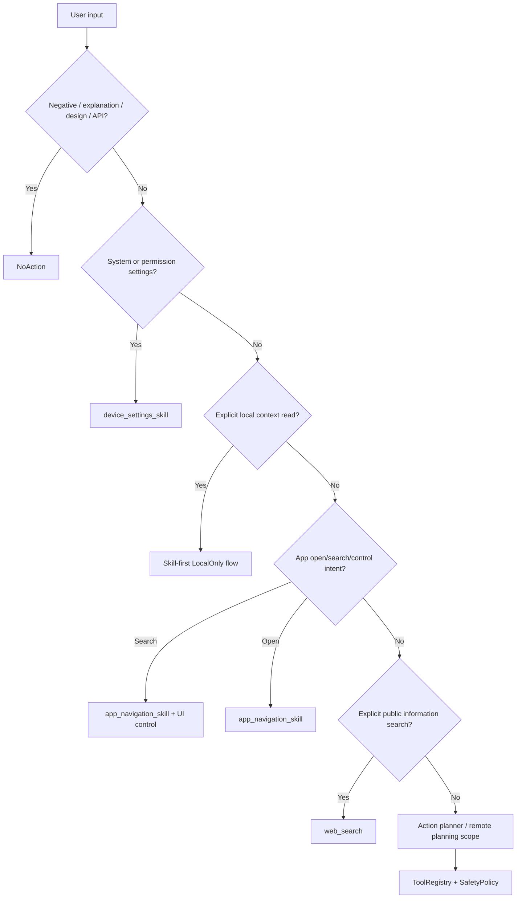

# Intent Routing / Skill Arbitration

## 目标

路由层只回答一个问题：这句话是否已经足够明确，可以安全地进入某个
Skill/tool 边界？

原则是“明确动作优先、风险边界优先、误触发最小化”。没有明确动作意图时，
必须保持 `NoAction`，让聊天回答处理解释、讨论、否定、设计和 API 问题。

## 当前决策流

## 优先级矩阵

| 输入类型 | 示例 | 期望路径 | 边界 |
| --- | --- | --- | --- |
| 否定、解释、设计讨论 | `解释 Wi-Fi`、`不要打开 Wi-Fi`、`Wi-Fi 设置页面怎么设计` | `NoAction` | 不进入 Skill，不生成工具草稿。 |
| 系统 Wi-Fi 设置动作 | `打开WiFi`、`打开 WiFi`、`打开 Wi-Fi` | `device_settings_skill` / `open_wifi_settings` | 系统设置优先于同名 App。 |
| 其他系统/权限设置动作 | `打开无障碍设置`、`打开 Usage Access` | `device_settings_skill` / 对应 settings tool | 需要确认；特殊访问不当作普通 runtime permission。 |
| 明确命名 App 打开 | `打开名为 WiFi 的 App` | App navigation 层 | 不能误触系统 Wi-Fi 设置。 |
| App 内搜索 | `打开淘宝搜索耳机` | App navigation + UI control | 仅低风险搜索闭环；失败时保留 resolver evidence。 |
| 普通 App 打开 | `打开淘宝` | App navigation 层 | 不接受任意 Intent、Activity、extras 或未白名单 deep target。 |
| 本地私密读取 | `总结剪贴板`、`读取当前屏幕文字` | Skill-first LocalOnly flow | 需要确认；结果不得进入远程 continuation。 |
| 公开信息检索 | `查一下今天杭州天气`、`搜索 Rust 最新版本` | `web_search` | 只做 public evidence；个人信息或疑似 secret 查询回到确认/保护路径。 |

## 模块职责

- Skill-first parser：只处理边界清楚、参数可本地保守提取的请求。
- Action planner：作为兼容和补充，不应覆盖明确的系统设置、权限设置、
  LocalOnly 读取或 App navigation Skill。
- Remote planning scope：只暴露 remote-safe planning specs；本地私密 evidence
  工具不进入远程工具列表。
- `ToolRegistry`：最终确认 tool 是否存在、参数是否合法、risk/permission/tag
  是否满足执行边界。
- `SafetyPolicy`：最终决定是否必须确认、是否拒绝、是否允许低风险免确认。

## Resolver Evidence 策略

`UiTargetResolver.explain()` 只用于诊断 App 内搜索/control 失败，不替代实际
Accessibility 执行路径。

Debug eval receiver 可以把这些字段写入 tap/type/submit 的 request result：

- ranked candidates
- label
- bounds
- clickable/editable
- profile hint
- score components
- selected node
- failure kind

正式 tool result schema 暂不扩大；用户侧只看到安全摘要。

## 验证合同

- `IntentRoutingDecision`：记录 Skill-first、ActionPlanner、remote planning 的命中路径、优先级、拒绝原因和确认策略。
- `UiTargetResolutionEvidence`：记录 resolver 候选排名、命中节点、分数构成和失败类型。
- `AgentBehaviorEvalCase`：记录输入、期望工具、确认策略、risk level、LocalOnly/RemoteEligible 和允许失败模式。
- `DeviceVerificationArtifact`：记录 serial、API、ABI、test count、failedTarget、reason、instrumentation/logcat 路径和 SHA-256。
- `ModelCapabilityProfile`：复用现有 `ModelProfile`，让 UI/runtime 从单一 profile 判断 chat、vision、embedding、action 能力。

脚本层 artifact 仍落到 `device-verification.properties`，并绑定
instrumentation/logcat SHA。Release validation verifier 必须用这些 SHA 证明
报告内容真实存在，而不是只填路径。
