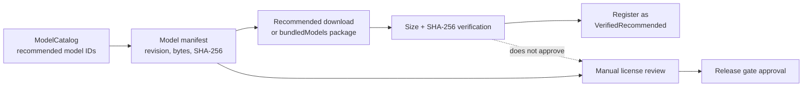

# Model Manifest

This file owns the provenance contract for Solin recommended model
artifacts. It is the source used by model license review and release gates for
model ID, repository, pinned upstream revision, byte size, and SHA-256 digest.
Runtime privacy behavior belongs in `docs/privacy_notice.md`; internal
model-included packaging belongs in `docs/bundled_model_package.md`.

## Boundary Rules

- A pinned upstream revision plus SHA-256 identifies bytes. It does not approve
  the model license, redistribution, attribution, or store-policy use.
- The license columns are a release-readiness checklist, not legal advice.
  License names, redistribution rights, attribution, and notice requirements
  must be manually checked against the upstream model repositories before a
  release candidate.
- Hugging Face authorization is an access boundary only. A read token may allow
  downloading a gated asset after the user or builder has accepted upstream
  terms; it does not grant Solin permission to redistribute that asset.
- APK signing proves package identity for Android install/update purposes. It
  does not prove model provenance or grant model authorization.
- Chat model token budgets are runtime context-window limits. They are not API
  keys, Hugging Face tokens, or license credentials.

`VERIFY_MODEL_URLS=1` can verify availability and file metadata; it does not
verify licensing. `scripts/collect_model_license_metadata.sh` records current
Hugging Face model-card license metadata in
`docs/model_license_metadata.json`, but that file is only an input to human
review. The collector derives the model list from this manifest, not from the
review record, so stale review files cannot narrow the set of recommended
models.

The release gate reads `docs/model_license_review.json` for final approval and
requires each approval to name the manifest repository and pinned upstream
revision. Approved review evidence must bind the reviewed license source and
the current manifest by SHA-256.

The internal `bundledModels` quick-experience package consumes this same
manifest. It can package pinned assets into install-time modelpack split APKs
for lab validation, but that packaging path does not change the license,
redistribution, attribution, or store-policy review requirements.
Because those split APKs contain model bytes, any handoff outside local lab
validation must be treated as model redistribution and must be approved in
`docs/model_license_review.json` before distribution.

## Runtime Mapping

Recommended profiles map to different runtime paths:

- `chat-e2b` and `chat-e4b` are `.litertlm` local chat models. Their catalog
  profiles declare Text+Vision input, so verified files can process bounded
  user-provided image bytes on device.
- `memory-embedding-gemma-300m` is not a chat model and is not a LiteRT-LM
  conversational runtime. It uses an EmbeddingGemma `.tflite` primary file plus
  the `sentencepiece.model` companion through the local text-embedding runtime.
- `mobile-action-270m` is an optional experimental low-resource `.litertlm`
  action-planning model. Observation-to-action planning prefers verified E2B/E4B
  Chat models; this model is a fallback when no verified Chat planning model is
  available. The runtime falls back to conservative rule planning when the
  selected planning model is missing, fails to load, or produces no valid draft.

For memory embedding, the companion tokenizer is part of the verification
closure. Semantic memory becomes eligible only when the primary `.tflite`, the
`sentencepiece.model` companion, catalog size/SHA checks, and runtime probe all
succeed.

## Recommended Model Artifacts

The table rows describe primary artifacts. Companion assets are listed below so
the machine-readable Bytes/SHA-256 columns continue to match the primary model
profile fields used by release verifiers.

| ID | File | Repository | Upstream revision | Bytes | SHA-256 | License status |
| --- | --- | --- | --- | ---: | --- | --- |
| `chat-e2b` | `gemma-4-E2B-it.litertlm` | `https://huggingface.co/litert-community/gemma-4-E2B-it-litert-lm` | `a4a831c060880f3733135ad22f10e0e9f758f45d` | `2588147712` | `181938105e0eefd105961417e8da75903eacda102c4fce9ce90f50b97139a63c` | Release blocker: manually verify upstream license, attribution, notice, and redistribution terms. |
| `memory-embedding-gemma-300m` | `embeddinggemma-300M_seq256_mixed-precision.tflite` | `https://huggingface.co/litert-community/embeddinggemma-300m` | `870cbe05ef460385363c6b574c851ae5d8989ce3` | `179131736` | `37115ef7bff76cd37dd86abe503ff511b1032bf85fc624a85c49c84899e92bc5` | Release blocker: gated Gemma asset; download requires Hugging Face authorization and manual license review. |
| `mobile-action-270m` | `mobile-actions_q8_ekv1024.litertlm` | `https://huggingface.co/litert-community/functiongemma-mobile-actions_q8_ekv1024.litertlm` | `82d0f654a6270c518d16c600edce3136221b3347` | `284426240` | `92109695f911d1872fa8ae07c1e3ff0ed70f2c3d1690d410ec6db8587c2ab409` | Release blocker: manually verify upstream license, attribution, notice, and redistribution terms. |
| `chat-e4b` | `gemma-4-E4B-it.litertlm` | `https://huggingface.co/litert-community/gemma-4-E4B-it-litert-lm` | `65ce5ba80d8790d66ef11d82d7d079a06f3fef97` | `3659530240` | `0b2a8980ce155fd97673d8e820b4d29d9c7d99b8fa6806f425d969b145bd52e0` | Release blocker: manually verify upstream license, attribution, notice, and redistribution terms. |

Companion asset for `memory-embedding-gemma-300m`:
`sentencepiece.model`, bytes `4683319`, SHA-256
`d6daa52d93d7aad10e8388bd526c4e501d914b47177398d1d9621f1fe48438c7`,
same upstream revision
`870cbe05ef460385363c6b574c851ae5d8989ce3`, and same gated authorization and
manual review boundary.

## Custom Models

Custom imported or custom URL models are user-supplied. They can be useful for
local testing, but they are not covered by this manifest, the recommended-model
SHA-256 guarantees, or the recommended-model license review.

Custom URL downloads accept HTTPS `.litertlm` chat model URLs, with HTTP limited
to local debug hosts. Local import is also restricted to `.litertlm` display
names before copy. Custom imports are registered as unverified custom chat
models and do not imply memory embedding, mobile action planning, or local
vision support.

## Release Review Record

For each release candidate, record the manifest repository, pinned upstream
revision, verified license name, concrete source URL or license file path,
attribution or notice obligations, redistribution decision, reviewer, review
date, review evidence file path, and matching evidence SHA-256 in
`docs/model_license_review.json`.
