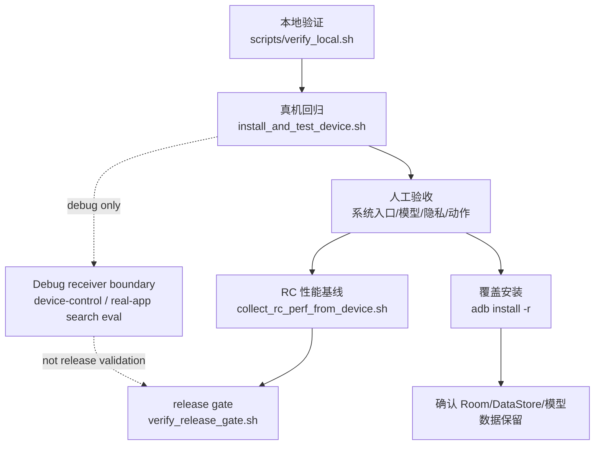

# 真机验收指南

本页只回答一件事：怎样在真机或模拟器上证明当前构建能安装、启动，并通过关键用户路径。发布放行由 `docs/release_checklist.md`、最终 release gate 和 release owner sign-off 判定；`docs/release_blocker_dashboard.md` 只汇总风险。

## 证据口径

- 真机证据优先。JVM、lint、build、模拟器、debug eval、人工观察都不能替代 release physical-device evidence。
- release 真机证据必须绑定设备 serial、API、ABI、执行命令、APK/AAB SHA-256、`device-verification.properties`、`instrumentation.txt`、`logcat.txt` 及对应 SHA-256。
- 失败也要可审计：报告必须写 `failedTarget` 和 `reason`，不能只写自由文本。
- debug device-control 和 real-app search eval 只证明 App 控制链路 readiness，不是正式 release validation。
- 覆盖安装必须使用 `adb install -r` 或脚本中明确的覆盖安装路径，并记录数据是否保留。
- `bundledModels` 是内部体验包口径，不是 Play/public release 口径；模型 license、redistribution approval、正式签名和 store/privacy review 仍要单独完成。



## 连接设备

1. 手机连续点击“版本号”打开开发者选项。
2. 打开“USB 调试”。如果使用无线调试，同时打开“无线调试”。
3. 使用支持数据传输的 USB 线连接 Mac。
4. 在手机弹窗中允许调试。
5. 在仓库根目录确认设备：

```bash
adb devices -l
```

继续前必须看到一台状态为 `device` 的已授权设备。多台设备同时连接时，显式设置：

```bash
export ANDROID_SERIAL=<physical-device-serial>
```

小米 / HyperOS / MIUI 出现 `INSTALL_FAILED_USER_RESTRICTED` 时，在开发者选项里打开“USB 安装 / 通过 USB 安装”，并在安装确认弹窗中允许。

无线调试时，配对端口和调试端口通常不同。先用手机上显示的配对码配对，再连接调试端口：

```bash
adb pair <phone-ip>:<pair-port>
adb connect <phone-ip>:<debug-port>
adb devices -l
export ANDROID_SERIAL=<phone-ip>:<debug-port>
```

当前脚本把非 `emulator-*` serial 视作真机候选；无线真机同样需要授权状态为 `device`。

## 自动回归

本地验证不要求设备，也不要求 `adb` 在 `PATH`：

```bash
scripts/doctor.sh
scripts/verify_local.sh
```

真机或模拟器验收要求 Android SDK 中存在 `adb`，且目标设备已授权：

```bash
scripts/doctor.sh --device
ANDROID_SERIAL=<physical-device-serial> scripts/install_and_test_device.sh
```

`doctor --device` 只检查 SDK 工具。设备选择、授权状态、ABI、可用空间、APK 安装、AndroidTest 安装、instrumentation 总数和 App 启动由 `install_and_test_device.sh` 检查。没有授权设备、设备 `offline` / `unauthorized`、未指定目标且存在多台设备时，脚本会在 Gradle 构建、安装和 instrumentation 前退出。

默认脚本使用 `adb install -r` 覆盖安装并保留 App 数据。只有显式设置
`RESET_APP_DATA_AFTER_TESTS=1` 时，脚本才会在退出前执行 `pm clear`，这会删除私有存储中的模型文件、模型登记、远程配置、会话和消息。需要连旧安装包一起清理时使用：

```bash
CLEAN_DEVICE=1 ANDROID_SERIAL=<physical-device-serial> scripts/install_and_test_device.sh
```

需要在报告中明确记录保留测试后的数据、模型或远程配置时，可显式设置：

```bash
RESET_APP_DATA_AFTER_TESTS=0 ANDROID_SERIAL=<physical-device-serial> scripts/install_and_test_device.sh
```

不要用 `./gradlew :app:connectedDebugAndroidTest` 作为最后一步来保留真机安装；Android Gradle Plugin 可能在 instrumentation 后清理安装包。

instrumentation 超时必须按失败记录，不能替代 release physical-device evidence。至少保留 `failedTarget`、`reason`、`instrumentation_test_count`、设备 serial/API/ABI、`instrumentation.txt` SHA-256 和 `logcat.txt` SHA-256。需要缩小复现范围时再设置：

```bash
INSTRUMENTATION_CLASS=<fully.qualified.TestClass> \
ANDROID_SERIAL=<physical-device-serial> \
scripts/install_and_test_device.sh
```

## 覆盖安装与人工安装

人工查看当前 debug 包时，不要把完整 smoke 脚本作为最后一步；它会运行 instrumentation，和人工安装证据不是同一口径。使用只负责安装和报告的脚本：

```bash
ANDROID_SERIAL=<physical-device-serial> \
ARTIFACT_DIR=build/verification/manual-acceptance-install-current \
scripts/install_review_device.sh
```

需要临时注入远程模型配置时通过环境变量传入。报告只记录变量来源，不记录实际密钥：

```bash
ANDROID_SERIAL=<physical-device-serial> \
SOLIN_REVIEW_REMOTE_BASE_URL=<https-base-url> \
SOLIN_REVIEW_REMOTE_MODEL=<model-name> \
SOLIN_REVIEW_REMOTE_API_KEY=<api-key> \
ARTIFACT_DIR=build/verification/manual-acceptance-install-remote-current \
scripts/install_review_device.sh
```

该报告会写 `target=manual-acceptance-install` 和 `regressionEvidence=false`，只能作为人工安装证据，不能作为 release physical regression evidence。

正式包人工覆盖安装使用已签名 release APK。该路径保留 App 数据，不运行 instrumentation，不支持 debug receiver 注入远程配置：

```bash
SOLIN_REVIEW_TARGET=device \
SOLIN_REVIEW_APK_MODE=release \
SOLIN_REVIEW_APK_PATH=<signed-release.apk> \
ANDROID_SERIAL=<physical-device-serial> \
ARTIFACT_DIR=build/verification/manual-acceptance-install-release-current \
scripts/install_review_device.sh
```

内部 ad hoc release smoke 可以先使用签名 helper 在本地私有环境生成签名 APK，再用上面的 review install 路径覆盖安装。`ALLOW_DEBUG_KEYSTORE=1` 只适合本地 lab；正式签名必须设置生产 keystore 环境变量和 `EXPECTED_SIGNING_CERT_SHA256`：

```bash
ALLOW_DEBUG_KEYSTORE=1 scripts/sign_release_artifacts.sh
```

覆盖安装后重点确认：已有 Room/DataStore 状态、会话、远程配置和已下载模型按预期保留；如果之前选择过远程模式，需手动切回本地再判断 bundled/local 模型是否可用。

## 隐私边界人工核对

远程模型模式下，`记住：...` 只写入本地记忆，不应发送到远程模型。相关验收记录必须说明本地记忆、Accessibility 文本、OCR 摘录和截图派生内容的隐私等级；OCR 摘录属于 `LocalOnly`，只能用于本机一次性确认或本地处理路径。

本地视觉验收需要单独覆盖：已校验且声明 vision 的本地聊天模型可在设备内处理用户主动选择的图片字节；不支持本地 vision 时不得读取图片字节、不得隐式 OCR、不得发送远程。远程 vision 仍必须经过逐次预览确认。

## 内置模型体验包

验收“安装后直接可用”的内部体验包时，使用 `bundledModels` split 包，不使用普通 debug/release 单 APK。该路径会把推荐的 E2B、E4B、本地记忆模型和设备动作模型打入 install-time modelpack split，并在首启复制、校验、注册到本地模型目录。

```bash
export SOLIN_BUNDLED_MODELS_DIR=/path/to/verified/model/files
ALLOW_DEBUG_KEYSTORE=1 \
INSTALL_ON_DEVICE=1 \
ANDROID_SERIAL=<physical-device-serial> \
scripts/package_bundled_models.sh
```

安装必须使用脚本固定的 `adb install-multiple --no-incremental -r`。不要退回 incremental install；大型 split 包的快速 incremental `Success` 不能作为安装成功证据，必须以 PackageManager 中可见的 base APK 和四个 modelpack split 为准。

至少确认：

- `pm path com.bytedance.zgx.solin` 同时列出 `base.apk` 和四个 split：`split_modelpackE2b.apk`、`split_modelpackE2bExtra.apk`、`split_modelpackE4b.apk`、`split_modelpackE4bExtra.apk`。
- 模型管理页中 E2B、E4B、本地记忆模型、设备动作模型都显示 `SHA-256 已校验`。
- 新装或切回本地后，首页显示 `本机模型已就绪`，当前模型为基础对话 E2B，健康状态为 `已加载`，并标明 GPU 或 CPU backend。
- 本地记忆文件 SHA 校验通过不等于语义记忆 runtime 已可用；embedding runtime probe 失败时，UI 可显示 `已安装待探测` 或 `已回退轻量索引`。

## 模拟器与远程 debug 检查

模拟器用于 UI、确认链路、工具失败路径和普通聊天回归；LiteRT-LM 性能、GPU 行为和正式 release physical evidence 仍以真机为准。

```bash
AVD_NAME=focus_agent_api36_arm64 scripts/regression_emulator.sh
```

完整模拟器回归只以 `regression-emulator.properties` 中的 `status=passed` 为准。

在 x86 Linux 工作站做 UI 实效检查时，先准备 x86_64 AVD，再跑截图链路：

```bash
scripts/check_x86_emulator_host.sh
APPLY=1 scripts/prepare_x86_emulator.sh
scripts/capture_x86_release_screenshots.sh
```

默认 AVD 为 `solin_api36_x86_64`，默认 headless 启动参数为 `-no-window -no-audio -no-boot-anim -gpu swiftshader_indirect -no-snapshot`。如果要打开模拟器窗口，可显式传空的 `EMULATOR_ARGS`，但当前新版 Android Emulator 的 Qt UI 可能要求 glibc 2.30 或更新：

```bash
EMULATOR_ARGS= scripts/capture_x86_release_screenshots.sh
```

这条 x86_64 链路只用于开发模拟和截图复核；正式 release evidence 仍以 arm64 模拟器矩阵和 arm64 真机验收为准。

已有模拟器时可用 emulator-only helper，避免误选真机：

```bash
ANDROID_SERIAL=emulator-5554 scripts/verify_emulator.sh
```

真实远程模型 debug 检查使用 `scripts/live_remote_emulator.sh`。脚本默认只选 emulator；要在真机上跑必须显式设置 `SOLIN_LIVE_REMOTE_TARGET=device`。远程 base URL、model、API key 必须来自环境变量，报告不得记录实际 key。

```bash
SOLIN_LIVE_REMOTE_TARGET=device \
ANDROID_SERIAL=<physical-device-serial> \
SOLIN_LIVE_REMOTE_BASE_URL=<https-base-url> \
SOLIN_LIVE_REMOTE_MODEL=<model-name> \
SOLIN_LIVE_REMOTE_API_KEY=<api-key> \
scripts/live_remote_emulator.sh
```

## Debug App 控制验收

手机控制专项验收使用已授权真机和 debug eval receiver：

```bash
ANDROID_SERIAL=<physical-device-serial> scripts/run_device_control_debug_eval.sh
ANDROID_SERIAL=<physical-device-serial> scripts/run_real_app_search_eval.sh
```

`run_real_app_search_eval.sh` 验证真实 App 的低风险搜索闭环，不等同于正式 release validation。完成 debug 验收后，应使用 `adb install -r` 覆盖安装最新签名 release 包，以保留已下载模型数据并恢复正式包。

报告要求：

- 顶层 fatal 必须写 `failedTarget` 和 `reason`，例如 `device-selection` / `selected-device-unavailable`。
- 已选中设备后必须记录 serial/API/ABI、logcat 路径和 SHA-256。
- 每个失败 case 使用 `RealAppSearchCaseArtifact/v1`，包含 `failed_step`、debug receiver `result_file` 与 SHA-256、resolver evidence、diagnostics 目录、截图、UIAutomator XML、focused-window dump、logcat 路径和 SHA-256。
- 淘宝、拼多多、高德、京东、Chrome、Android Browser、Quark、UC 是低风险搜索矩阵目标；未安装只记录 skipped。

## 手工验收场景

手工验收只记录用户可见行为和必要系统弹窗，不能用脚本通过、直接调用 ViewModel/reader、mock intent 或 UI 文案存在替代。

## 必须手工验收的系统入口

- 语音输入必须在设备上点麦克风入口，观察 Android 系统语音识别、收音/转写条、取消/完成状态和最终文本进入输入框。
- 系统文档选择器必须从输入区附件按钮打开，观察本地摘录、metadata-only、远程预览确认和取消路径。
- 当前屏幕截图 OCR 必须在确认卡后观察 Android MediaProjection 前台同意弹窗；取消和同意后的单次消费行为不能用 provider 直接调用替代。

聊天中只应追加安全摘要；结构化工具结果、allowlisted completion metadata
和执行细节通过 Agent trace / audit 入口查看。Agent trace / audit 应提供足够的
状态、工具名、风险、权限和脱敏摘要，不能暴露原始私密 payload。

| 场景 | 必看点 |
| --- | --- |
| 模型准备 | 主界面的远程配置、推荐模型下载、导入模型或内置体验包路径；下载进度/取消、`SHA-256 已校验`、离线问答、token/s、模型切换、GPU 失败后 CPU fallback。 |
| 导入模型 | `.litertlm` 可导入并加载；非 `.litertlm`、无效 URL、空间不足、断网都有可理解失败提示。 |
| 远程模型 | HTTPS 配置、API key 非明文保存、流式响应、取消恢复、错误不泄露响应体或 Authorization；敏感内容逐次确认，取消不得请求远程。 |
| 记忆 | `记住/忘记/清空` 只走本地控制路径；远程模式不得自动携带长期记忆文本或 embedding。语义记忆必须证明不是关键词召回。 |
| 动作与 Skill | 中高风险和外发文本动作先确认；取消不执行；低风险公开 `web_search` 可无确认；混入私密或副作用工具的批次全批拒绝。 |
| 系统入口 | 语音输入、系统文档选择器、MediaProjection 当前屏幕 OCR 必须在设备上点真实系统入口。 |
| 多模态 | 文本/RTF/PDF/Office 只做有界本地摘录；图片仅在已验证本地视觉或逐次确认远程视觉时读取；覆盖 8 MB 单图、最多 5 张、unsupported local/remote vision fail-closed、图片不进入文本 prompt/history/audit；音频/视频/未知二进制 metadata-only。 |
| 后台任务 | 提醒确认后才创建；Android 13+ 通知权限拒绝不误报成功；任务完成/失败/取消后的列表状态正确。 |
| 资源入口 | compact 宽度从 `更多` 菜单进入；普通状态不显示大号百分比圆环；详情优先展示 App 内存、可用 RAM、App CPU、温度，高级 heap 指标靠后。 |

远程模型模式下，`记住：...` 只写入本地记忆控制路径，不把长期记忆文本或 embedding 自动发送给远程模型。OCR 摘录按 LocalOnly 处理；远程视觉发送与 OCR 工具分离，必须经过逐次确认。

## RC 性能基线

正式 RC 主路径是 `scripts/collect_rc_perf_from_device.sh`。它安装 `rcPerfRelease` 测量 APK 但把 perf baseline 绑定到最终签名 RC artifact；脚本不清数据、不删除已下载模型，并要求 `RELEASE_ARTIFACT` 与 `APP_VERSION`：

```bash
ANDROID_SERIAL=<physical-device-serial> \
RELEASE_ARTIFACT=app/build/outputs/apk/release/app-release-signed.apk \
APP_VERSION=<versionName> \
HARNESS_MODEL_ID=<installed-vision-chat-model-id> \
scripts/collect_rc_perf_from_device.sh
```

`HARNESS_MODEL_ID` 可指定已安装且支持视觉输入的本地对话模型，例如 `chat-e4b`。该参数只决定本次只读 perf harness 加载哪个已安装模型，不修改用户当前 active model，不删除模型文件。底层手工 fallback 才直接调用 `collect_perf_baseline.sh`，且必须填入所有已测得字段，不生成推测值：

```bash
OUT_FILE=build/verification/rc/perf-baseline.properties \
RELEASE_ARTIFACT=app/build/outputs/apk/release/app-release-signed.apk \
APP_VERSION=<versionName> \
MODEL_ID=chat-e2b \
BACKEND=GPU \
FIRST_LAUNCH_INTERACTIVE_MS=<measured> \
MODEL_LOAD_MS=<measured> \
FIRST_TOKEN_MS=<measured> \
TOKENS_PER_SECOND=<measured> \
STOP_GENERATION_RECOVERY_MS=<measured> \
GPU_FALLBACK_STATUS=<not-needed|cpu-fallback-passed> \
VISION_INPUT_MS=<measured> \
MEMORY_SEARCH_5K_MS=<measured> \
ZVEC_MEMORY_INDEX_50K_MS=<measured> \
ZVEC_MEMORY_SEARCH_50K_MS=<measured> \
MEMORY_PEAK_MB=<measured> \
OOM_OR_ANR_OBSERVED=false \
scripts/collect_perf_baseline.sh
```

正式 manual acceptance 和 release-flow 证据用脚本生成，不手写 JSON 片段。两个脚本都要求
`OWNER`、`SOURCE_EVIDENCE_FILES`、`RELEASE_ARTIFACT_SHA256`，并且必须一次覆盖全部 required keys / flows 才能作为 passed release validation 证据：

```bash
OWNER=<qa-owner> \
SOURCE_EVIDENCE_FILES=<comma-separated-evidence-files> \
RELEASE_ARTIFACT_SHA256=<signed-release-apk-sha256> \
MANUAL_ACCEPTANCE_ALL=1 \
scripts/record_manual_acceptance_evidence.sh

OWNER=<qa-owner> \
SOURCE_EVIDENCE_FILES=<comma-separated-evidence-files> \
RELEASE_ARTIFACT_SHA256=<signed-release-apk-sha256> \
RELEASE_FLOW_ALL=1 \
scripts/record_release_flow_evidence.sh
```
