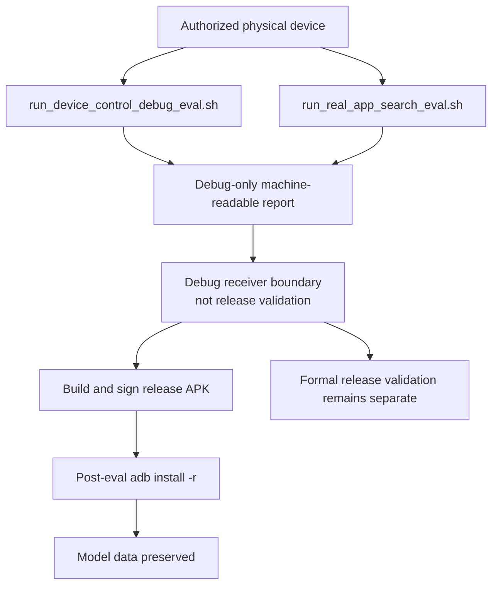

# 真机验收清单

本页用于 device/emulator 验收，要求 Android SDK 中存在 `adb` 并连接一台已授权设备或模拟器。本地 JVM/lint/build 验证见 README 的 Testing 章节，不要求 `adb`。

## 连接手机

1. 手机设置里连续点 7 次“版本号”，打开开发者选项。
2. 在开发者选项里打开“USB 调试”。
3. 用支持数据传输的 USB 线连接 Mac。
4. 手机弹窗选择允许调试。
5. 在项目根目录运行：

```bash
adb devices -l
```

看到一台设备状态为 `device` 后继续。

小米 / HyperOS / MIUI 设备如果出现 `INSTALL_FAILED_USER_RESTRICTED`，需要在开发者选项里打开“USB 安装 / 通过 USB 安装”，并在手机弹出的安装确认里点允许。

## 自动回归

本地 JVM/lint/build 验证不要求连接设备，也不要求 `adb` 在 PATH：

```bash
scripts/doctor.sh
scripts/verify_local.sh
```

真机或模拟器验收要求 Android SDK 中存在 `adb`，并连接一台已授权设备：

```bash
scripts/doctor.sh --device
scripts/install_and_test_device.sh
```

`doctor --device` 只确认 SDK 里的 `adb` 工具可用；是否存在可执行验收的设备由
`install_and_test_device.sh` 检查。没有已授权设备、设备为 `offline` /
`unauthorized`，或多台已授权设备同时连接且没有指定目标时，脚本会在 Gradle
构建、APK 安装和 instrumentation 前退出。

脚本会检查：

- 只连接了一台已授权设备；或通过 `ANDROID_SERIAL` 选择其中一台。
- 设备支持 `arm64-v8a`。
- `/data` 分区大致有 3 GB 以上可用空间。
- Debug APK 可以安装。
- AndroidTest APK 可以安装。
- instrumentation runner 报告的测试总数全部通过。
- App 可以被启动。

如果 instrumentation 超时，报告必须按失败记录处理，不能替代 release
physical-device evidence。重点记录 `device-verification.properties` 中的
`failedTarget`、`reason`、`instrumentation_test_count`、设备 serial/API/ABI、
`instrumentation.txt` 和 `logcat.txt` SHA；必要时再用 `INSTRUMENTATION_CLASS=...`
缩小到单个测试类复现。

默认情况下，脚本会保留已安装的 debug App，但会在最终手动启动前执行 `pm clear`
清空 App 数据，避免 instrumentation 写入的测试状态残留到验收起点。这会删除 App
私有存储里的已下载模型文件、模型登记记录、远程模型配置、会话和消息。需要连旧安装包也一起清理时，显式运行：

```bash
CLEAN_DEVICE=1 scripts/install_and_test_device.sh
```

`CLEAN_DEVICE=1` 会在测试前卸载旧调试包，已经下载好的模型会被清掉；只在确认可以重新下载或重新导入时使用。确实需要保留测试后的 App 数据、已下载模型或远程配置时，显式设置
`RESET_APP_DATA_AFTER_TESTS=0`，并避免卸载、手动 `pm clear` 或切到会清数据的完整验收脚本。

需要保留真机安装时，不要直接运行 `./gradlew :app:connectedDebugAndroidTest`；Android Gradle Plugin 可能会在 instrumentation 结束后清理安装包。

手机控制专项验收使用已授权真机和 debug eval receiver：

```bash
ANDROID_SERIAL=<physical-device-serial> scripts/run_device_control_debug_eval.sh
ANDROID_SERIAL=<physical-device-serial> scripts/run_real_app_search_eval.sh
```

`run_real_app_search_eval.sh` 验证真实 App 的低风险搜索闭环。它不等同于正式
release validation；完成 debug 验收后，使用 `adb install -r` 覆盖安装最新签名
release 包，以保留已下载模型数据并恢复正式包。

两个 debug eval 脚本的顶层 report 也必须保留机器可读失败语义：设备选择、
Accessibility、目标 App 缺失或 case 失败不能只写自由文本。预检失败应分开记录
`failedTarget` 和 `reason`，例如选中的 serial 不可用时写
`failedTarget=device-selection` / `reason=selected-device-unavailable`；已选中设备后还应记录
serial/API/ABI 和 logcat 路径及 SHA-256。

真实 App UI 会持续变化；每次失败必须保留 case 级 artifact，而不是只写人工现象。
`<case>.case.properties` 使用 `RealAppSearchCaseArtifact/v1`，失败时必须包含
`failed_step`、debug receiver `result_file` 与 SHA-256、`target_resolution_*`
resolver evidence、`diagnostics_dir`、截图、UIAutomator XML、focused-window dump 和
logcat 的路径及 SHA-256。淘宝、拼多多、高德、京东、Chrome、Android Browser、Quark
和 UC 作为低风险搜索矩阵目标；未安装 App 只记录 skipped。



## 人工验收安装

如果目的是在手机上继续人工查看页面、远程配置、已下载模型或已保存会话，不要使用完整 smoke
脚本作为最后一步。`scripts/install_and_test_device.sh` 默认会在测试后清空 App 数据，
这会清掉模型数据、远程模型配置并把 App 带回无模型、无远程配置的干净起点。

人工查看当前 debug 包时使用：

```bash
ANDROID_SERIAL=<physical-device-serial> \
ARTIFACT_DIR=build/verification/manual-acceptance-install-current \
scripts/install_review_device.sh
```

需要临时注入远程模型配置时，通过环境变量传入；报告只记录变量来源，不记录实际密钥：

```bash
ANDROID_SERIAL=<physical-device-serial> \
POCKETMIND_REVIEW_REMOTE_BASE_URL=<https-base-url> \
POCKETMIND_REVIEW_REMOTE_MODEL=<model-name> \
POCKETMIND_REVIEW_REMOTE_API_KEY=<api-key> \
ARTIFACT_DIR=build/verification/manual-acceptance-install-remote-current \
scripts/install_review_device.sh
```

该脚本生成 `target=manual-acceptance-install`、`regressionEvidence=false` 的 report；
它只用于人工验收安装，不能作为 release validation 的 physical regression evidence。

## RC 性能基线

正式 RC 需要把真机实测指标写成 `perf-baseline.properties`，并与签名 APK/AAB 的
SHA-256 绑定。脚本只记录已经测得的值，不会生成推测值：

```bash
OUT_FILE=build/verification/rc/perf-baseline.properties \
RELEASE_ARTIFACT=app/build/outputs/apk/release/app-release-signed.apk \
ANDROID_SERIAL=<physical-device-serial> \
APP_VERSION=<versionName> \
MODEL_ID=chat-e2b \
BACKEND=GPU \
FIRST_LAUNCH_INTERACTIVE_MS=<measured> \
MODEL_LOAD_MS=<measured> \
FIRST_TOKEN_MS=<measured> \
TOKENS_PER_SECOND=<measured> \
STOP_GENERATION_RECOVERY_MS=<measured> \
GPU_FALLBACK_STATUS=<not-needed|cpu-fallback-passed> \
VISION_INPUT_MS=<measured> \
MEMORY_SEARCH_5K_MS=<measured> \
MEMORY_PEAK_MB=<measured> \
OOM_OR_ANR_OBSERVED=false \
scripts/collect_perf_baseline.sh
```

## Ad Hoc Release 覆盖安装

内部真机 smoke 可以使用 release 构建加本地临时签名覆盖安装，以验证混淆/压缩后的
APK 能启动并保留 App 数据。该流程不等同于正式分发签名：

```bash
./gradlew :app:assembleRelease

BUILD_TOOLS="$ANDROID_SDK_ROOT/build-tools/36.0.0"
UNSIGNED=app/build/outputs/apk/release/app-release-unsigned.apk
ALIGNED=app/build/outputs/apk/release/app-release-local-aligned.apk
SIGNED=app/build/outputs/apk/release/app-release-local-signed.apk

"$BUILD_TOOLS/zipalign" -p -f 4 "$UNSIGNED" "$ALIGNED"
"$BUILD_TOOLS/apksigner" sign \
  --ks "$HOME/.android/debug.keystore" \
  --ks-key-alias androiddebugkey \
  --ks-pass pass:android \
  --key-pass pass:android \
  --out "$SIGNED" \
  "$ALIGNED"
"$BUILD_TOOLS/apksigner" verify --verbose "$SIGNED"
adb -s "$ANDROID_SERIAL" install -r "$SIGNED"
adb -s "$ANDROID_SERIAL" shell am start -n com.bytedance.zgx.pocketmind/.MainActivity
```

验收记录应包含 APK 路径、SHA-256、设备 serial/model/API/ABI、`lastUpdateTime`、
启动 PID，以及是否清理数据。本流程只做覆盖安装和启动 smoke；完整真机回归仍以
`scripts/install_and_test_device.sh` 的 instrumentation 结果为准。
需要保留模型数据时只使用覆盖安装，不使用 `CLEAN_DEVICE=1`、卸载、清数据或
`pm clear`。

## 模拟器回归

模拟器用于 UI、确认链路、工具失败路径和普通聊天回归；LiteRT-LM 性能和 GPU 行为仍以真机为准。
工具执行矩阵由 JVM 单测覆盖；模拟器/真机仍用于确认卡、runtime permission 弹窗和 UI 审计入口端到端验证。

已启动一个模拟器时，优先使用 emulator-only helper，避免误选真机：

```bash
adb devices -l
ANDROID_SERIAL=emulator-5554 scripts/verify_emulator.sh
```

如果 `adb` 或 `emulator` 不在 `PATH`，先设置 SDK 路径，或直接使用
`$ANDROID_SDK_ROOT/platform-tools/adb` 与 `$ANDROID_SDK_ROOT/emulator/emulator`。

也可以让脚本先启动指定 AVD，再等待 boot completed 后复用安装和 instrumentation 流程：

```bash
AVD_NAME=focus_agent_api36_arm64 scripts/verify_emulator.sh
```

指定 `AVD_NAME` 且没有显式设置 `EMULATOR_ARGS` 时，脚本会用包含
`-wipe-data`、`-no-window` 和 `-no-snapshot-save` 的默认参数启动模拟器，避免旧
userdata 或快照状态污染验收。

完整模拟器回归优先使用更严格的 artifact gate；它会强制 `CLEAN_DEVICE=1`，
复用 emulator helper，并校验 `emulator-verification.properties`、
嵌套 `device-verification.properties` 和当前 AndroidTest 源码数量：

```bash
AVD_NAME=focus_agent_api36_arm64 scripts/regression_emulator.sh
```

`verify_emulator.sh` 只接受 `emulator-*` 目标；未指定 `ANDROID_SERIAL` 时要求恰好一台已授权模拟器。如果只有真机或同时存在多台模拟器，脚本会在 Gradle 构建、安装和 instrumentation 前退出。
`AVD_NAME` 不存在时会列出可用 AVD 并在 Gradle 前退出。失败时会在
`build/verification/` 下尽量保存截图、UI dump、短 logcat 和 emulator 日志路径。

完整回归记录至少包含设备序列号或 AVD 名称、API、ABI、是否设置
`CLEAN_DEVICE=1`、执行命令和 instrumentation 测试总数。device report 会用
`instrumentation_test_count` 记录该数量。脚本会在
`build/verification/` 下写入机器可读证据：真机 helper 产出
`device-verification.properties`；模拟器 helper 产出
`emulator-verification.properties`，并把复用的 device helper 摘要写入同目录的
`device-verification.properties`；完整模拟器回归还会产出
`regression-emulator.properties`。验收记录必须引用这些 artifact；没有对应
`status=passed` 摘要时，不应把设备或模拟器回归写成已执行通过。

### Live remote model check

真实远程模型检查使用 debug APK 和 `scripts/live_remote_emulator.sh`。脚本默认只选择
emulator；需要在真机上验证时必须显式设置
`POCKETMIND_LIVE_REMOTE_TARGET=device ANDROID_SERIAL=<serial>`。脚本不内置任何
provider endpoint、model 或 key；必须通过 `POCKETMIND_LIVE_REMOTE_BASE_URL`、
`POCKETMIND_LIVE_REMOTE_MODEL` 和 `POCKETMIND_LIVE_REMOTE_API_KEY` 显式传入配置，
密钥应从临时环境或静默 stdin 注入。脚本会通过 debug-only ADB receiver 写入远程配置，
发送一个固定提示，保存截图、UI dump、短 logcat 和
`live-remote-<target>.properties`；报告只记录 base URL、model 和密钥的来源变量名，
不记录实际 endpoint、model 或密钥值。脚本退出时会通过 debug receiver 清空设备内保存的
远程配置。默认提示不包含预期 token，验收通过必须来自远程助手回复中的
`POCKETMIND_LIVE_OK`。

## 必须手工验收的系统入口

自动回归通过只证明脚本、构建、JVM 单测和 instrumentation 覆盖的路径通过；必须手工验收的系统入口要单独记录，不能用脚本通过、直接调用 ViewModel/reader、mock intent 或 UI 文案存在替代。

- 语音输入必须在设备上点麦克风入口，观察 Android 系统语音识别、收音/转写条、取消/完成状态和最终文本进入输入框。
- 系统文档选择器必须从输入区附件按钮打开，观察本地模式摘录/metadata-only 行为，以及远程模式下主动选择的图片只在远程发送预览确认后、发送给支持 OpenAI-compatible `image_url` 的远程视觉模型/API；其他附件和分享文本不读取正文、文本摘录或 OCR 摘录。
- 当前屏幕截图 OCR 必须在确认卡后观察 Android MediaProjection 前台同意弹窗；取消和同意后的单次消费行为不能用直接调用 OCR provider 替代。

## 手动模型验收

1. 使用 `CLEAN_DEVICE=1 scripts/install_and_test_device.sh` 或手动清除数据后打开“PocketMind”，确认首屏会展示基础能力包准备向导。
2. 默认只勾选基础对话模型；设备动作模型资产可以手动勾选，或之后到“模型”里补装。本地记忆默认走轻量
   token/hash 索引，不以 memory model asset 为开启条件。
3. 下载中确认能看到进度、字节数和取消入口。
4. 下载完成后确认模型出现在“本地模型”，状态显示“SHA-256 已校验”。
5. 关闭 Wi-Fi/移动网络后输入一个中文问题，确认能生成回答。
6. 回答完成后，确认助手消息附近显示本次 token 数和 token/s。
7. 点“模型”，调整 Temperature、Top P、Top K，确认页面能解释参数效果；调整后下一次生成立即生效。
8. 再下载或导入第二个模型，在“本地模型”里点选切换，确认顶部当前模型名更新并重新加载。
9. 点“会话”新建第二个会话，切回第一个会话，确认历史消息仍在；删除当前会话后还能继续问答。
10. 粘贴一个 `.litertlm` 下载链接，确认可以从链接启动下载。
11. 如果 GPU 初始化失败，确认 App 自动切到 CPU，且仍可问答。
12. 导入或自定义链接下载一个模型，确认状态显示“自定义未校验”，且不会因为文件名和推荐模型相同而显示为已校验。
13. 如果设备上已有旧推荐模型文件，确认它先显示“旧文件未校验”，校验成功后才可加载；失败时不应自动删除文件。

## 导入模型验收

1. 卸载重装或清除 App 数据。
2. 把一个兼容的对话 `.litertlm` 模型放到手机存储。
3. 打开 App，点顶部“模型”，再点击“导入本地文件”。
4. 选择 `.litertlm` 文件，确认导入进度可见。
5. 导入完成后确认自动加载并可离线问答。

## 失败场景

- 用非 `.litertlm` 文件导入，应显示“请选择 .litertlm 模型文件”。
- 输入非 http/https 下载链接，应提示链接无效。
- 存储空间不足时，应显示空间不足提示。
- 断网或非 Wi-Fi 时，下载应等待或失败，并给出可理解状态。

## 远程模型验收

- HTTPS 服务地址加模型名应可保存并切换远程模式。
- 非本机 HTTP 地址应被拒绝；`localhost`、`127.0.0.1`、`10.0.2.2` 可用于本机调试。
- 配置 API Key 后重启 App，应仍可读取配置；SharedPreferences 中不应保存明文 key。
- 远程回答应逐步显示流式片段，取消生成后 UI 应回到可继续输入状态。
- 远程错误不应展示响应体、Authorization 或 API Key 内容。
- 远程模型模式下，当前输入如果包含手机号、邮箱、身份证、token/API key 或明确个人地址/密码/工号等敏感模式，应在本地拦截为 `LocalOnly` 提示，不应进入远程请求。

## 记忆与动作验收

- 开启记忆后，历史会话相关问题应能注入“本地记忆”上下文；关闭后不应显示记忆命中。普通会话召回仍由已保存会话历史重建，不写入长期记忆表。
- 输入本地记忆控制命令“记住：我喜欢简洁的中文回答”后，后续相关问题应能从显式持久化的偏好记忆中召回；已显式持久化的偏好/任务状态记录应出现在长期记忆列表。
- 默认轻量 token/hash 记忆可以通过保守的本地 alias 召回显式回答偏好和结构化活跃任务状态，例如“brief replies”召回“我偏好简洁回答”、“有哪些提醒”召回活跃 Reminder 任务；alias 不应写入 Room、长期记忆列表、`buildContext`、远程 prompt 或普通会话记录。
- 远程模型模式下，`记住：...` / `remember ...` 仍应只走本地控制路径，不应调用远程模型，也不应把控制命令、偏好内容或本地确认消息写入后续远程 history。记忆关闭时这些命令应以 `LocalOnly` 状态说明未保存，且不得写入新的长期记忆；`忘记`、单条删除和清空仍应删除已有记录。
- 仍处于运行中的后台任务应自动写入可遗忘的任务状态长期记忆，只包含任务类型、状态、触发时间和不透明任务记录 id；提醒标题、正文、工具参数、prompt 或远程响应不应进入长期记忆。任务取消、完成、失败或删除后，对应自动任务状态记忆应被移除。
- 重复执行同一句“记住：我喜欢简洁的中文回答”后，长期记忆列表不应出现重复偏好。
- 长期记忆应支持单条遗忘和清空；删除后不应再从对应显式持久化记录召回，清空不代表删除普通会话历史。
- 本地记忆不可用时，普通聊天仍应继续；此时不显示记忆命中，长期记忆列表可降级为空。
- 安装并校验推荐记忆模型后，只有 `.tflite` 文件和 runtime probe 都成功，才可认为语义记忆启用；UI 应显示“语义记忆可用”，否则应显示“已安装待探测”或“已回退轻量索引”。
- 语义验收必须证明不是关键词召回：例如保存“用户偏好：回复要简洁”后，使用无明显词面重叠的查询应命中该偏好并标记为 `Semantic`；删除记忆模型后，同一查询不应再有 semantic 命中，但长期记忆文本仍应保留并可通过轻量索引召回。
- 远程模型模式下不得自动携带长期记忆文本或 embedding 内容；只有用户显式复制进输入的内容才可能外发。
- 未安装或未校验动作模型时，动作请求应显示“规则回退”的待确认草稿。
- 安装并校验动作模型后，支持的动作请求可以显示“动作模型实验”的待确认草稿；执行前仍必须经过用户确认。
- 低风险只读 `web_search` 不应打开浏览器；公开查询例如“北京天气怎么样”应直接调用 Web 搜索工具，把公开结果作为证据交回模型组织回答。疑似包含手机号、邮箱、地址、身份证、工号、账号、密码、token、API key 或类似个人/密钥内容的查询应先展示确认，不应无确认联网。涉及比较、总结或判断时，模型应基于工具事实完成推理，证据不足时可继续调用公开只读工具补充。
- 远程模型模式下，明确的内置 Skill 请求应先走本地 preflight，以保护剪贴板、联系人、屏幕、OCR、设置和直接搜索等本地确认/执行路径；未被直接 Skill 命中的复杂公开问题可由远程模型选择工具。例如“北京和上海今天温差多少？”应允许远程模型发起两个 `web_search` 证据请求再综合回答。
- 远程模型一次返回多个公开只读证据工具调用时，只有全部工具都满足 `PublicEvidence` / `LowReadOnly` / `NotRequired` / 无私密输出 / 无设备或副作用权限，才允许并发执行并聚合结果回模型；例如“北京和上海今天温差多少？”可并发执行两个 `web_search` 后由模型计算温差。批次中混入打开设置、分享、读取剪贴板、文件、联系人、日历、通知、当前屏幕或截图 OCR 等工具时，应全批拒绝，不应执行安全子集。
- 并发公开证据批次中某个工具返回 retryable 失败时，只应重试失败的 request 一次；成功的 request 不应重复执行，重试后仍失败才把批次失败交回 Agent 观察。
- 确认动作后，聊天中只应追加安全摘要；结构化工具详情、allowlisted completion metadata 和审计状态应通过 Agent trace / audit 入口查看。外部 Activity 工具只能说明外部界面已打开且最终结果未验证。
- 取消动作后，不应打开外部 App 或系统页面，Agent run 应进入 `Cancelled` 并写入审计事件。
- 生成中点击停止后，当前 Agent run 应进入 `Cancelled`，迟到模型输出不应再改变 run 或生成新的待确认动作；最近 Agent 轨迹应刷新为取消状态。
- 出现可恢复的待确认动作后杀进程并重启 App，应恢复同一个确认 UI；恢复瞬间不应执行工具、不应弹 Android runtime permission，只有再次确认后才继续执行链路。含外发文本、搜索 query、提醒标题/正文、深链 URI、模型输出或私密读取结果的 payload-bearing 待确认动作应 fail closed，而不是恢复可执行参数。
- 需要 Android runtime permission 的工具应在确认卡提前展示友好权限名和用途；如果用户在系统权限弹窗中拒绝权限，不应执行工具、不应自动重试，应显示结构化权限失败并清除待确认状态，同时保留 raw manifest permission 供审计。
- 需要 Usage Access 的前台 App 摘要不应触发 Android runtime permission 弹窗；确认卡应说明系统“使用情况访问权限 / Usage Access”设置入口，未授权时不应读取数据、不应自动重试，应返回结构化权限失败。
- 授予 Usage Access 后再次触发前台 App 摘要，只应返回最小 App metadata，并标注为 `usage_stats_estimate` / `estimate`；不应展示完整使用历史、通知正文、窗口内容或自动上传到远程模型。
- 通过受确认保护的当前屏幕 Accessibility 文本快照工具读取当前屏幕文字时，应只在用户确认后读取当前 Accessibility 文本节点快照；结果应标记为 `LocalOnly`，raw `screenText` 不应进入 trace、audit、持久消息或远程 runtime。
- 当前屏幕 Accessibility 文本快照不等于截图、OCR、像素读取或语义屏幕理解；无 Accessibility 服务授权或节点读取失败时，应返回结构化失败，不应自动退化为截图/OCR/屏幕扫描。
- 通过受确认保护的 `capture_current_screenshot_ocr` 识别当前屏幕截图文字时，确认卡之后应出现 Android MediaProjection 前台同意；同意 token 只能由当前 pending tool requestId 在短 TTL 内消费一次，requestId 不匹配、过期或取消同意应返回结构化 `LocalOnly` 权限失败，不应执行截图或重试。
- 授予 MediaProjection 前台同意后，App 只应单次截取当前屏幕并在本地生成有界 OCR 摘录；结果应标记为 `LocalOnly` / `requiresLocalModel=true`，只包含 `ocrTextIncluded`、`truncated` 和 OCR 文本摘录，不应在 trace/audit/持久消息里保存图片像素、URI、路径、文件名、窗口标题、坐标或视觉描述。
- “打开链接 https://example.com” 应先出现确认；确认后只打开 HTTPS 链接，`http`、`file`、`content`、`javascript` 和自定义 scheme 应被拒绝。
- “启动微信” 或指定合法包名的 App 启动请求应通过 Skill-first 先出现确认；确认后只打开应用启动页，不接受任意 activity/action/data/extras。
- “打开微信应用详情设置” 或指定合法包名的 `android_app_details_settings` 请求应通过 Skill-first 先出现确认；确认后只打开白名单固定目标，不接受任意 targetId、URI、activity/action/data/extras。微信小程序、支付码、App 内设置或故障/文档问题不应降级成打开 App。
- 低风险 App 控制任务可以在打开 App 后继续执行观察、点击、输入、提交搜索、滚动和返回；顶部半透明进度条应展示当前步骤，执行完成后不再单独要求用户补录“是否完成”。
- 分享面板、草稿页、高风险或未知外部 Activity 打开后，UI、Agent trace 和 audit 只能说明“外部界面已打开，最终结果未验证”；不应声称分享、发送、保存或目标 App 内高风险操作已经完成，也不应基于未验证结果自动规划下一步工具。
- 上述高风险或未知 launch-only Agent run 应处于“等待外部结果确认”的状态，而不是已完成；只有用户补录外部结果后才进入完成、失败或下一步确认。
- 对上述 launch-only 结果，UI 应要求用户显式记录“已完成 / 未完成 / 只是打开了”。只有用户选择“已完成”后，trace/audit 才能记录 `externalOutcomeSource=UserConfirmed`、`completionVerified=true`，并允许 Agent 继续规划依赖该外部动作完成的下一步；“未完成”和“只是打开了”只记录结果，不应继续规划下一步工具。
- 如果 App 在高风险或未知外部界面打开后重启，当前会话应从 Agent trace 恢复外部结果确认 sheet；恢复过程不应重新执行工具、不应恢复原始参数/外发 payload，用户确认后应只追加 `ExternalOutcomeConfirmed`。若打开外部界面前已经记录了无参数、已验证的单工具 tail cursor，只有用户补录“已完成”后，才可在重新校验预算、工具注册表和安全策略后进入下一张确认卡；“未完成”和“只是打开了”不应继续规划。
- 如果 App 重启时某个 `AwaitingExternalOutcome` run 的 trace 已损坏或缺少可恢复的 launch-only `ToolObserved`/`ToolRequested` 元数据，启动修复应把该 run 标记为失败，而不是留下不可见、不可处理的外部结果等待状态。
- 如果 App 在多步请求的工具确认卡处重启，恢复后的确认仍不应恢复 raw 后续自然语言；只有无参数、已验证的单工具 tail 可以通过结构化 cursor 在用户重新确认当前工具且观察成功后进入下一张确认卡。
- 未知工具、缺少参数或没有可处理 Intent 的设备，应显示明确失败原因，不应崩溃。
- 工具参数错误、权限拒绝或 provider 失败应返回结构化失败；校验拒绝时不应执行 delegate。
- 支持的动作应能在 Agent trace 中形成 `ToolRequested -> UserConfirmed -> ToolObserved -> AssistantResponded` 顺序。
- Agent loop 硬预算耗尽时，应在生成下一张确认卡、重试或模型续写前 fail closed；失败原因应为通用预算原因，不应包含 prompt、模型输出、剪贴板、屏幕文本、联系人或 OCR 原文。
- 支持的动作应先经过 `SafetyPolicy`，中高风险或外发文本工具不允许绕过确认。
- 确认并执行动作后，`tool_audit_events` 应记录计划、请求确认、用户确认和观察结果；记录中不应包含 API Key、完整 prompt 或工具参数明文。
- 通过“后台任务”入口应能查看最近持久化工具审计事件；列表只展示时间、事件类型、工具名、状态、风险、权限和不含参数的安全摘要，不展示工具参数、prompt、远程响应、剪贴板原文、Authorization 或 API Key。
- 通过“后台任务”入口应能查看最近 Agent 轨迹摘要；轨迹 UI 只读展示 run 状态和 step 摘要，不展示工具参数、完整 prompt、原始剪贴板文本或持久化 trace JSON；Room 中的 `agent_runs.input` 不应保存原始 prompt，持久 trace 摘要、JSON 预览和 allowlisted metadata value 应脱敏 key/token/email/bearer 等敏感片段。
- 普通聊天路由可携带最小设备上下文，例如推理模式、能力类别、存储估计和是否存在待确认动作；上下文不应包含联系人、通知、剪贴板或文件内容。
- “读取剪贴板” 应先出现确认；确认后可读取当前文本剪贴板，审计日志不应保存原始剪贴板文本。
- “分享这段文字：...” 应先出现确认；确认后只打开 Android 系统分享面板，不能声明目标 App 已完成发送。

## Skill 验收

- “帮我写封邮件说明明天延期” 应进入邮件草稿 Skill，最终使用 `compose_email` 工具且仍需确认。
- “帮我建个明天下午开会的日程” 应进入日程 Skill，最终使用 `create_calendar_event` 工具且仍需确认。
- “查去机场的路线” 应进入地图 Skill，最终使用 `search_maps` 工具且仍需确认。
- “搜一下 Kotlin 协程” 应进入信息查找 Skill，最终使用低风险只读 `web_search` 工具且无需确认、不打开浏览器。
  设备/模拟器 smoke 至少应包含 `MainActivitySkillUiTest` 中远程模式下不调用远程模型、直接显示
  `正在使用工具：Web 搜索` 的路径。
- “提醒我 15 分钟后喝水” 应可由后台提醒 Skill 直接规划，不依赖动作模型先分类；最终使用 `schedule_reminder` 工具且仍需确认。
- “读取剪贴板” 应进入剪贴板上下文 Skill，最终使用 `read_clipboard` 工具且仍需确认。
- “分享这段文字：明天十点开会” 应进入系统分享 Skill，最终使用 `share_text` 工具且仍需确认。
- “总结剪贴板并分享” 即使不先进入普通动作草稿识别，也应进入剪贴板摘要分享 Skill：先确认 `read_clipboard`，本地摘要后再确认 `share_text`。
  设备/模拟器 smoke 至少应包含 `MainActivitySkillUiTest` 中远程模式下直接展示第一步
  `读取剪贴板` 确认卡、尚未展示 `分享摘要`，并可取消后留下审计/轨迹记录的路径。
- “总结当前屏幕文字并分享” 应进入当前屏幕文本摘要分享 Skill：先确认 `read_current_screen_text`，只用本地模型摘要后再确认 `share_text`；raw `screenText` 不应直接绑定到 `share_text.text`，也不应进入远程 runtime、持久 trace、audit、长期消息或 checkpoint。
  设备/模拟器 smoke 至少应包含 `MainActivitySkillUiTest` 中远程模式下直接展示第一步
  `读取当前屏幕文本` 确认卡、展示特殊授权说明、不展示 runtime permission 或
  `分享屏幕摘要`，并可取消后留下审计/轨迹记录的路径。
- “总结当前屏幕内容”、“总结这个界面”、“summarize current screen content”、“summarize this page”、“describe current screen” 或 “what is on my screen” 等未明确要求屏幕文字/可访问文本的请求，不应规划 `read_current_screen_text` 或当前屏幕摘要分享 Skill。
- 声明式多步 Skill 的模型输出只能通过 `argumentBindings` 进入后续工具确认卡；缺失 binding 或直接绑定私密工具原文到外发工具时应失败，不应生成确认卡、执行外发工具或泄漏原文。
- 声明式 `ToolStep -> ToolStep` 只可跨重启恢复低语义结构化参数形成的待确认 UI，例如 `schedule_reminder.taskId -> cancel_reminder.taskId`；恢复后仍必须再次确认才执行，且 `schedule_reminder` 的 title/body/delayMinutes 不应作为待确认 payload 跨重启恢复。
- “总结剪贴板并分享” 到第二个 `share_text` 确认卡后杀进程并重启 App，如果该确认卡包含模型生成的外发 payload，应 fail closed，不应恢复摘要参数、自动打开分享面板、重跑旧 `read_clipboard`，或让旧 request id 继续推进。
- “总结当前屏幕文字并分享” 到第二个 `share_text` 确认卡后杀进程并重启 App，也应 fail closed，不应恢复摘要参数、自动打开分享面板、重跑旧 `read_current_screen_text`，或让旧 request id 继续推进。
- 多步 Skill 的 pending checkpoint 只能持久化 run/request/step id、manifest identity、输出 key 名和 private-output refs；pending row 只可保存当前工具 `ToolSpec` allowlist 允许的结构化参数。不得写入 `SkillRunContinuation.outputs` 值、模型输出、剪贴板/OCR/屏幕文本、内容型工具参数明文或原始用户输入。checkpoint 与 redacted `SkillPlan` 或当前工具 registry 不匹配时应 fail closed；如果 pending 工具参数来自前序 Skill 输出且参数目标不在 pending allowlist 中，应在重启恢复时说明 pending 不可恢复，不应恢复缺参数确认卡。
- 多步 Skill 在任一待确认工具处取消后，不应继续执行后续工具；已读取的私密工具输出不应出现在公开 trace、audit 或 UI 摘要里。
- Skill manifest 输入 schema 契约由 JVM 覆盖：有效自然语言输入会以 `input` 字段进入对应 Skill；缺失、空白或额外 Skill 输入字段不应生成确认卡，也不应调用工具。模拟器/真机仍用于验证确认卡和多步 UI 链路。

## 后台任务验收

- 安排提醒前应先出现动作确认，不确认时不应创建 `scheduled_tasks` 记录。
- 确认 `schedule_reminder` 后，`scheduled_tasks` 应写入 `Scheduled` 状态，聊天中只应追加安全摘要；Agent trace / audit 应提供 `cancel_reminder` recovery metadata，但不写入提醒标题或正文。
- Android 13+ 首次确认提醒时应先弹出通知权限请求；拒绝后应显示结构化权限失败，不应创建误导性的成功状态。
- 到点后如果通知权限可用，应通过 `pocketmind_agent_reminders` 通知通道弹出提醒，并把任务状态更新为 `Delivered`。
- 如果触发时通知权限不可用，不应崩溃，任务应进入 `Failed`。
- “后台任务”入口应只展示仍处于 `Scheduled` 的可管理任务；`Running` / `Delivered` / `Failed` / `Cancelled` / `Deleted` 不应显示为运行中或可取消任务。
- “后台任务”入口应展示最近已结束任务历史；已送达、失败、已取消或已删除任务只读展示，不应出现取消按钮。
- 安排提醒后，使用返回的 `taskId` 发送“取消提醒 task-...”应出现独立确认卡；确认后才取消对应任务。无 `taskId`、API/实现/解释、否定命令、取消日历/联系人/邮件等负例不应出现确认卡或 tool audit。
- 取消 `Scheduled` 提醒后，应取消底层调度、把 `scheduled_tasks.status` 更新为 `Cancelled`，任务从可管理列表消失，出现在最近历史中，并显示“后台任务已取消”；任务不存在、已送达、已取消或本地状态竞态变化时不应声明回滚成功。
- 取消失败时 UI 应显示可理解失败提示，不应误标为已取消；若任务仍是 `Scheduled` 可继续显示，若已竞态进入 `Running` 则不应继续显示为可取消任务。
- 多个同标题、同时间或 task id hash 碰撞的提醒应互不覆盖；取消其中一个提醒或触发 stale alarm 不应影响其他提醒，也不应投递过期标题/正文。
- “后台任务”入口应展示周期检查策略状态，包括启用状态、检查间隔、最小通知间隔、过期宽限、耗电约束、下次允许检查时间和最近运行结果。
- 用户保存或关闭周期检查策略后，应刷新运行中任务和最近历史；关闭成功后 `periodic-check-local` 不应继续显示为运行中。
- 周期检查策略更新失败时，UI 应显示可理解失败提示，不应把 WorkManager 未成功登记的策略展示为健康运行中。
- 周期检查只验收本地提醒巡检策略；不应把它泛化为后台聊天任务执行、屏幕扫描或文件内容扫描。

## 多模态入口验收

- 从 Android 分享菜单把文本分享到 PocketMind，应生成一条用户可见的分享 prompt。
- 点击输入区附件按钮应打开 Android 系统文档选择器；用户选择文本、图片、音频、视频、PDF 或 Office 文件后，应生成同一类用户可见的本地分享 prompt。
- 分享 `text/*` 文档时，App 可以生成用户可见、有界、本地文本摘录；摘录只进入本地 shared-input prompt。摘录必须是严格 UTF-8，伪装成文本的 malformed UTF-8 二进制内容应保持 metadata-only。
- 分享或选择用户主动提供的 RTF 文档时，App 可以生成用户可见、有界、本地文本层摘录；摘录只进入本地 shared-input prompt，不代表完整富文档解析、版式理解或语义理解。
- 分享或选择用户主动提供的 PDF 文档时，App 可以生成用户可见、有界、本地 PDF 文本层摘录；没有可读文本层时，可以渲染前几页并生成有界的本地扫描页 OCR 摘录。摘录只进入本地 shared-input prompt，不代表版式理解、表格/坐标提取、图片语义理解或完整 PDF 解析。
- 分享或选择用户主动提供的 `.docx` / `.xlsx` / `.pptx` Office Open XML 文件时，App 可以生成用户可见、有界、本地文本层摘录；摘录只进入本地 shared-input prompt，不代表完整文档解析、版式理解或语义理解。
- 本地模式下分享或选择用户主动提供的 `image/*` 附件时，若当前已安装且已验证的本地 chat 模型声明支持视觉输入，App 应把受限图片字节作为本地模型图片输入处理，不跑 OCR，也不把图片写入 prompt、历史、审计或回执；若本地模型不支持视觉输入，应明确提示不支持且不读取图片像素。远程模式下，用户主动提供的 `image/*` 附件只应在用户确认远程发送预览后、发送给已开启图片输入且支持 OpenAI-compatible `image_url` 内容块的远程模型/API，不跑本地 OCR；若模型或接口不支持图片输入，应直接提示图片输入失败/不支持，不暴露接口响应正文或 API key。
- 当 Android provider 返回空 MIME 或 `application/octet-stream` 时，应使用显示文件名扩展名保守推断常见图片、文本、PDF、RTF 和 Office Open XML 类型；推断成功后仍只允许对应的有界本地摘录，未知或不支持扩展名继续 metadata-only。
- 分享或选择音频、视频、旧版 Office、二进制和其他非文本附件时，App 只应读取 MIME 类型、文件名和大小等元数据，不应读取文件正文、像素或二进制内容。
- 自动生成的 shared-input 文本、PDF 扫描页 OCR 摘录、文本/RTF/PDF/Office 摘录和非图片附件元数据应标记为 `LocalOnly`；远程模式不应自动上传这些内容，应在 ShareIntentReader 边界就避免读取分享文本值、非图片附件元数据、非图片文件流、文本摘录或 OCR。远程模式下用户主动提供的图片附件例外：只在 provider 识别为图片、用户确认远程发送预览、配置开启图片输入且接口支持 OpenAI-compatible `image_url` 时，读取并作为图片输入发送给远程视觉模型。
- 本地模式下，即使模型已就绪，外部分享或附件选择生成的分享 prompt 也只能先进入输入区待发送草稿；用户点击发送后才可进入普通聊天路由。模型未就绪时，点击发送后应落到会话里并提示先准备模型。
- `LocalOnly` 分享/OCR/屏幕文本会话内容不应进入自动记忆召回，也不应原文派生会话列表标题；显式长期记忆仍必须通过用户明确 remember/fact 路径。
- 点击语音输入入口应拉起 Android 系统语音识别；转写成功后，文本只应出现在输入框。
- 收音期间应显示非弹窗式语音条，收到声音时波形应随 RMS 音量更新；停止说话后到最终 `onResults`/`onError` 前，语音条应保持“正在转写”状态而不是提前消失。
- 用户未点击发送前，语音转写不应进入聊天路由，不应新增用户消息，也不应触发本地或远程模型。
- 语音入口不应读取本地音频文件；音频分享入口仍只读取元数据。
- 通过受确认保护的 `query_recent_files(kind="screenshots")` 查询最近截图时，只应展示截图候选文件的文件名、MIME、大小、修改时间等元数据；不应读取图片像素、文件路径、URI 或截图内容。
- Android 14+ 仅授予“选择照片和视频”时，最近图片/截图/视频相关工具结果应标注 `mediaAccessScope=user_selected_visual_media`，不应宣称拥有完整相册访问。
- Android 13+ 的 `query_recent_files` 不应把 `documents`、`downloads` 或 `others` 暴露为可直接读取的 kind；非媒体文件只能通过系统文件选择器或 Android 分享入口由用户主动提供。
- 通过受确认保护的 `read_recent_screenshot_ocr` 识别最近截图文字时，App 只应读取最近 1 张截图并在本地生成 OCR 摘录；结果应标记为 `LocalOnly`，不应在 trace/audit/持久消息里保存截图 URI、路径、文件名、大小、修改时间、原始像素或 OCR 原文。
- 通过受确认保护的 `read_recent_image_ocr` 识别最近图片/照片文字时，App 最多扫描最近 3 张图片并在本地返回第一条有界 OCR 摘录；结果应标记为 `LocalOnly`，不应在 trace/audit/持久消息里保存图片 URI、路径、文件名、大小、修改时间、原始像素或 OCR 原文。
- OCR 摘录可以保留 ML Kit 识别出的文本块/行顺序；不应输出坐标、框选位置、图片标签、看图描述、像素或语义理解结果。
- 远程模型模式下，最近截图 OCR、最近图片 OCR、当前屏幕截图 OCR 和当前屏幕 Accessibility 文本快照的后续回答不应自动调用远程 runtime；UI 应提示已保护对应本地内容，并要求切换本地模型或由用户手动粘贴愿意上传的内容。
- 当前只验收分享入口、系统文件选择入口、语音入口、`text/*` 有界摘录、RTF/PDF 文本层有界摘录、用户主动提供 PDF 扫描页 OCR fallback、Office Open XML 文本层有界摘录、已验证本地视觉模型的用户主动图片输入、不支持视觉时的明确失败、远程视觉图片输入、最近截图 metadata 查询、最近 1 张截图确认式 OCR、最近 3 张图片确认式 OCR、受确认当前屏幕 Accessibility 文本节点快照、受确认单次当前屏幕截图 OCR 与 metadata-only/LocalOnly 边界；连续屏幕捕获、语义屏幕理解、PDF 版式解析、旧 Office 解析、完整文档解析、完整富文本保真、任意媒体 OCR 和媒体内容理解仍是待实现项。
