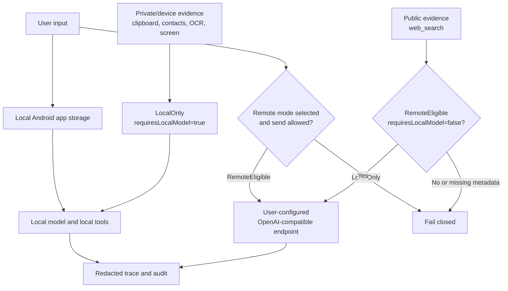

# Privacy Notice

This notice describes the privacy boundary implemented by `栖知 Solin` for
Android release candidates. It is not a publication approval: public
distribution still requires release, security, legal, store-policy, and support
owner review for the exact build and channel.

## Boundary Summary

Solin is local-first. Conversation data, local model state, memory,
background tasks, Agent traces, pending confirmations, Skill checkpoints, and
tool audit metadata are stored in local Android app storage unless a specific
remote or Android system boundary below is crossed.

`LocalOnly` means the app must keep the content on device and route any
continuation through a local model. `RemoteEligible` means the content may be
sent only after remote-mode gates and confirmations pass. Missing or ambiguous
privacy metadata fails closed.

## Local Storage

Local records may include user-entered chat text and assistant responses.
Privacy-sensitive generated or tool-derived content is marked `LocalOnly`
where the code can identify it. Examples include clipboard-derived messages,
shared-input excerpts, OCR excerpts, current-screen Accessibility text,
local memory-control status turns, and local action turns.

If a chat-message row is inserted without an explicit privacy value, the local
database defaults that row to `LocalOnly`. These local records are not a cloud
sync source in this codebase.

Remote model API keys and Hugging Face read tokens are stored separately in
Android Keystore-backed encrypted preferences. Clearing the relevant field
removes the stored secret.

The Android manifest sets `allowBackup=false`, so this codebase does not opt
local app storage into Android cloud backup or app-data sync.

## Remote Model Mode

Remote model mode sends requests only after the user-configured
OpenAI-compatible chat endpoint exists and the active backend is switched to
remote. Solin accepts a base URL and appends `/chat/completions` unless
the configured URL already points at that endpoint. "OpenAI-compatible" means
the request and response shape; it does not imply OpenAI operates the endpoint.

A remote request can include the current user prompt, selected model name,
generation parameters, and prior chat messages whose privacy is
`RemoteEligible`. The app filters `LocalOnly` messages from remote history and
rejects a `LocalOnly` current prompt before making a remote request. Local
memory hits, device context, clipboard content, OCR text, current-screen
Accessibility text, shared-input excerpts, attachment metadata, and local
action draft turns are not automatically sent to a remote model. If the user
manually types or pastes the same content into a normal remote-eligible
message, that new message can be sent.

Remote send reminders are policy-controlled for ordinary text. User-provided
images and suspected sensitive content are stricter: they require per-send
confirmation before they can leave the phone. Image bytes are attached as
OpenAI-compatible `image_url` content parts only when image input is enabled,
the selected remote profile declares vision support, the endpoint/model
supports that message shape, and the user confirms the send. If the endpoint
rejects image content, Solin reports image-input failure and does not
fall back to OCR.

Remote transport requires HTTPS, except for local debug hosts such as
`localhost`, `127.0.0.1`, `::1`, and Android emulator `10.0.2.2`. When an API
key is configured, the runtime sends it as an authorization credential to the
configured endpoint. The endpoint operator's logging and retention policies
apply.

Local vision is separate from remote vision. A verified local chat model whose
profile declares vision support can process user-provided image bytes on
device, within the app's bounded size/count limits. Unsupported local vision
paths fail closed instead of implicitly OCRing or uploading the image.

## Tool And Device Context Boundary

Remote model tool requests are not executed by the remote endpoint. The app
parses OpenAI-compatible `tool_calls` locally and revalidates every request
through the Tool Registry, safety policy, Agent trace, and audit path before
execution.

Remote mode can expose public search plus non-private draft, navigation,
sharing, or local reminder-style planning schemas. Those action schemas are
validated and executed locally, not by the remote endpoint, and still require
local confirmation when their risk policy requires it. Private local evidence
tools that read clipboard, contacts, calendar, files, notifications, screen
text, OCR, or other device context are not exposed to remote planning. A public
read-only evidence tool such as `web_search` may run without confirmation for
public queries; queries that appear to contain personal data or secrets require
confirmation before network access.

Multiple tool calls in one remote model turn may run concurrently only when
every requested tool is public/read-only, requires no confirmation, has no
private output keys, and declares no Android permission, MediaProjection,
external-navigation, sharing, scheduling, notification, or other side-effect
permission. Mixed batches are rejected as a whole before any tool runs. A
public evidence result can return to the remote model only when it explicitly
declares `privacy=RemoteEligible` and `requiresLocalModel=false`.

Device context and phone-control tools are gated behind Agent planning, schema
validation, safety policy, and user confirmation. Current local evidence
includes bounded reads for clipboard text, calendar busy/free windows, contact
name/phone search, foreground-app estimates, notification summaries, recent
file metadata, screenshot/image OCR excerpts, current-screen Accessibility
snapshots, and low-risk Accessibility actions such as tap, type, submit search,
scroll, back, and wait. These private results are `LocalOnly` and
`requiresLocalModel=true`.

Android runtime permissions and special-access flows are requested only after
the user confirms the associated tool request. Permission denial is a
structured tool failure, not an automatic retry. Usage Access is used only for
confirmed foreground-app estimates. Accessibility is used for confirmed
current-screen reads and low-risk phone-control gestures. MediaProjection is
used only for one-shot current-screen screenshot OCR after foreground consent.

For screen understanding specifically, screen pixels, OCR excerpts,
Accessibility text, Accessibility snapshot nodes/bounds metadata, and
post-action structured observations and verification summaries stay
`LocalOnly`. They are not automatically included in remote history, sent to a
remote endpoint, or sent to a remote VLM.
The same content may leave the device only if the user manually creates a
separate `RemoteEligible` message containing it.
Current-screen screenshot OCR may return a fused LocalOnly screen observation
that combines OCR text/bounds with transient Accessibility nodes/bounds; it
does not persist screenshots, pixels, URI/path metadata, or window titles.
Text-only OCR and screen evidence cannot directly bypass target validation for
tap/type actions. When a post-action page-change check fails or the action
target cannot be grounded, phone control fails closed or asks for a new
confirmation instead of converting private screen evidence into `web_search`,
external sends, or other outbound actions.

## External Intents And Attachments

Confirmed tools may open Android system screens, the share sheet, email drafts,
calendar drafts, contact drafts, web links, app launchers, the camera, or
allowlisted app settings pages. Once an external screen opens, the destination
app or Android system component may receive the prefilled data needed for that
action. Share sheets, drafts, high-risk actions, and unknown external actions
remain an opened-but-unverified boundary until the user records the outcome.

System speech recognition inserts a transcript into the compose box only;
sending remains explicit. Audio/video/legacy Office/binary attachments are
metadata-only in the current app. Supported strict UTF-8 text, RTF, PDF text
layers, PDF scanned-page OCR fallback, and Office Open XML attachments may
produce bounded local excerpts. Shared-input excerpts are staged as local
composer drafts and are not sent to generation until the user taps send.

Images are not written into text prompts, chat history, audit, or receipts.
They enter model requests only as bounded image bytes on a verified local
vision path or as confirmed remote vision content parts on a configured remote
vision path. Non-image attachments, shared text, text excerpts, and OCR
excerpts are not read or sent on the remote image path. Explicit confirmed OCR
tools remain separate.

## Model Downloads And Tokens

Recommended model downloads use Android `DownloadManager` and contact the
configured upstream download URLs. Recommended downloads are registered only
after SHA-256 verification against the pinned model manifest. Custom imported
models and custom URL downloads are user-supplied and are not covered by the
recommended-model provenance guarantees.

The Hugging Face read token saved in the app is used only to prepare and
download gated model assets that require Hugging Face authorization. It does
not approve model licensing, redistribution, or publication. Build-time tokens
such as `SOLIN_HF_TOKEN` belong to internal packaging flows and must not
be committed, logged, or placed in reports.

The recommended local chat path currently starts with the E2B model, which is a
multi-GB download. Users can instead configure a remote model endpoint or
import a trusted compatible `.litertlm` file. Smaller memory and action model
assets are not replacements for a chat model. Local chat model profiles use an
8k-token context window with a 6k input budget and 2k output reserve; that is a
runtime prompt budget, not an authorization token.

Model files are stored in local app storage and are not bundled into the
ordinary Play/public APK. The separate internal `bundledModels`
quick-experience package can include model bytes in same-signature install-time
split APKs for lab validation, but that package is not the public release
artifact.
Network operators and model hosts may receive normal download metadata such as
IP address, URL, user agent, timing, and download size.

## Audit, Retention, And Controls

Tool audit events store metadata such as event time, event type, tool name,
status, risk level, permission names, and sanitized summaries. They are not a
full prompt or tool-argument log. The app prunes the Room-backed audit table
after writes and keeps only the most recent 500 audit events.

Agent trace and pending confirmation recovery are narrower than a full
execution replay. Pending rows persist only allowlisted request arguments,
redacted structure, and value-free checkpoint identifiers where possible.
Payload-bearing confirmations fail closed after restart instead of restoring
private executable payload values.

Users can create, switch, and delete chat sessions. Long-term memory supports
reviewing explicit records, forgetting individual records, and clearing
explicit memory records. Clearing app data or uninstalling the app removes
local app storage according to Android platform behavior. When local memory is
disabled, explicit remember/fact commands do not create new long-term memory
records; forget and clear controls can still remove existing records.

This codebase does not contain a first-party analytics upload path beyond
user-configured remote model calls, recommended/custom model downloads, and
Android external intents initiated by confirmed actions. Recheck release builds
and any added SDKs before publishing this statement externally.
The device resource entry displays only locally sampled aggregate app PSS,
heap, available RAM, CPU, and thermal pressure state. It does not include
prompts, files, images, tool parameters, API keys, or remote responses, and it
is not uploaded as analytics.
