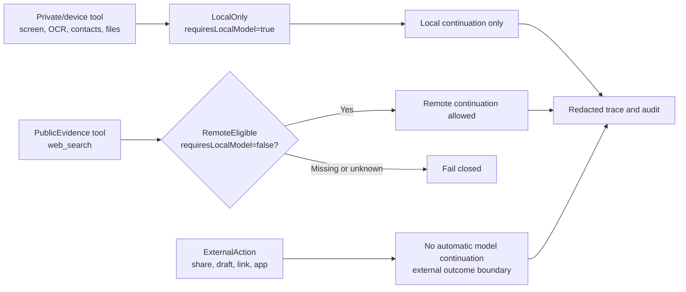

# Privacy Notice

This notice describes the privacy boundary implemented by PocketMind for Android
release candidates. Public distribution still requires release, security, and
legal approval for the current app behavior, support process, and publication
channel.

## Local Storage

PocketMind is local-first by default. The app stores chat sessions, chat
messages, model registry state, download records, scheduled background tasks,
explicit long-term memory records, Agent trace summaries, pending confirmation
snapshots, Skill checkpoints, and tool audit metadata in local Android app
storage. These records are not a cloud sync source in this codebase.

Local records may include user-entered chat text and assistant responses.
Privacy-sensitive generated or tool-derived content is marked `LocalOnly` where
the code can identify it. Examples include clipboard-derived messages,
shared-input excerpts, OCR excerpts, current-screen Accessibility text
continuations, local memory-control status turns, and local action turns.
If a chat-message row is inserted without an explicit privacy value, the local
database defaults that row to `LocalOnly`.

Remote API keys are stored separately through Android Keystore-backed encrypted
preferences. Clearing the API key field removes the stored secret.

## Remote Model Mode

Remote model mode sends requests only after the user-configured
OpenAI-compatible chat endpoint exists and the active backend is switched to
remote.
PocketMind accepts a base URL and appends `/chat/completions` unless the
configured URL already points at that endpoint. The request can include the
current user prompt, selected model name, generation parameters, and prior chat
messages whose privacy is `RemoteEligible`.

Remote send reminders are policy-controlled for ordinary text: the app can warn
on remote-mode switch, every message, once per session, or only when content is
detected as sensitive. User-provided images and suspected sensitive content are
stricter than ordinary text and require per-send confirmation before they can
leave the phone.

The app filters `LocalOnly` messages from remote history and rejects a
`LocalOnly` current prompt before making a remote request. Local memory hits,
device context, clipboard content, OCR text, current-screen Accessibility text,
shared-input excerpts, attachment metadata, and local action draft turns are
not automatically sent to a remote model. If the user manually types or pastes
the same content into a normal remote-eligible message, that message can be
sent.

When the user explicitly sends images to a configured and selected remote vision
model, the image bytes are attached as OpenAI-compatible `image_url` content
parts only when image input is enabled, the endpoint/model supports that
message shape, and the user confirms the send. A text-compatible OpenAI-style
endpoint is not automatically vision-capable.
If the endpoint rejects image content, PocketMind reports image-input failure
and does not fall back to OCR. The text prompt uses only a generic image count
and support notice. It does not include attachment display names, MIME types,
byte sizes, OCR text, or non-image attachment metadata.

Remote transport requires HTTPS, except for local debug hosts such as
`localhost`, `127.0.0.1`, and Android emulator `10.0.2.2`. When an API key is
configured, the runtime sends it as an authorization credential to the
configured endpoint. The endpoint operator's own logging and retention policies
apply.

Remote model tool requests are not executed by the remote endpoint. The app
parses OpenAI-compatible `tool_calls` locally and revalidates every request
through the Tool Registry, safety policy, Agent trace, and audit path before
execution. Remote mode exposes a model-planning tool schema set that can include
public search plus non-private draft, navigation, sharing, or local
reminder-style tools, but those non-public tools still require local
confirmation and are not executed by the remote model. Local evidence tools
that read clipboard, contacts, calendar, files, notifications, screen text, OCR,
or other private context are not exposed to remote planning. A single public
read-only evidence tool such as `web_search` may run without confirmation for
public queries; queries that appear to contain personal data or secrets require
confirmation before network access. Multiple tool calls in one remote model turn may run
concurrently only when every requested tool is `PublicEvidence`,
`LowReadOnly`, `NotRequired`, has no private output keys, and declares no
device-context, Android permission, MediaProjection, external-navigation,
sharing, scheduling, notification, or other side-effect permission. Mixed
batches are rejected as a whole before any tool runs, so a safe public lookup
is not executed beside a private local read or action tool. A public evidence
result can return to the remote model only when it explicitly declares
`privacy=RemoteEligible` and `requiresLocalModel=false`; missing or local-only
metadata fails closed before remote continuation.

## Device Context Tools

Device context and phone-control tools are gated behind Agent planning, schema
validation, safety policy, and user confirmation. The current tool set includes
bounded reads for clipboard text, calendar busy/free windows, contact
name/phone search, current foreground app metadata, current-app notification
metadata, recent file metadata, recent screenshot/image OCR excerpts,
current-screen Accessibility text/screen-state snapshots, and low-risk
Accessibility actions such as tap, type, submit search, scroll, back, and wait.

These tools are designed to minimize returned data. For example, recent file
reads return metadata rather than file contents, paths, or URIs; current-screen
reads use Accessibility nodes rather than screenshots or pixels; OCR tools
avoid persisting image identifiers, paths, raw pixels, and raw OCR text in trace
or audit stores. Foreground-app reads are labeled as UsageStats estimates, and
Android 14+ selected-photo grants are labeled as user-selected visual media
rather than full-library access. Clipboard text, contact matches, calendar
busy/free windows, foreground-app metadata, current-app notification summaries,
recent file metadata, OCR excerpts, and current-screen Accessibility snapshots
are marked `LocalOnly` and `requiresLocalModel=true`; their local payload fields are
declared as private tool outputs so they remain inside local continuation,
observation, trace-redaction, and Skill public-output boundaries.

Android runtime permissions and special app access are requested only after the
user confirms the associated tool request. Permission denial is treated as a
structured tool failure rather than an automatic retry.
On Android 13 and above, `query_recent_files` does not expose a direct
`documents`, `downloads`, or `others` query path; non-media files must be
provided through the system file picker or Android share input.
Special-access flows are disclosed separately from runtime permissions:
Usage Access is used only for confirmed foreground-app estimates.
Accessibility is used for confirmed current-screen reads and, during a
phone-control session, for low-risk gestures requested by the user. Device
actions are conservative by default; the reduce-confirmations setting can lower
prompt frequency for low-risk continuous navigation/search/tap/scroll/back
steps, while sending, deleting, paying, ordering, publishing, sensitive input,
and permission authorization still require confirmation. A short-lived
foreground service and a translucent Accessibility overlay show phone-control
progress; the service stops when the Agent run reaches a terminal state or
times out. MediaProjection is used only for one-shot current-screen screenshot
OCR after foreground consent.

## External Intents And Sharing

Confirmed tools may open Android system screens, the share sheet, email drafts,
calendar drafts, contact drafts, web links, app launchers, the camera, or
allowlisted app settings pages. Once an external screen opens, the destination
app or Android system component may receive the prefilled data needed for that
action. Low-risk app-control sessions can continue into observe/tap/type/search
steps. Share sheets, drafts, high-risk, and unknown external actions remain an
opened-but-unverified boundary until the user records the outcome.

System speech recognition inserts a transcript into the compose box only.
Sending remains explicit. Audio/video/legacy Office/binary attachments are
metadata-only in the current app; supported strict UTF-8 text, RTF, PDF text
layers, PDF scanned-page OCR fallback, and Office Open XML attachments may
produce bounded local excerpts. When the user selects an image, PocketMind reads
restricted image bytes only if the active local model is a verified
vision-capable profile, or if the remote model is configured, selected, and
image input is explicitly enabled, forming a local pending image payload. The
remote path does not call the remote endpoint until the user confirms that send.
Images are not written into prompts, history, audit, or receipts; non-image
attachments, shared text, text excerpts, and OCR excerpts are not read or sent
on the remote path. Explicit confirmed OCR tools remain separate. Malformed PDFs
remain metadata-only. If Android does not provide a useful MIME type for a
user-provided attachment, PocketMind may infer common supported types from the
display-name extension before deciding whether a bounded local excerpt is
possible. Shared-input excerpts are staged as local composer drafts and are not
sent to local generation until the user taps send. LocalOnly conversation text
is not indexed for automatic memory recall. Automatic conversation recall is
rebuilt only from user messages; assistant responses are not indexed as
conversation recall. LocalOnly user text is not used verbatim for session-list
titles. This inference does not make shared-input excerpts remote-eligible.

## Model Downloads

Recommended model downloads use Android `DownloadManager` and contact the
configured upstream download URLs. Recommended downloads are registered only
after SHA-256 verification against the pinned model manifest. Custom imported
models and custom URL downloads are user-supplied and are not covered by the
recommended-model provenance guarantees.

The recommended local chat path currently starts with the E2B model, which is a
multi-GB download. Users can instead configure a remote model endpoint or import
a trusted compatible `.litertlm` file. The smaller memory and action model
assets are not replacements for a chat model.

Model files are stored in local app storage and are not bundled into the APK.
Network operators and model hosts may receive normal download metadata such as
IP address, URL, user agent, timing, and download size.

## Audit And Trace Data

Tool audit events store metadata such as event time, event type, tool name,
status, risk level, permission names, and sanitized summaries. They are
intentionally not a full prompt or tool-argument log. The app prunes the
Room-backed audit table after writes and keeps only the most recent 500 audit
events.

Agent trace and pending confirmation recovery are intentionally narrower than a
full execution replay. Pending rows persist only allowlisted request arguments,
redacted structure, and value-free checkpoint identifiers where possible.
Payload-bearing confirmations, including Skill pending arguments bound from
earlier outputs but not pending-allowlisted, fail closed after restart instead
of restoring private executable payload values or incomplete confirmations.

## Retention And Controls

Users can create, switch, and delete chat sessions in the app. Long-term memory
supports reviewing explicit records, forgetting individual records, and
clearing explicit memory records. Clearing app data or uninstalling the app
removes local app storage according to Android platform behavior.
When local memory is disabled, explicit remember/fact commands do not create
new long-term memory records; forget and clear controls can still remove
existing records.

This codebase does not contain a first-party analytics upload path beyond
user-configured remote model calls, recommended/custom model downloads, and
Android external intents initiated by confirmed actions. Recheck release builds
and any added SDKs before publishing this statement externally.
The device resource entry displays only locally sampled aggregate app PSS, heap,
available RAM, CPU, and thermal pressure state. It does not include prompts,
files, images, tool parameters, API keys, or remote responses, and it is not
uploaded as analytics.
