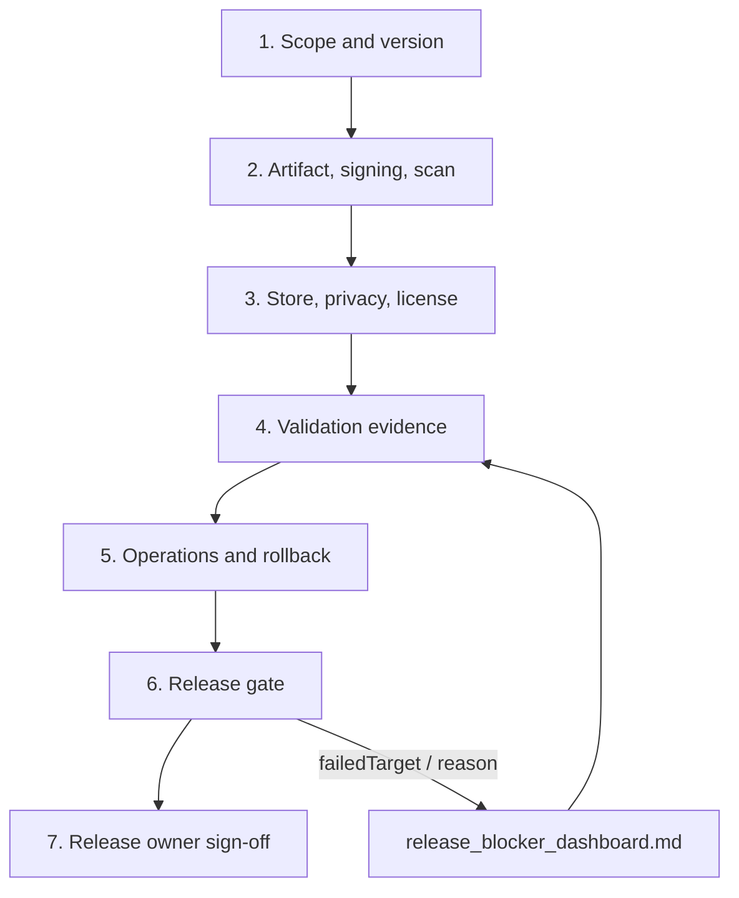

# Production Release Checklist

Use this checklist for every release candidate. Its job is to decide whether a build may ship, not to repeat every device step. Phone and manual execution details live in `docs/phone_acceptance.md`; open risk is summarized in `docs/release_blocker_dashboard.md`.

Every checked item needs an owner, date, artifact path, and SHA-256 in the release ticket or PR. Code gates verify records and evidence shape; they do not replace release-owner, legal, privacy, store, or production-signing approval.



## Evidence Standard

- [ ] Evidence files are structured properties or JSON records, not prose-only notes.
- [ ] Passed evidence includes `status=passed`, `artifactSchema`, owner, UTC `recordedAt`, command, reproducible path, artifact path, and matching SHA-256.
- [ ] Failed, skipped, or preflight-failed evidence includes `failedTarget` and `reason`.
- [ ] Release-gate-owned child reports include the release gate report path, release record file, current HEAD commit, release artifact path/type/SHA-256, and reproducible command/path.
- [ ] Status-only files, stale files, hand-written summaries, or evidence whose SHA-256 does not match the record are not accepted.

## Scope And Version

- [ ] Release version name, version code, target channel, owner, reviewer, date, release branch, commit SHA, and changelog are final.
- [ ] Current Gradle identity is recorded: `applicationId=com.bytedance.zgx.pocketmind`, `minSdk=28`, `targetSdk=36`, current `versionCode=1`, and current `versionName=0.1.0`.
- [ ] `versionCode` is higher than every artifact ever uploaded to the same Play application; rejected uploads still count.
- [ ] Target audience is explicit: internal testing, closed testing, open testing, staged production, or full production.
- [ ] Known unsupported or constrained capabilities are called out: continuous screen capture, semantic screen understanding, full PDF layout parsing, legacy Office parsing, arbitrary media OCR, and local image semantic understanding unless a verified vision-capable local model is active. One-shot current-screen/recent-image OCR remains confirmation-gated and `LocalOnly`.
- [ ] Agent/tool behavior changes are summarized, including remote OpenAI-style `tool_calls`, public evidence batch execution, all-or-nothing mixed-batch rejection, and the privacy boundary for `LocalOnly` tool results.

## Artifact, Signing, And Packaging

- [ ] Release artifact path, SHA-256, file size, mapping file, signing certificate fingerprint, and verification evidence links are recorded.
- [ ] Local debug builds and the Android debug keystore are clearly excluded from production distribution and production evidence.
- [ ] Production signing material is kept outside source control. The release record names signing owner, custody location, upload key alias, certificate SHA-256 fingerprint, and recovery contact.
- [ ] `scripts/sign_release_artifacts.sh` runs in the private signing environment with `RELEASE_KEYSTORE`, `RELEASE_KEY_ALIAS`, `RELEASE_KEYSTORE_PASSWORD`, `RELEASE_KEY_PASSWORD`, and `EXPECTED_SIGNING_CERT_SHA256`. `ALLOW_DEBUG_KEYSTORE` is unset for production signing.
- [ ] Play App Signing status is recorded. App-signing and upload certificate fingerprints are both captured because they are different trust anchors.
- [ ] Play candidates use `./gradlew :app:bundleRelease`; internal ad hoc APK validation is separately labeled and never confused with the Play AAB.
- [ ] `scripts/scan_android_artifacts.sh` runs against the final APK/AAB. The report confirms no `.litertlm` model binaries, API keys, bearer tokens, private hostnames, release keystore files, or unreadable APK/AAB structure.
- [ ] `scripts/verify_release_mapping.sh` archives R8/ProGuard mapping evidence for the RC; `PUBLIC_RELEASE=1` requires this mapping check.

## Internal `bundledModels`

- [ ] Internal `bundledModels` quick-experience artifacts are recorded separately from Play/public release candidates.
- [ ] Any handoff beyond local lab validation is approved as model
      redistribution: every recommended model in `docs/model_license_review.json`
      has approved license source, redistribution decision, attribution/notice
      requirement, reviewer, date, evidence path, and matching SHA-256.
- [ ] Build and package checks use `./gradlew checkBundledModelsPackageOutputs` and `scripts/package_bundled_models.sh`.
- [ ] All five split APKs are signed by the same key and the package report from `build/verification/bundled-models/package.properties` is attached.
- [ ] Device install uses `adb install-multiple --no-incremental -r`; fast incremental-install `Success` is not accepted for this split set.
- [ ] Device smoke records that `pm path` lists `base.apk` plus all four modelpack splits, Model Manager shows E2B, E4B, memory, and action models with `SHA-256 已校验`, and local E2B reaches `已加载` on GPU or CPU fallback.
- [ ] Model byte size, SHA-256, license, attribution, and redistribution approval evidence are attached. No API keys, bearer tokens, private hostnames, or release keystore files are bundled.

## Store, Privacy, And License

- [ ] App name, descriptions, category, support contact, screenshots, and release notes are reviewed and match the target channel.
- [ ] Privacy policy URL points to the approved external version of `docs/privacy_notice.md`.
- [ ] Google Play Data safety answers match implemented behavior for local Room/DataStore storage, encrypted remote API keys, user-configured remote model calls, model downloads, Android permissions, external intents, and the absence of first-party analytics upload in this codebase.
- [ ] Required Android permissions and special-access flows are explained in user-facing language, including microphone, calendar, contacts, media, notifications, foreground service, Usage Access, Accessibility, Accessibility gestures, and one-shot MediaProjection consent.
- [ ] `docs/store_policy_record.json` is approved and `VERIFY_STORE_POLICY=1 scripts/verify_release_gate.sh` passes.
- [ ] `docs/privacy_review.json` records release, security, and legal approvals for the current privacy notice and capability matrix; `VERIFY_PRIVACY_REVIEW=1 scripts/verify_release_gate.sh` passes.
- [ ] `docs/model_license_metadata.json` is freshly collected before review, and `docs/model_license_review.json` approves every recommended model with concrete license source, reviewer, review date, redistribution decision, attribution/notice requirements, evidence path, and SHA-256.
- [ ] `VERIFY_MODEL_LICENSES=1 scripts/verify_release_gate.sh` passes for the RC.
- [ ] `scripts/privacy_scan.sh` passes. No API keys, bearer tokens, private endpoints, raw prompts, private device-context payloads, contacts, notifications, clipboard text, or sensitive screenshots are present in release docs, logs, screenshots, or notes.

## Validation

- [ ] `scripts/verify_local.sh` passes on a clean checkout.
- [ ] Emulator regression passes on prepared arm64 AVDs, including API 28, 32, 33, 34, and 36, or the release record explains why emulator validation was unavailable.
- [ ] `scripts/check_emulator_api_matrix.sh` and, when needed, `scripts/prepare_emulator_api_matrix.sh` produce readiness evidence before API-matrix regression.
- [ ] At least one physical `arm64-v8a` device passes `scripts/install_and_test_device.sh`. Emulator serials are rejected as physical-device evidence.
- [ ] Physical device reports include `exit_code=0`, empty `failedTarget`/`reason`, UTC start/finish, sufficient `data_free_kb`, instrumentation output with final `OK`, `instrumentation_test_count`, `logcat_file`, and SHA-256 bindings.
- [ ] Upgrade validation uses `adb install -r` and records first-install timestamp preservation, last-update timestamp refresh, versionCode increase, data retention, and instrumentation coverage.
- [ ] Manual acceptance from `docs/phone_acceptance.md` covers model setup, remote-mode privacy, tool confirmation, permissions, background reminders, sharing, multimodal entry points, and resource-status UI.
- [ ] Manual acceptance records voice input, the Android system document picker,
  and MediaProjection consent separately from scripted regression.
- [ ] System-mediated flows are manually accepted on device: voice input, Android document picker, runtime permission dialogs, Usage Access settings, Accessibility service, and MediaProjection consent/cancel.
- [ ] Screenshots are sanitized and listed in `docs/release_validation_record.json` with screenshot SHA-256, UI dump SHA-256, required visible text, and `release-screenshots.properties` report path/SHA-256. Text placeholders are not accepted.
- [ ] Performance sanity points to a real `perf-baseline.properties` collected on non-emulator physical `arm64-v8a` hardware and verified by `scripts/verify_perf_baseline.sh`.
- [ ] Public-release AI behavior eval uses a deterministic `agent_loop_runtime` actual trace collected by `scripts/collect_ai_behavior_actual_trace.sh`, with runtime provenance, current fixture/capability/action-model hashes, no mismatches, and zero allowed-failure trace diff rows.
- [ ] Debug device-control and real-app search evidence is attached separately from release physical evidence. It must keep machine-readable failure semantics and case artifacts, but it never replaces fresh release physical validation.
- [ ] `docs/release_validation_record.json` is approved and `VERIFY_RELEASE_VALIDATION=1 scripts/verify_release_gate.sh` passes.

## Operations And Rollback

- [ ] CI release operations evidence is complete: local verification, emulator regression, release artifact archive, and protected signing evidence are referenced from `docs/release_operations_record.json` with matching SHA-256 values.
- [ ] Crash/ANR smoke evidence is collected for the RC. Android Vitals is the minimum source for Play builds; any additional crash SDK requires privacy review before release.
- [ ] Crash/ANR smoke evidence shows no unresolved launch crash, install crash, crash loop, fatal native LiteRT-LM failure, or reproducible ANR.
- [ ] Monitoring owner, signal sources, staged-rollout thresholds, first-24-hour watcher, and escalation channel are recorded.
- [ ] Rollback criteria include install failure, crash loop, model download verification failure, privacy boundary failure, and critical tool execution regression.
- [ ] Rollback plan accounts for Play version-code policy: a replacement build must use a higher `versionCode`.
- [ ] Model manifest rollback path and data compatibility are reviewed. Room migrations are forward-only, so downgrade is tested or explicitly unsupported.
- [ ] `docs/release_operations_record.json` is approved and `VERIFY_RELEASE_OPERATIONS=1 scripts/verify_release_gate.sh` passes.

## Release Gate

Run focused gates as records become ready:

```bash
VERIFY_RELEASE_RECORD=1 scripts/verify_release_gate.sh
VERIFY_STORE_POLICY=1 scripts/verify_release_gate.sh
VERIFY_PRIVACY_REVIEW=1 scripts/verify_release_gate.sh
VERIFY_MODEL_LICENSES=1 scripts/verify_release_gate.sh
VERIFY_RELEASE_VALIDATION=1 scripts/verify_release_gate.sh
VERIFY_RELEASE_OPERATIONS=1 scripts/verify_release_gate.sh
```

Run the final public gate with the production artifact, signing fingerprint, physical perf baseline, and AI behavior actual trace:

```bash
PUBLIC_RELEASE=1 \
EXPECTED_SIGNING_CERT_SHA256=<production-upload-cert-sha256> \
PERF_BASELINE_FILE=<rc-perf-baseline.properties> \
AI_BEHAVIOR_ACTUAL_TRACE_FILE=<actual-trace.jsonl> \
scripts/verify_release_gate.sh
```

The final gate checks the release record, current HEAD commit, artifact checksum, signing certificate fingerprint, unsupported capabilities, Agent behavior summary, resolved or accepted blockers, store policy, privacy review, model license review, validation, operations, perf baseline, mapping, and public-distribution channel. For production, the Git worktree must be clean unless `ALLOW_DIRTY_RELEASE=1` is explicitly set for a non-production dry run.

## Final Sign-Off

- [ ] Open blockers are resolved or explicitly accepted by the release owner with dated risk note, evidence file, and matching SHA-256.
- [ ] Release artifact, checksums, mapping, logs, screenshots, privacy/license approvals, store approvals, validation reports, operations evidence, and rollback plan are attached to the release record.
- [ ] The release owner signs off after the final release gate passes.
