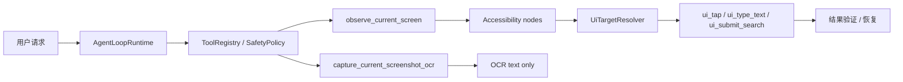
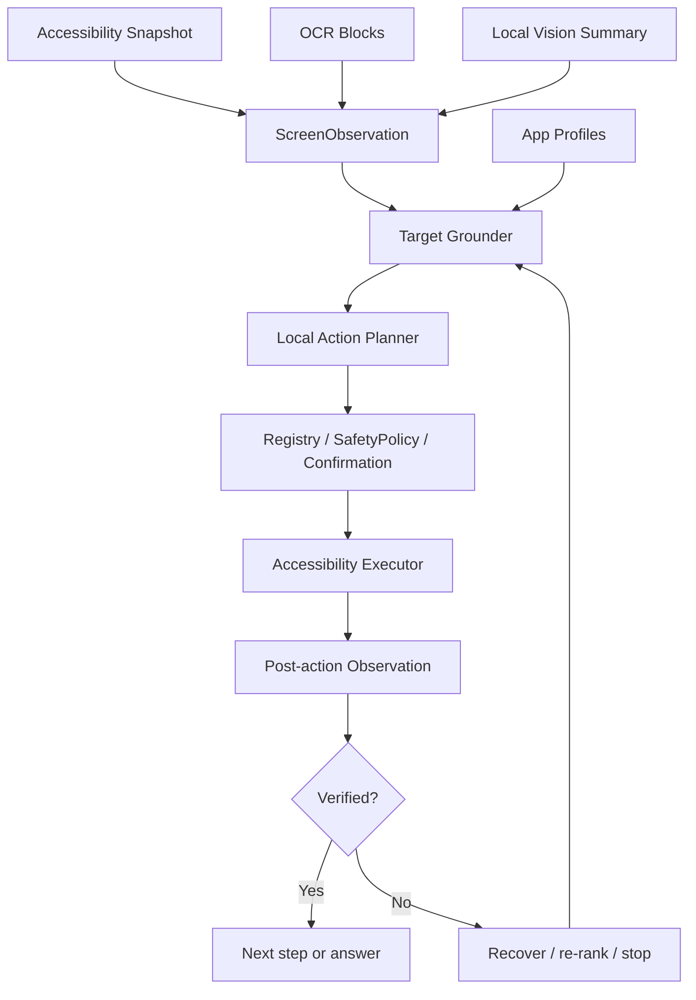
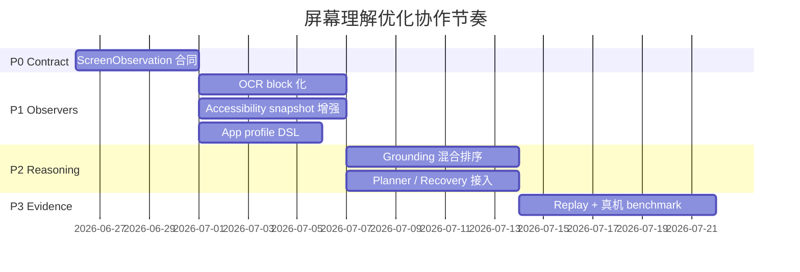

# 屏幕理解与手机操作优化计划

本文定义 PocketMind 下一阶段“用本地模型更可靠地理解屏幕并操作手机”的执行计划。
它不是发布验收记录；完成证据仍写入 `docs/validation_report.md` 和
`docs/phone_acceptance.md`。

## 根目标

让 PocketMind 在用户明确授权后，能把“当前屏幕上有什么、下一步该点哪里、执行后是否成功”
表示为可验证的本地证据，并在真实手机上完成更多低风险、多步骤任务。

成功标准：

- 屏幕理解不只返回 OCR 文本，而是返回带来源、边界框、置信度和隐私级别的结构化观察。
- 操作执行优先依赖 Android Accessibility 节点和官方手势能力，不把 ADB、坐标脚本或持续录屏作为产品运行时。
- OCR、Accessibility 文本、截图和视觉摘要都保持 `LocalOnly`，不能自动进入远程模型。
- 每一次 tap/type/scroll/submit 都能解释目标来源，并在动作后做结果验证。
- 真机回归能覆盖至少 6 个真实 App 的低风险搜索/筛选/导航任务，并记录失败原因。

## 当前基线

已有能力：

- `ScreenStateSnapshot` 能表达 Accessibility 节点、bounds、可点击/可编辑/可滚动等属性。
- `UiTargetResolver` 已按 App profile 排序搜索框、提交按钮、筛选和结果候选。
- `capture_current_screenshot_ocr` 已通过前台 MediaProjection 同意做一次性 OCR。
- `AgentLoopRuntime` 已有本地证据续写、observe/wait 恢复、mobile-action 模型能力门控。

主要缺口：

- OCR 结果目前偏文本摘录，没有纳入统一屏幕观察、候选目标和动作验证。
- Accessibility 节点、OCR block、局部视觉摘要之间没有统一 ID、坐标、来源和置信度合同。
- App profile 仍偏硬编码；新增真实 App 或页面状态需要改 Kotlin。
- 失败恢复主要围绕搜索闭环，还缺“观察差异、换候选、滚动重试、主动停手”的通用策略。
- 真机 benchmark 还没有达到可长期比较的任务 DSL、指标和产物规范。

## 边界判断

| 方向 | 决策 | 原因 |
| --- | --- | --- |
| 产品运行时执行 | 使用 Accessibility + 用户确认 | Android 官方支持跨 App 可访问性读写和手势；能进入现有 special access、policy 和 trace。 |
| 当前屏幕像素 | 只做前台一次性 MediaProjection OCR/视觉补充 | Android 对屏幕捕获有显式同意边界；持续捕获会扩大隐私和商店合规风险。 |
| ADB / uiautomator2 / Appium | 只用于测试、回放、benchmark 对照 | 这些适合工程验证，不适合面向用户的端侧运行时。 |
| 远程 VLM | 不接收屏幕/OCR/Accessibility 证据 | 当前项目隐私合同要求本地屏幕证据 `LocalOnly`。 |
| 坐标点击 | 仅作为带来源证据的低优先 fallback | 坐标本身不可解释，必须有节点/OCR/视觉候选支撑并做动作后验证。 |

## 目标架构

新增核心合同：

- `ScreenObservation`：统一表达屏幕尺寸、时间戳、前台包名、Accessibility 节点、OCR block、视觉区域、可交互候选和隐私边界。
- `ObservationElement`：统一 `id/source/bounds/text/role/clickability/confidence/sensitiveFlags`。
- `ResolvedUiTarget`：把“为什么点这里”拆成候选证据、选择原因、风险、fallback 类型和预期验证信号。
- `ActionOutcome`：记录 before/after diff、验证结果、失败类别和下一步建议。

## 多 Agent 阵列

| Agent | 产物 | 首要文件 |
| --- | --- | --- |
| Coordinator Agent | 拆分接口、合并节奏、发布门槛 | `docs/screen_ocr_agent_optimization_plan.md` |
| Contract Agent | `ScreenObservation` / `ObservationElement` 数据模型和 JSON trace | `app/src/main/java/com/bytedance/zgx/pocketmind/device/` |
| OCR Agent | ML Kit OCR block 化、bounds 保留、LocalOnly 输出 | `app/src/main/java/com/bytedance/zgx/pocketmind/multimodal/` |
| Accessibility Agent | 节点采集、稳定 ID、执行前后 snapshot diff | `PocketMindAccessibilityService.kt` |
| Grounding Agent | 混合候选排序、坐标 fallback、可解释 evidence | `UiTargetResolver.kt` |
| App Profile Agent | 外置 App profile DSL、真实 App 页面样本 | `docs/`、`app/src/test/resources/` |
| Planner Agent | 本地模型 action grammar、step budget、replan prompt | `AgentLoopRuntime.kt`、`skill/` |
| Recovery Agent | wait/scroll/retry/stop 策略和失败分类 | `orchestration/`、`device/` |
| Eval Agent | AndroidWorld 风格任务 DSL、回放、真机矩阵 | `scripts/`、`app/src/androidTest/` |
| Safety Agent | LocalOnly、权限、审计、商店合规回归 | `ToolRegistry.kt`、`SafetyPolicy.kt`、`docs/privacy_notice.md` |

协作顺序：

## 实施阶段

### P0：观察合同先行

交付：

- 新增 `ScreenObservation` 和序列化测试。
- `observe_current_screen` 可返回当前 Accessibility 节点的统一观察结构。
- Trace 中记录元素数量、来源分布、截断状态和隐私级别，不记录原始截图。

验收：

- JVM contract tests 覆盖 schema、隐私标记、超大屏幕截断。
- 旧 `ScreenStateSnapshot` 回放测试仍通过。

### P1：OCR 与 Accessibility 融合

交付：

- ML Kit text block、line、element 的 bounds/语言/置信信号进入 `ScreenObservation`。
- MediaProjection 当前屏幕 OCR 仍保持一次性同意、一次性消费。
- Accessibility 元素和 OCR block 能按空间关系合并为候选，如“节点没有 text，但 OCR 区域识别出按钮文案”。

验收：

- OCR 结果仍为 `LocalOnly`，远程模式无法看到 OCR 摘录。
- 真实设备取消 MediaProjection 后没有残留截图或可复用 token。

### P2：目标定位和动作执行

交付：

- `UiTargetResolver` 消费混合候选：Accessibility 优先，OCR/视觉辅助，坐标 fallback 最低。
- 每个动作输出 `ResolvedUiTarget` 和 `ActionOutcome`。
- 执行后比较 before/after observation，能判断输入框填入、搜索结果出现、页面切换或无变化。

验收：

- 淘宝、拼多多、高德、京东、Chrome、Android Browser 的搜索入口定位有 replay 用例。
- 相机、扫一扫、找同款、广告位等负例不会被误点。

### P3：本地模型规划与恢复

交付：

- 本地 action 模型只输出受限 action grammar，不直接输出 Android API 调用。
- Agent loop 根据 `ActionOutcome` 选择继续、滚动、换候选、等待、重新观察或停手。
- 低风险任务允许 bounded autonomous loop；中高风险继续走确认。

验收：

- 无 `MobileActionPlanning` profile 时 fail closed。
- 连续失败、目标不确定、页面含支付/发送/删除/授权语义时主动停手。

### P4：Benchmark 与真机证据

交付：

- 借鉴 AndroidWorld 的任务 DSL：`initial_state / instruction / allowed_apps / success_signal / max_steps`。
- 借鉴 DroidBot 的状态图思想，记录页面状态签名、动作边和失败状态。
- Appium/uiautomator2 只作为测试对照和 dump 来源，不进入用户运行时。

验收：

- `scripts/run_device_control_debug_eval.sh` 和 `scripts/run_real_app_search_eval.sh` 输出稳定 JSON evidence。
- 至少 50 个真实任务样本，覆盖搜索、筛选、地图地点检索、浏览器查询、设置入口。
- 50k 物理 perf gate 使用覆盖安装，不删除安装包，不清理已下载模型数据。

## 开源参考

| 项目 | 可借鉴点 | 在 PocketMind 中的落点 |
| --- | --- | --- |
| [AndroidWorld](https://github.com/google-research/android_world) | 任务 DSL、动态参数、可重复 benchmark、reward signal | 真机/eval 任务格式和成功判定。 |
| [DroidBot](https://github.com/honeynet/droidbot) | UI 状态图、探索式输入、事件转移记录 | 页面状态签名、失败重放、App profile 样本采集。 |
| [AutoDroid](https://github.com/MobileLLM/AutoDroid) | LLM 手机自动化、动作抽象、任务执行链路 | 本地 action grammar 和 planner/replanner 结构。 |
| [UI-TARS](https://github.com/bytedance/UI-TARS) | GUI grounding 和视觉动作模型思路 | 本地视觉 fallback 与目标定位评估，不直接上传屏幕。 |
| [Mobile-Agent](https://github.com/X-PLUG/MobileAgent) | observe-plan-act 多轮闭环 | Agent loop 的观察、行动、验证节奏。 |
| [AppAgent](https://github.com/TencentQQGYLab/AppAgent) | App 使用经验沉淀和多模态操作框架 | App profile DSL、页面别名和任务模板。 |
| [Appium UiAutomator2](https://github.com/appium/appium-uiautomator2-driver) / [openatx uiautomator2](https://github.com/openatx/uiautomator2) | Android UIAutomator2 测试控制 | 自动化测试、dump 对照和 CI，不进产品运行时。 |

平台边界参考：

- [Android AccessibilityService](https://developer.android.com/guide/topics/ui/accessibility/service)
- [Android MediaProjection](https://developer.android.com/media/grow/media-projection)
- [ML Kit Text Recognition](https://developers.google.com/ml-kit/vision/text-recognition/v2/android)

## 风险与防线

| 风险 | 防线 |
| --- | --- |
| 屏幕内容误发远程 | `ToolResultContinuationPolicy.LocalEvidence`、远程工具清单过滤、trace 隐私测试。 |
| OCR 误识别导致误点 | Accessibility 优先、OCR 只增益候选、动作后验证、低置信停手。 |
| 页面变化导致循环乱点 | step budget、状态签名去重、连续失败停手、危险语义 fail closed。 |
| App profile 过拟合 | profile 外置、保留 generic resolver、真实 App replay 矩阵。 |
| 性能和耗电退化 | OCR 限频、截图尺寸上限、观察缓存、50k 物理 perf gate。 |
| 商店合规风险 | 明确 Accessibility 用途、MediaProjection 前台同意、无持续录屏、无后台任意控制。 |

## 第一批任务拆分

1. Contract Agent：新增 `ScreenObservation` 数据模型、schema 测试、trace 摘要。
2. OCR Agent：把 `ImageTextExtractor` 输出从纯文本扩展为 block list，并保持兼容文本摘要。
3. Accessibility Agent：为 `PocketMindAccessibilityService` 输出统一 observation，补稳定元素 ID。
4. Grounding Agent：让 `UiTargetResolver` 同时消费 Accessibility 和 OCR candidates。
5. Eval Agent：新增 10 个 UI dump + OCR block 回放样本，先覆盖搜索入口负例。
6. Safety Agent：补远程模式、审计、隐私 notice 和 store policy 回归断言。

## 2026-06-27 Safety/Docs 最小闭环

本轮代码化 P0 和部分无设备 P1/P2/P4 合同；仍不把真机、人审或性能证据标成完成。

已代码化并由现有测试钉住的诉求：

- 私有工具结果必须声明 `privacy=LocalOnly` 和 `requiresLocalModel=true`；否则
  `ToolRegistry.validateResult` fail closed。
- `read_current_screen_text`、`capture_current_screenshot_ocr`、`observe_current_screen`
  和 `ui_*` 屏幕/OCR/Accessibility 工具不是 public evidence batch，也不进入远程模型
  planning surface。
- 当前屏幕 OCR 需要 MediaProjection 前台同意；Accessibility 读屏和 UI 动作仍走用户确认、
  Tool Registry、SafetyPolicy 和本地 trace/audit。
- `ScreenStateSnapshot` 可投影为 `ScreenObservation` JSON，包含来源、bounds、role、
  clickability、confidence、`LocalOnly` 隐私级别和截断摘要；旧 `nodesJson` 兼容保留。
- OCR 预览保留旧文本摘要，同时可携带 block/line/element bounds；当前屏幕 OCR 输出的
  `ocrBlocksJson` 是私有本地证据。
- `UiTargetResolver` 增加解释合同，标明 Accessibility 来源、fallback 类型和预期验证信号；
  OCR/vision grounding 仍只是占位合同，未宣称已接入真实排序。
- Replay eval 增加小样本覆盖搜索入口负例和 OCR bounds，不替代 6 App/50 task 真机 benchmark。

本轮文档化的诉求：

- `docs/privacy_notice.md` 明确屏幕像素、OCR 摘录、Accessibility 文本、节点/bounds
  元数据和动作后验证摘要均为 `LocalOnly`，不会自动发送到远程 endpoint 或远程 VLM。
- P3/P4 真机 benchmark、50k 物理 perf gate 和 release checklist 同步仍保留为未完成门槛，
  不作为本轮完成项。

仍需真机/人审/性能证据：

- 真机：MediaProjection 取消/同意、Accessibility special access、6 App/50 task benchmark、
  connected Android tests 和 real-app eval JSON evidence。
- 人审：release、security、legal、store-policy、support owner 对隐私 notice、
  Accessibility 用途和商店文案的发布前审阅。
- 性能：OCR 限频、截图尺寸上限、观察缓存、50k 物理 perf gate 和耗电/内存 evidence。

## 放行门槛

- `./gradlew :app:testDebugUnitTest` 通过，且新增 resolver/observation/OCR contract tests。
- `./gradlew :app:connectedDebugAndroidTest` 在授权真机通过。
- `ZvecNativeStoreSmokeTest` 和语义记忆 probe 不回退到轻量索引，或记录明确 blocker。
- `scripts/run_device_control_debug_eval.sh` 和 `scripts/run_real_app_search_eval.sh` 在真机产出 passed evidence。
- 50k 物理 perf gate 完成，覆盖安装，不删除本地模型数据。
- 文档同步：`agent_core_modules.md`、`phone_acceptance.md`、`privacy_notice.md`、`release_checklist.md`。
