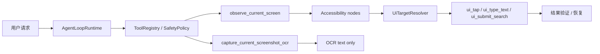
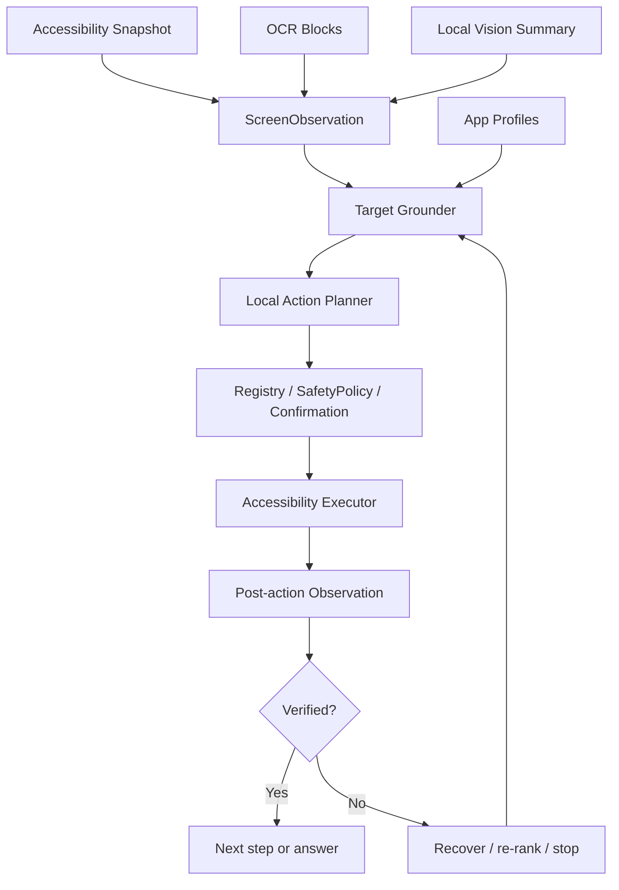
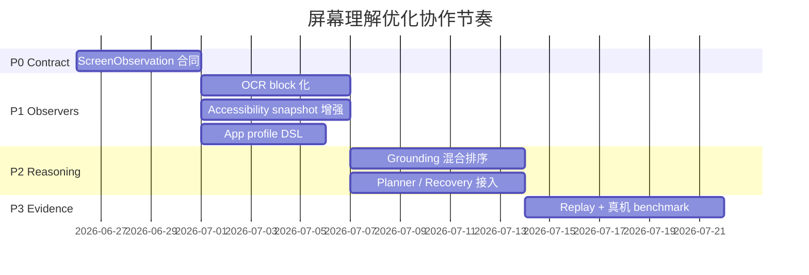

# 屏幕理解与手机操作优化计划

本文定义栖知下一阶段“用本地模型更可靠地理解屏幕并操作手机”的执行计划。
它不是发布验收记录；完成证据仍写入 `docs/validation_report.md` 和
`docs/phone_acceptance.md`。

## 根目标

让栖知在用户明确授权后，能把“当前屏幕上有什么、下一步该点哪里、执行后是否成功”
表示为可验证的本地证据，并在真实手机上完成更多低风险、多步骤任务。

成功标准：

- 屏幕理解不只返回 OCR 文本，而是返回带来源、边界框、置信度和隐私级别的结构化观察。
- 操作执行优先依赖 Android Accessibility 节点和官方手势能力，不把 ADB、坐标脚本或持续录屏作为产品运行时。
- OCR、Accessibility 文本、截图和视觉摘要都保持 `LocalOnly`，不能自动进入远程模型。
- 每一次 tap/type/scroll/submit 都能解释目标来源，并在动作后做结果验证。
- 真机回归能覆盖至少 6 个真实 App 的低风险搜索/筛选/导航任务，并记录失败原因。

## 当前基线

已有能力：

- `ScreenStateSnapshot` 能表达 Accessibility 节点、bounds、可点击/可编辑/可滚动等属性。
- `UiTargetResolver` 已按 App profile 排序搜索框、提交按钮、筛选和结果候选。
- `capture_current_screenshot_ocr` 已通过前台 MediaProjection 同意做一次性 OCR。
- `AgentLoopRuntime` 已有本地证据续写、observe/wait 恢复、mobile-action 模型能力门控。

主要缺口：

- OCR 结果目前偏文本摘录，没有纳入统一屏幕观察、候选目标和动作验证。
- Accessibility 节点、OCR block、局部视觉摘要之间没有统一 ID、坐标、来源和置信度合同。
- App profile 仍偏硬编码；新增真实 App 或页面状态需要改 Kotlin。
- 失败恢复主要围绕搜索闭环，还缺“观察差异、换候选、滚动重试、主动停手”的通用策略。
- 真机 benchmark 还没有达到可长期比较的任务 DSL、指标和产物规范。

## 边界判断

| 方向 | 决策 | 原因 |
| --- | --- | --- |
| 产品运行时执行 | 使用 Accessibility + 用户确认 | Android 官方支持跨 App 可访问性读写和手势；能进入现有 special access、policy 和 trace。 |
| 当前屏幕像素 | 只做前台一次性 MediaProjection OCR/视觉补充 | Android 对屏幕捕获有显式同意边界；持续捕获会扩大隐私和商店合规风险。 |
| ADB / uiautomator2 / Appium | 只用于测试、回放、benchmark 对照 | 这些适合工程验证，不适合面向用户的端侧运行时。 |
| 远程 VLM | 不接收屏幕/OCR/Accessibility 证据 | 当前项目隐私合同要求本地屏幕证据 `LocalOnly`。 |
| 坐标点击 | 仅作为带来源证据的低优先 fallback | 坐标本身不可解释，必须有节点/OCR/视觉候选支撑并做动作后验证。 |

## 目标架构

新增核心合同：

- `ScreenObservation`：统一表达屏幕尺寸、时间戳、前台包名、Accessibility 节点、OCR block、视觉区域、可交互候选和隐私边界。
- `ObservationElement`：统一 `id/source/bounds/text/role/clickability/confidence/sensitiveFlags`。
- `ResolvedUiTarget`：把“为什么点这里”拆成候选证据、选择原因、风险、fallback 类型和预期验证信号。
- `ActionOutcome`：记录 before/after diff、验证结果、失败类别和下一步建议。

## 多 Agent 阵列

| Agent | 产物 | 首要文件 |
| --- | --- | --- |
| Coordinator Agent | 拆分接口、合并节奏、发布门槛 | `docs/screen_ocr_agent_optimization_plan.md` |
| Contract Agent | `ScreenObservation` / `ObservationElement` 数据模型和 JSON trace | `app/src/main/java/com/bytedance/zgx/solin/device/` |
| OCR Agent | ML Kit OCR block 化、bounds 保留、LocalOnly 输出 | `app/src/main/java/com/bytedance/zgx/solin/multimodal/` |
| Accessibility Agent | 节点采集、稳定 ID、执行前后 snapshot diff | `SolinAccessibilityService.kt` |
| Grounding Agent | 混合候选排序、坐标 fallback、可解释 evidence | `UiTargetResolver.kt` |
| App Profile Agent | 外置 App profile DSL、真实 App 页面样本 | `docs/`、`app/src/test/resources/` |
| Planner Agent | 本地模型 action grammar、step budget、replan prompt | `AgentLoopRuntime.kt`、`skill/` |
| Recovery Agent | wait/scroll/retry/stop 策略和失败分类 | `orchestration/`、`device/` |
| Eval Agent | AndroidWorld 风格任务 DSL、回放、真机矩阵 | `scripts/`、`app/src/androidTest/` |
| Safety Agent | LocalOnly、权限、审计、商店合规回归 | `ToolRegistry.kt`、`SafetyPolicy.kt`、`docs/privacy_notice.md` |

协作顺序：

## 实施阶段

### P0：观察合同先行

交付：

- 新增 `ScreenObservation` 和序列化测试。
- `observe_current_screen` 可返回当前 Accessibility 节点的统一观察结构。
- Trace 中记录元素数量、来源分布、截断状态和隐私级别，不记录原始截图。

验收：

- JVM contract tests 覆盖 schema、隐私标记、超大屏幕截断。
- 旧 `ScreenStateSnapshot` 回放测试仍通过。

### P1：OCR 与 Accessibility 融合

交付：

- ML Kit text block、line、element 的 bounds/语言/置信信号进入 `ScreenObservation`。
- MediaProjection 当前屏幕 OCR 仍保持一次性同意、一次性消费。
- Accessibility 元素和 OCR block 能按空间关系合并为候选，如“节点没有 text，但 OCR 区域识别出按钮文案”。

验收：

- OCR 结果仍为 `LocalOnly`，远程模式无法看到 OCR 摘录。
- 真实设备取消 MediaProjection 后没有残留截图或可复用 token。

### P2：目标定位和动作执行

交付：

- `UiTargetResolver` 消费混合候选：Accessibility 优先，OCR/视觉辅助，坐标 fallback 最低。
- 每个动作输出 `ResolvedUiTarget` 和 `ActionOutcome`。
- 执行后比较 before/after observation，能判断输入框填入、搜索结果出现、页面切换或无变化。

验收：

- 淘宝、拼多多、高德、京东、Chrome、Android Browser 的搜索入口定位有 replay 用例。
- 相机、扫一扫、找同款、广告位等负例不会被误点。

### P3：本地模型规划与恢复

交付：

- 本地 action 模型只输出受限 action grammar，不直接输出 Android API 调用。
- Agent loop 根据 `ActionOutcome` 选择继续、滚动、换候选、等待、重新观察或停手。
- 低风险任务允许 bounded autonomous loop；中高风险继续走确认。

验收：

- 无 `MobileActionPlanning` profile 时 fail closed。
- 连续失败、目标不确定、页面含支付/发送/删除/授权语义时主动停手。

### P4：Benchmark 与真机证据

交付：

- 借鉴 AndroidWorld 的任务 DSL：`initial_state / instruction / allowed_apps / success_signal / max_steps`。
- 借鉴 DroidBot 的状态图思想，记录页面状态签名、动作边和失败状态。
- Appium/uiautomator2 只作为测试对照和 dump 来源，不进入用户运行时。

验收：

- `scripts/run_device_control_debug_eval.sh` 和 `scripts/run_real_app_search_eval.sh` 输出稳定 JSON evidence。
- 至少 50 个真实任务样本，覆盖搜索、筛选、地图地点检索、浏览器查询、设置入口。
- 50k 物理 perf gate 使用覆盖安装，不删除安装包，不清理已下载模型数据。

## 开源参考

| 项目 | 可借鉴点 | 在栖知中的落点 |
| --- | --- | --- |
| [AndroidWorld](https://github.com/google-research/android_world) | 任务 DSL、动态参数、可重复 benchmark、reward signal | 真机/eval 任务格式和成功判定。 |
| [DroidBot](https://github.com/honeynet/droidbot) | UI 状态图、探索式输入、事件转移记录 | 页面状态签名、失败重放、App profile 样本采集。 |
| [AutoDroid](https://github.com/MobileLLM/AutoDroid) | LLM 手机自动化、动作抽象、任务执行链路 | 本地 action grammar 和 planner/replanner 结构。 |
| [UI-TARS](https://github.com/bytedance/UI-TARS) | GUI grounding 和视觉动作模型思路 | 本地视觉 fallback 与目标定位评估，不直接上传屏幕。 |
| [Mobile-Agent](https://github.com/X-PLUG/MobileAgent) | observe-plan-act 多轮闭环 | Agent loop 的观察、行动、验证节奏。 |
| [AppAgent](https://github.com/TencentQQGYLab/AppAgent) | App 使用经验沉淀和多模态操作框架 | App profile DSL、页面别名和任务模板。 |
| [Appium UiAutomator2](https://github.com/appium/appium-uiautomator2-driver) / [openatx uiautomator2](https://github.com/openatx/uiautomator2) | Android UIAutomator2 测试控制 | 自动化测试、dump 对照和 CI，不进产品运行时。 |

平台边界参考：

- [Android AccessibilityService](https://developer.android.com/guide/topics/ui/accessibility/service)
- [Android MediaProjection](https://developer.android.com/media/grow/media-projection)
- [ML Kit Text Recognition](https://developers.google.com/ml-kit/vision/text-recognition/v2/android)

## 风险与防线

| 风险 | 防线 |
| --- | --- |
| 屏幕内容误发远程 | `ToolResultContinuationPolicy.LocalEvidence`、远程工具清单过滤、trace 隐私测试。 |
| OCR 误识别导致误点 | Accessibility 优先、OCR 只增益候选、动作后验证、低置信停手。 |
| 页面变化导致循环乱点 | step budget、状态签名去重、连续失败停手、危险语义 fail closed。 |
| App profile 过拟合 | profile 外置、保留 generic resolver、真实 App replay 矩阵。 |
| 性能和耗电退化 | OCR 限频、截图尺寸上限、观察缓存、50k 物理 perf gate。 |
| 商店合规风险 | 明确 Accessibility 用途、MediaProjection 前台同意、无持续录屏、无后台任意控制。 |

## 第一批任务拆分

1. Contract Agent：新增 `ScreenObservation` 数据模型、schema 测试、trace 摘要。
2. OCR Agent：把 `ImageTextExtractor` 输出从纯文本扩展为 block list，并保持兼容文本摘要。
3. Accessibility Agent：为 `SolinAccessibilityService` 输出统一 observation，补稳定元素 ID。
4. Grounding Agent：让 `UiTargetResolver` 同时消费 Accessibility 和 OCR candidates。
5. Eval Agent：新增 10 个 UI dump + OCR block 回放样本，先覆盖搜索入口负例。
6. Safety Agent：补远程模式、审计、隐私 notice 和 store policy 回归断言。

## 2026-06-27 Safety/Docs 最小闭环

本轮代码化 P0 和部分无设备 P1/P2/P4 合同；仍不把真机、人审或性能证据标成完成。

已代码化并由现有测试钉住的诉求：

- 私有工具结果必须声明 `privacy=LocalOnly` 和 `requiresLocalModel=true`；否则
  `ToolRegistry.validateResult` fail closed。
- `read_current_screen_text`、`capture_current_screenshot_ocr`、`observe_current_screen`
  和 `ui_*` 屏幕/OCR/Accessibility 工具不是 public evidence batch，也不进入远程模型
  planning surface。
- 当前屏幕 OCR 需要 MediaProjection 前台同意；Accessibility 读屏和 UI 动作仍走用户确认、
  Tool Registry、SafetyPolicy 和本地 trace/audit。
- `ScreenStateSnapshot` 可投影为 `ScreenObservation` JSON，包含来源、bounds、role、
  clickability、confidence、`LocalOnly` 隐私级别和截断摘要；旧 `nodesJson` 兼容保留。
- OCR 预览保留旧文本摘要，同时可携带 block/line/element bounds；当前屏幕 OCR 输出的
  `ocrBlocksJson` 和融合 Accessibility+OCR 的 `screenObservationJson` 是私有本地证据。
- `ui_*` 动作结果在保留旧 `afterNodesJson` 的同时输出
  `beforeScreenObservationJson`、`afterScreenObservationJson` 和有界
  `screenObservationDiffSummary`，让动作后验证和本地 replanning 能判断屏幕是否变化、
  新增/消失了哪些文本和可交互目标。
- 本机 observation replanner 接收有界 `LocalOnly` 观察摘要：`screenObservationJson`、
  `beforeScreenObservationJson`、`afterScreenObservationJson`、`screenObservationDiffSummary`、
  OCR blocks、OCR 文本和 Accessibility 文本先被本地裁剪/脱敏成 action-model prompt
  evidence；当前屏幕 OCR/读屏可在本地模型回答前规划下一步手机动作，trace、audit
  和公开返回值仍只保存脱敏结果。
- 可恢复的失败 `ui_*` 动作如果携带 before/after/diff/OCR 本地证据，也可以先交给本机
  action model 规划下一步；权限缺失、无本地证据、不可重试或 active skill plan 场景仍走
  原有 fail-closed / safe observe-wait 恢复路径，失败态私有证据不会进入 trace/audit。
- 本机 observation replanner prompt 增加有界动作诊断摘要：`actionType`、`target`、
  `failureKind`、`retryable`、搜索验证状态、节点计数和 `verificationSummary` 等字段会先脱敏
  再交给本机 action model，帮助区分换目标、等待、滚动、重试或停手。
- 本机 observation replanner prompt 增加有界 `Prior request details`：记录最近几步
  UI 工具的 target/direction/captureMode/timeout 等执行上下文，并明确失败后不要无证据重复
  同一个 target；`ui_type_text.text` 只记录字符数，不把输入正文放进 prompt。
- 本机 observation replanner 对小模型输出增加窄口径重复目标保护：当上一条失败的
  `ui_tap`、`ui_type_text` 或 `ui_scroll` 与本机模型下一步 draft 是同一工具、同一 target，
  且最新 diff 没有 `changed=true`、当前结构化观测/OCR blocks 也没有支持该 target 的证据时，
  不继续下发这条重复动作，让外层走已有 observe/wait 安全恢复；如果屏幕变化或当前观测确有
  可操作/OCR target 证据，则仍允许模型判断重试。
- 本机 observation replanner 对本地 OCR/结构化观测里的危险语义增加停手保护：如果当前
  `screenObservationJson`、`afterScreenObservationJson`、`ocrBlocksJson`、强危险
  `ocrText` 或 `screenText` 显示支付、发送、删除、发布、下单、购买、转账或授权类控制，
  小模型即使输出 `ui_tap`、`ui_type_text`、`ui_submit_search` 或 `ui_scroll` draft，
  也不会继续自动下发；OCR-only 证据只接受强危险短语或独立按钮词，静态说明文案不被当成
  可执行危险控制。
- 危险控件判断已下沉为共享 UI guard：绕过 observation replanner 的 direct/skill
  `ui_tap`、`ui_type_text`、`ui_submit_search` 和 `ui_scroll` 也会先用原始
  Accessibility provider 观察当前屏幕；若发现可交互的支付/发送/删除/发布/下单/购买/转账/授权
  控件，则返回 `failureKind=dangerous_action`，不调用动作 provider，也不清掉当前屏幕 OCR
  grounding cache。
- 结构化屏幕观测的本机 prompt 现在显式生成 `targets=[...]` 和 `targetShortlist(...)`
  候选列表，把可点、可编辑、可滚动的 Accessibility 元素和可作为低优先坐标 fallback
  的 OCR block 按 label/target/modeTags/source/role/bounds/confidence 摘要给本机模型；
  裁剪时优先保留可操作元素和 OCR 候选，减少模型从静态文本里猜目标或漏掉后置输入框/按钮的负担。
- 本机 prompt 会把 `screenObservationJson` 反序列化回 `ScreenObservation`，复用
  `UiTargetResolver` 的 profile 排序、负例惩罚和来源优先级来排序 `targetShortlist(...)`；
  排序会先根据当前 `User intent preview` 提升搜索入口、筛选、提交或滚动等目标 kind，
  再回填默认 resolver kind；同一 target 被多个 kind 命中时保留最优 rank，且 shortlist
  先于 verbose `elements=[...]` / `targets=[...]` 输出，降低长屏幕摘要截断时丢失可执行目标的风险。
- 当 OCR 文案空间覆盖在无文本 Accessibility 可操作节点上时，本机 prompt 会生成
  `source=accessibility+ocr` 的融合候选：label 来自 OCR，target 仍使用可执行的
  Accessibility transient node id，并要求 OCR bounds 大部分落在节点 bounds 内，降低模型输出
  纯 OCR 文本后运行时找不到节点的概率。
- fused `screenObservationJson` 中的 OCR 候选裁剪会优先选择 `ocr_block`、按 OCR 文本去重，
  再回填其它元素；同一 OCR block 展开的 line/element 不再能挤掉后置关键 OCR target，
  确保 `targetShortlist(ocrFallback=...)` 更稳定暴露给本机 action model。
- 当 `screenObservationJson` 尚未融合 OCR source、但工具结果带有 standalone `ocrBlocksJson`
  时，本机 prompt 也会从 OCR blocks 生成 `targets=[...]` 和
  `targetShortlist(ocrFallback=...)`；OCR fallback target 使用稳定的 `ocr:block:N`
  / `ocr:block:N:line:M` / `ocr:block:N:line:M:element:K`
  元素 id，文本和 bounds 保留为 label/证据，避免多个相同 OCR 文案坍缩成同一个 target；
  standalone OCR 的 shortlist 优先暴露更精确的 element/line target，再回退 block target，
  并先于 block 摘要和 verbose targets 输出，减少长 OCR 摘要截断风险。
  当同一 OCR 文案在当前证据里出现多次时，replanner 和执行器都要求使用 OCR element id；
  只有唯一 OCR 文本才保留文本 target 兼容路径。
- 本机 replanner 明确要求模型只把候选 `target=...` 值复制到工具 `target` 参数：
  Accessibility 候选优先使用可执行的 transient node id，OCR fallback 使用 OCR element id；
  `modeTags`、label、bounds、confidence 等只是候选注解，不能作为工具参数输出，避免模型生成
  执行器 schema 不支持的字段。
- 本机 observation replanner 对 `ui_tap`、`ui_type_text` 和 `ui_scroll` draft 增加当前证据
  守卫：当最新结果提供 `screenObservationJson`、`afterScreenObservationJson` 或
  `ocrBlocksJson`，或 `screenObservationDiffSummary` 里有新增文本/可操作项时，模型输出的
  `target` 必须能在当前 Accessibility/OCR/diff 证据中找到；找不到则停手，避免模型凭空
  生成不在屏幕上的目标。diff summary 只按 `|` 分隔后的完整新增文本或可操作 label
  匹配 target，`clickable:`/`editable:` 等模式前缀可剥离，但短子串不能单独放行动作。
- 对无 `target` 的 `ui_scroll` draft 也增加证据守卫：当前结构化观测或新增 diff 必须显示
  scrollable 元素，否则停手，避免本机模型在非滚动页上泛滚并形成循环。
- 对无 `target` 的 `ui_submit_search` draft 增加搜索上下文守卫：当前结构化观测、OCR
  blocks 或新增 diff 必须显示搜索输入框、搜索提交控件或搜索相关新增文本/可操作项，
  否则停手，避免本机模型在非搜索上下文里盲提交；OCR-only 的 `确定`、`完成`、
  `go`、`enter` 这类提交词必须同时伴随搜索上下文，不能单独触发 `ui_submit_search`。
- 执行器 wrapper 也增加 `ui_submit_search` 搜索上下文守卫：direct/skill path 在触发
  Accessibility IME enter 或 submit button 前，当前 Accessibility 快照必须显示搜索输入框、
  搜索提交控件，或 OCR cache 必须同时包含搜索上下文与提交词；普通聊天/评论/表单输入框
  不再能被 blind submit；动作前无法读取当前屏幕且没有有效 OCR submit hint 时也 fail closed。
- 本机 observation replanner、执行器 wrapper 和 AccessibilityService 都收紧了无 target 输入：
  `ui_type_text` 在 target 为空时必须有搜索输入上下文，否则 replanner 停手或执行器返回
  `editable_not_found`；底层服务不再回退到任意 editable，只接受已聚焦且非密码的输入框，
  或明确 target/搜索入口打开后的输入框。
- direct/skill `ui_type_text` 的空 target 路径在无法读取当前屏幕上下文时也 fail closed；
  只有当前 Accessibility 快照证明搜索输入上下文，或一次性 OCR cache 证明强搜索入口时，
  才会进入底层输入 provider。
- targetless `ui_type_text` 现在可使用一次性 OCR 搜索入口 grounding：当当前屏幕 OCR cache
  明确包含 `搜索商品`、搜索框、地址栏等强搜索输入上下文，且 Accessibility 屏幕签名未漂移时，
  执行器可带 OCR hint 先聚焦该入口再输入；孤立 `搜索`、`确定`、`go` 等提交词不会放行
  targetless 输入或 OCR-only `ui_submit_search`。
- 当前屏幕 OCR grounding 只在 capture 前后 Accessibility 签名稳定时生成可执行
  `screenObservationJson`；如果截图 OCR 与后置观察之间页面已变化，则只返回 OCR 文本并标记
  `screenObservationFailureKind=page_changed`，不缓存 OCR 坐标。缓存仍保持一次性且 15s 短 TTL，
  过期 hint 不能放行 targetless 输入。
- 本机 replanner 区分“OCR 可读”和“OCR 可执行”：`screenObservationIncluded=false` 或
  `page_changed` 时，`ocrBlocksJson` 只作为本机只读摘要，不生成 `ocrFallback` target、不放行
  `ui_tap`/`ui_type_text`/`ui_submit_search`；当前屏幕 OCR 也只在已有 request-bound
  MediaProjection one-shot consent 时才做 capture 前 Accessibility 稳定性采样。
- `ocrText` / `screenText` 这类纯文本摘要同样只作为理解证据；当没有
  `screenObservationJson`、`afterScreenObservationJson`、可执行 `ocrBlocksJson` 或 diff
  证据时，本机 replanner 不会仅凭文本摘要下发 tap/type/submit/scroll。
- LocalOnly OCR/屏幕 observation 后的本机模型重规划增加工具 allowlist：只允许
  `observe_current_screen`、`ui_tap`、`ui_type_text`、`ui_submit_search`、`ui_scroll`
  和 `ui_wait` 这类明确本地设备控制继续执行；`web_search`、外部发送/分享、联系人/文件/剪贴板
  等非本地控制工具即使由本机模型输出 draft，也不会从 LocalOnly 屏幕证据自动下发。
- 同一 allowlist 也进入本机 replanner prompt：模型会直接看到 LocalOnly observation 只能输出哪些
  本地 device-control 工具，并被明确要求不要从 OCR/屏幕证据输出 `web_search` 或外发工具，减少无效
  draft 后再被硬门拦截的概率。
- 搜索提交和无目标输入的上下文 guard 仍然阻止盲提交/盲输入；当当前屏幕快照可用时，
  失败结果会携带同一份 before/after structured screen observation 和 `changed=false` diff，
  让本机 replanner 可以基于当前按钮/输入框候选先点击或聚焦目标，而不是停在裸失败上。
- `ValidatingToolExecutor` 的 failed private-output 清洗边界保留上述本地恢复所需的
  observation id、before/after screen observation JSON 和 diff，但只限 `DeviceControl`
  工具，且 screen observation JSON 必须声明 `privacyLevel=LocalOnly`；`nodesJson` 等更大
  私有原始字段仍会被清洗掉。
- 本机 action parser 对 `ui_tap`、`ui_type_text`、`ui_scroll` 的 `target` 增加轻量纠偏：
  如果小模型把 `target=...`、`targetShortlist(...)` 或候选摘要片段误放进 JSON 字段，
  会在进入工具前提取真正的 target 字符串；非 UI 工具参数不做该归一化，避免扩大行为面。
- 本机 observation replanner 在接受模型 draft 后也复用同一套 UI target 纠偏，再运行危险动作、
  当前证据和重复 target 守卫；这样即使模型绕过 parser 层或输出候选摘要片段，最终下发的
  `ToolRequest` 也只携带真正的 target 值。
- 本机 observation replanner 对 `ui_tap` 增加必填 target 守卫：模型输出无 `target` 的 tap
  draft 会在 replanner 层停住，不再把无效点击请求交给后续工具 schema 或执行器处理。
- 同一路径优先按严格 primitive JSON 解析模型参数，再回退旧的字符串键值解析；这样本机模型
  输出 `timeoutMillis:1500`、布尔值或其它 primitive 参数时不会丢失，UI 动作可保留模型给出的等待预算。
- 运行时 transient node id 匹配补上 raw id 前缀路径，观察输出里的
  `n*_hash_snapshotSalt` 可匹配动作执行阶段的 `n*_hash` 候选，降低本机模型按观测 id
  指定目标后的误失配概率。
- `UiTargetResolver` 增加解释合同，标明 Accessibility 来源、fallback 类型和预期验证信号；
  OCR grounding 已进入 resolver 排序和当前屏幕 OCR 后的下一次 `ui_tap`、`ui_type_text`
  或 `ui_submit_search` 低优先 fallback；`ui_submit_search` 只接受精确提交按钮 OCR 文案，
  且中间插入任何非 device-control 工具都会清除 hint。vision grounding 仍只是占位合同，未宣称已接入真实排序。
- 当前屏幕 OCR grounding hint 现在绑定 capture 时的 Accessibility 屏幕签名：消费 hint 前会用
  最新 Accessibility 快照比对 package、节点数、可交互数和有界元素指纹；同包页面漂移后会丢弃
  旧 OCR 坐标，避免把上一屏 OCR bounds 用到下一屏。危险控件漂移仍由 direct UI action
  preflight 先行 fail closed。
- Replay eval 增加小样本覆盖搜索入口负例和 OCR bounds，不替代 6 App/50 task 真机 benchmark。

本轮文档化的诉求：

- `docs/privacy_notice.md` 明确屏幕像素、OCR 摘录、Accessibility 文本、节点/bounds
  元数据、动作后结构化观测和验证摘要均为 `LocalOnly`，不会自动发送到远程 endpoint 或远程 VLM。
- P3/P4 真机 benchmark、50k 物理 perf gate 和 release checklist 同步仍保留为未完成门槛，
  不作为本轮完成项。

仍需真机/人审/性能证据：

- 真机：MediaProjection 取消/同意、Accessibility special access、6 App/50 task benchmark、
  connected Android tests 和 real-app eval JSON evidence。
- 人审：release、security、legal、store-policy、support owner 对隐私 notice、
  Accessibility 用途和商店文案的发布前审阅。
- 性能：OCR 限频、截图尺寸上限、观察缓存、50k 物理 perf gate 和耗电/内存 evidence。

## 放行门槛

- `./gradlew :app:testDebugUnitTest` 通过，且新增 resolver/observation/OCR contract tests。
- `./gradlew :app:connectedDebugAndroidTest` 在授权真机通过。
- `ZvecNativeStoreSmokeTest` 和语义记忆 probe 不回退到轻量索引，或记录明确 blocker。
- `scripts/run_device_control_debug_eval.sh` 和 `scripts/run_real_app_search_eval.sh` 在真机产出 passed evidence。
- 50k 物理 perf gate 完成，覆盖安装，不删除本地模型数据。
- 文档同步：`agent_core_modules.md`、`phone_acceptance.md`、`privacy_notice.md`、`release_checklist.md`。
