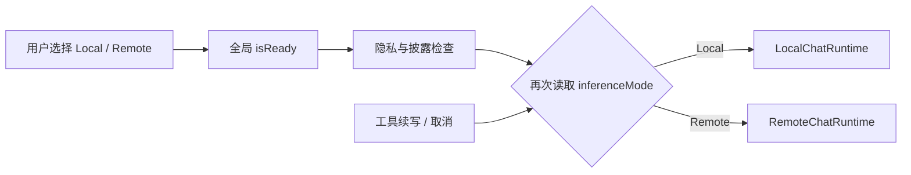

# 自适应端云推理：现状与外部调研

日期：2026-07-18

代码基线：`main@4ede5d1`

本文保留规格前的历史调研基线；当前已合并事实见 [status.md](status.md)。

调研方式：当前仓库只读代码审查、隐私/验证文档审查、官方模型服务文档核对，以及多 Agent 独立架构/安全/协议复核。

## 1. 结论摘要

当前项目已经具备第一阶段约一半的基础设施：本地和远程 runtime、远程模型配置、SSE 流式协议、远程连通性探测、手机资源采样、隐私分类、远程披露、工具确认和不含原文的运行审计。缺失的核心不是另一个模型客户端，而是一个位于隐私分类之后、首次 serving-model 调用之前的**run 级放置决策**。

第二阶段也无需替换现有远程数据面。Ollama、vLLM 和 llama.cpp 均能通过 OpenAI 兼容接口接入现有 `/v1/chat/completions` 流程；真正缺少的是统一、可信的节点身份、能力/负载快照、请求幂等和取消。因此建议保留现有数据面，增加最小控制面和一个薄适配层。

## 2. 当前代码能力地图

| 能力 | 当前实现 | 可复用程度 | 主要缺口 |
|---|---|---|---|
| 用户选择后端 | [`InferenceMode`](../../../app/src/main/java/com/bytedance/zgx/solin/RemoteModels.kt#L5) 仅 `Local / Remote` | 中 | 偏好和实际执行位置混在一起，无 `Auto` |
| 远程配置 | [`RemoteModelConfig`](../../../app/src/main/java/com/bytedance/zgx/solin/RemoteModels.kt#L18) 包含 URL、模型、API key、Vision 和连接状态 | 高，作为第一阶段候选描述 | 不含节点身份、协议、能力清单、状态时效 |
| URL 安全 | [`RemoteModelConfig.isConfigured`](../../../app/src/main/java/com/bytedance/zgx/solin/RemoteModels.kt#L27) 通过私有 `hasAllowedTransport()` 只允许 HTTPS，HTTP 仅 loopback | 高 | 第二阶段需要与配对身份关联；不能放宽全局策略 |
| 远程推理 | [`RemoteChatRuntime`](../../../app/src/main/java/com/bytedance/zgx/solin/runtime/RemoteChatRuntime.kt#L65) 使用 OkHttp、OpenAI Chat Completions 和 SSE | 高，第二阶段继续使用 | EOF 可被当作正常结束；取消是 runtime 全局取消 |
| 连通性探测 | [`RemoteModelConnectivityProbe`](../../../app/src/main/java/com/bytedance/zgx/solin/runtime/RemoteModelConnectivityProbe.kt#L15) 请求模型列表并映射状态 | 中 | 没有 RTT、时间戳、TTL、模型能力、负载、队列或 boot ID |
| 本地资源 | [`SystemResourceSnapshot`](../../../app/src/main/java/com/bytedance/zgx/solin/resource/SystemResourceMonitor.kt#L33) 含 PSS、heap、可用 RAM、low-memory、CPU、thermal | 中 | 当前只供 UI overlay 使用；CPU 首样本为空，单样本易抖动 |
| 本地生成适配 | [`AdaptiveGenerationPolicy`](../../../app/src/main/java/com/bytedance/zgx/solin/runtime/AdaptiveGenerationPolicy.kt#L7) 调节 token/图片预算 | 高，继续服务本地运行 | 它不选择执行位置，不应扩张为端云路由器 |
| 任务规模估算 | [`AgentLoopRouting`](../../../app/src/main/java/com/bytedance/zgx/solin/orchestration/AgentLoopRouting.kt#L145) 已有近似 token 估算 | 高 | 需提取为放置输入，不能记录原始文本 |
| 隐私边界 | [`MessagePrivacy`](../../../app/src/main/java/com/bytedance/zgx/solin/ChatModels.kt) 与 [`privacy_notice.md`](../../privacy_notice.md) 定义 LocalOnly/RemoteEligible | 高，必须先于放置执行 | 当前部分路径由 UI 模式反向决定消息隐私，耦合过强 |
| 发送编排 | [`ChatController`](../../../app/src/main/java/com/bytedance/zgx/solin/presentation/ChatController.kt#L407) 在一条大流程里检查就绪、隐私、披露并调用 runtime | 中 | 在放置前使用全局 readiness；需要抽出协作者，不能继续长大 |
| 工具续写 | [`ChatToolContinuationSupport`](../../../app/src/main/java/com/bytedance/zgx/solin/presentation/ChatToolContinuationSupport.kt#L72) 重新读取当前 UI 模式 | 低 | 同一 run 可能因用户切换模式而换目标 |
| 取消 | [`ChatController.stopGeneration`](../../../app/src/main/java/com/bytedance/zgx/solin/presentation/ChatController.kt#L1326) 按当前模式选择 runtime | 低 | `Auto` 时无法知道目标；远端需 request 级取消 |
| 数据目的地审计 | [`RunDataReceipt`](../../../app/src/main/java/com/bytedance/zgx/solin/orchestration/AgentModels.kt#L67) 记录 Local/Remote 聚合信息 | 高 | 缺策略版本、用户偏好、放置原因以及与实际调用的一致性断言 |
| 密钥存储 | 现有 Keystore 支持的 [`EncryptedSecretStore`](../../../app/src/main/java/com/bytedance/zgx/solin/data/EncryptedSecretStore.kt) | 高 | 第二阶段需要为节点 token 定义独立 alias/生命周期 |

## 3. 当前执行流的关键问题

当前简化流程如下：



这导致四个结构性问题：

1. **偏好不是运行事实。** UI 值可以变化，却被发送、工具续写和取消反复读取。
2. **就绪判断时机错误。** `Auto` 必须先得到候选，再判断所选目标的 readiness；不能用一个全局布尔值挡在路由之前。
3. **隐私与目标互相推导。** 目标应受隐私约束，而不是目标选择反过来放宽隐私。
4. **缺少 single-serving-placement 不变量。** 当前没有统一的 run 级对象证明“所有 serving attempt 只调用所选的一种 runtime”；本地 action-planning/embedding 辅助模型不计入该目的地。

因此，第一阶段的主要改动应集中在编排合同，而不是网络协议。

## 4. 可复用的隐私和安全边界

现有 [`privacy_notice.md`](../../privacy_notice.md) 已经提供本方案最重要的约束：

- `LocalOnly` 内容不允许进入远程路径。
- 隐私未知时 fail closed。
- 远程发送需要明确的用户配置/披露。
- 工具权限、敏感操作确认和证据边界独立于模型后端。
- 远程审计不得持久化原始 prompt。

自适应放置不能重新定义这些概念，只能在隐私分类给出的允许集合中选目标。特别是：

- `Auto` 不是“更智能的 Remote”，不能把 `LocalOnly` 升级为 `RemoteEligible`。
- 远端模型返回的工具调用仍只是一项建议；工具注册、SafetyPolicy、确认和执行继续在手机完成。
- 远端 run 获得新的私密 observation 后不能把该 observation 再发给远端，也不能无提示地切到本地继续生成。

## 5. 手机资源信号的可靠性

现有采样已覆盖 MVP 所需信息，但各信号不能等价使用：

| 信号 | 可靠用法 | 不应做的事 |
|---|---|---|
| Android `lowMemory` | 强远端偏置并收紧本地预算；只有 runtime admission 明确失败才硬阻断 | 把一次回调等同于本地模型必然 OOM |
| 严重 thermal 状态 | 本地候选硬阻断或强远端偏置 | 运行中迁移正在生成的请求 |
| CPU 使用率 | 经过短窗口稳定后作为软偏置 | 用首次空样本或一个尖峰判定不可用 |
| PSS / 可用内存 / heap | 组合成 Normal/Warm/Hot；Hot 才强偏置 | 声称能精确预测 OOM |
| Warm | 继续本地并收紧本地 generation budget | 仅因 Warm 就把私密/图片任务送远端 |

推荐在 run 创建时取最近三次样本的中位数或使用“2/3 命中”稳定档位，并加入短冷却窗口。第一阶段不做运行中的持续重路由。

## 6. 复杂度信号调研

当前代码已有 token 近似估算和结构化路由结果，因此不需要新增 LLM 分类器。可用信号：

- 输入 + 选定历史的估算 token 与本地上下文上限之比。
- 请求的输出预算和 reasoning 档位。
- 图片数量及本地/远端视觉能力。
- 是否已经判定需要多步计划或工具循环。
- 本地能力是否满足当前任务，而不是对自然语言做关键词匹配。

复杂度只回答“两个合法候选中哪个更合适”，不能回答“是否允许出端”。信号不全时标记 `Unknown` 并优先本地。

## 7. 外部模型服务兼容性

以下结论只使用项目官方文档：

| 服务 | 可复用的数据面 | 可观测能力 | 对方案的含义 |
|---|---|---|---|
| Ollama | 官方提供 [OpenAI compatibility](https://docs.ollama.com/api/openai-compatibility)，覆盖 Chat Completions、streaming，并随模型支持 vision/tools | [`/api/ps`](https://docs.ollama.com/api/ps) 提供运行模型、大小、VRAM 和上下文等 | 第一阶段可直接配置兼容地址；第二阶段不应让 Android 绑定 Ollama 私有字段 |
| vLLM | 官方 [OpenAI-Compatible Server](https://docs.vllm.ai/en/stable/serving/openai_compatible_server/) 提供 Chat API | 官方 [Metrics](https://docs.vllm.ai/en/stable/design/metrics/) 提供运行请求、KV cache、TTFT 等 | 适合服务器端大模型，但 Prometheus 字段需由 edge adapter 归一为少量移动端状态 |
| llama.cpp | 官方 [`llama-server`](https://github.com/ggml-org/llama.cpp/blob/master/tools/server/README.md) 提供 OpenAI Chat、streaming、模型和监控能力 | 有健康/指标能力，工具行为依赖 chat template | 可作为轻量桌面后端；上线前必须跑流式、工具、视觉契约用例 |
| Tailscale Serve | 官方 [Serve](https://tailscale.com/docs/features/tailscale-serve) 可在 tailnet 内以自动证书 HTTPS 暴露本地服务 | 连接身份由 tailnet 提供 | 是个人场景的推荐网络承载之一，但不成为 Solin 的强依赖 |

兼容性结论：

- 现有 `RemoteChatRuntime` 的 OpenAI 数据面方向正确，不应在第二阶段重写成 provider SDK。
- “OpenAI compatible” 不保证所有模型模板、工具参数、视觉格式和 `[DONE]` 行为一致；每个受支持 provider/profile 必须通过同一套契约夹具。
- 原生健康接口差异足以证明需要一个很薄的状态归一层，但不需要把 Prometheus、调度器或模型生命周期平台搬进手机。

## 8. 第二阶段协议缺口

仅靠现有 `RemoteModelConfig` 无法安全地做“自动远程”：

| 缺口 | 为什么影响自动路由 |
|---|---|
| 节点身份 | 相同 URL 指向的服务可能变化，手机无法区分目标节点或证书轮换 |
| 配对授权 | 手工 API key 不能表达“这台手机”的授权、撤销和邀请时效 |
| 状态时效 | 一个 `Reachable` 枚举无法证明当前模型仍加载、队列仍可接受请求 |
| 能力协商 | `supportsVision` 是用户配置，不足以描述上下文、工具和模型版本 |
| 幂等 | 断网后无法判断请求是否已经被服务端接受/完成 |
| 请求级取消 | 当前 `stop()` 取消 runtime 中全部活动 call，不能可靠取消指定 run |
| 流完成语义 | EOF 可能被当作结束，截断的工具 JSON 有副作用风险 |

第二阶段控制面只需解决以上问题。推理 payload 仍走现有 Chat Completions；手机不上传会话数据库、记忆存储、配置库或模型状态。

## 9. 目标代码边界

后续实现应遵守当前仓库的 god-object 约束：不继续把决策逻辑塞进 `SolinViewModel.kt`、`SolinScreen.kt` 或 `AgentLoopRuntime.kt`。

推荐的职责边界：

```text
presentation/
  ChatController                 只协调 UI、确认和一次 run 的启动/停止

orchestration/
  ModelPlacementPolicy           纯函数：聚合输入 -> 决策/阻断
  RunPlacementBinding            runId -> 不可变 placement；续写/取消只读它
  Agent trace                    保存枚举化原因，与 RunDataReceipt 对账

runtime/
  本地/远程 runtime              执行已选目标，不参与策略
  Resource monitor               只提供稳定快照

edge protocol（第二阶段）
  PairedEdgeNodeStore            配对元数据 + 加密 token
  EdgeNodeClient                 status / claim / request status / cancel
  RemoteChatRuntime              继续承担 Chat Completions 数据面
```

不要把 `AdaptiveGenerationPolicy` 扩成目的地路由器：前者负责“本地已经被选中后用什么预算”，后者负责“本次在哪里执行”，两者输入、风险和测试合同不同。

## 10. 验证和文档影响面

### 第一阶段最低验证

- 纯策略矩阵：隐私、偏好、能力、连接、资源、复杂度和 blocked。
- 组件测试：每个 run 只调用一种 serving runtime（同目标可有多个 attempt）；切换偏好不影响续写；取消命中实际目标。
- 隐私负向测试：`LocalOnly`、未知隐私、取消确认、私密工具结果均为零远程请求。
- trace 测试：placement、reason 与 `RunDataReceipt.destination` 一致，且无 prompt/endpoint/token。
- UI 行为：旧配置默认 Local；Auto 显式启用；本次目标和原因可见。

### 第二阶段最低验证

- 邀请过期/重放、token 撤销、401/403、节点身份不匹配。
- 协议版本、status TTL、boot ID、能力变化、过载和 `Retry-After`。
- request ID 同体重试、异体冲突、SSE 截断、显式完成、请求级取消。
- Ollama、vLLM、llama.cpp 至少各一套文本流；声明支持的 tools/vision profile 再跑对应夹具。
- 真机通过真实 LAN/tailnet 的 HTTPS 配对、推理、断网、后台/前台和停止。

### 实现落地后需要同步的所有者文档

本规格描述未来能力，不能在代码未实现时把它写成“当前事实”。相应阶段落地时，应同步更新：

- `docs/index.md`
- `docs/agent_core_modules.md`
- `docs/privacy_notice.md`
- `docs/capability_matrix.json` 及其代码镜像
- `docs/model_capability_profiles.json`
- `docs/ai_behavior_eval_plan.md`
- `docs/phone_acceptance.md`
- `docs/release_checklist.md`、`docs/release_readiness.md`
- `docs/privacy_review.json`、`docs/store_policy_record.json`、`docs/release_validation_record.json`
- README、商店隐私/数据披露和发布证据

## 11. 建议发布策略

第一阶段先运行 shadow decision：继续执行用户的手动选择，只记录纯枚举化“Auto 本会选择什么”，验证误路由和稳定性；随后才开放显式 Auto。第二阶段分别用 `edgeNodePairingEnabled` 和 `edgeNodeRoutingEnabled` 控制“可配对”和“可参与自动路由”，避免协议试验直接改变推理路径。

任一阶段出现以下情况应立即关闭相应开关：LocalOnly 发出远程请求、确认被绕过、同一 run 双发、receipt 与实际目的地不一致、未配对/已撤销节点被使用、身份不匹配被接受、凭证或原始内容进入日志。
