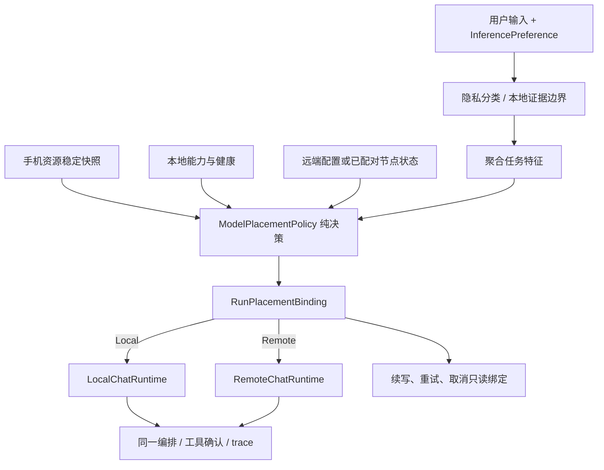
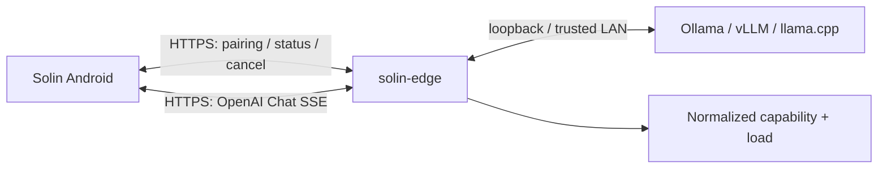

# 自适应端云推理技术规格

日期：2026-07-18

状态：已确认，第一阶段进入实施计划评审

代码基线：`main@4ede5d1`

相关调研：[research.md](research.md)

决策记录：[brainstorm.md](brainstorm.md)

## 1. 概述

Solin 增加一个隐私优先、可解释的模型放置能力：用户可选择本地、自动或远程；自动模式在每次 run 开始时，根据数据是否允许出端、模型能力、候选健康、手机资源和任务复杂度选择本地小模型或用户授权的远程大模型。

功能分两阶段交付：

1. **阶段一：自适应选择。** 复用当前手工配置的远程模型和现有连通性探测，在 Android 内完成决策、run 绑定、解释和审计。
2. **阶段二：可信边缘节点。** 在阶段一之上增加单节点配对、身份/授权、能力与负载状态、请求幂等和请求级取消，使个人电脑或服务器成为可被可靠感知的候选。

两阶段不是一次请求的串行推理步骤。MVP 中每个 run 只选择一个模型位置，不进行本地草稿、远端校正、运行中迁移或 KV/隐藏状态传输。

## 2. 目标和成功标准

### 2.1 目标

- 默认保持本地，用户显式开启后才允许自动选择远端。
- 在不改变现有隐私、工具安全和确认边界的前提下提高复杂任务成功率，降低手机在高资源压力下的本地推理负担。
- 保留现有 OpenAI 兼容远程模型能力，不把阶段二变成新的模型托管平台。
- 让每个决策都能由稳定原因码解释、测试和审计，且不记录敏感原文。
- 逐步演进：阶段一不依赖电脑端新程序；阶段二不重写阶段一决策器。

### 2.2 成功标准

1. 所有 `LocalOnly` 或隐私未知用例的远程请求数为 0；本地不可用时明确阻断。
2. 任一 run 的初始生成、同目标重试、工具续写和取消始终绑定同一 serving placement；允许同一目标多次 attempt，但 `localInvocationCount > 0` 与 `remoteInvocationCount > 0` 永不同时成立。
3. 阶段一在已验证远端可达时，能按定义的资源/复杂度规则选择远端；状态未知或过期时回到本地或阻断。
4. 用户始终能看到偏好与本次实际执行位置，远端发送继续经过既有披露/逐次确认规则。
5. 阶段二能在真机上完成单节点配对、状态协商、流式推理、停止、撤销和身份错误处理，且不要求放宽 Android 全局网络安全配置。
6. trace、日志和数据 receipt 中不出现 prompt、图片内容、工具原始参数、API key、配对 secret、bearer token、endpoint 或 IP。

产品收益门槛用固定评测集和设备基线衡量：Auto 对 RemoteEligible 的复杂任务，成功率相对强制 Local 至少提升 15 个百分点；资源 Hot 场景的本地生成时长或继续升温事件至少下降 30%；Normal + Simple 场景误选 Remote 的比例不高于 10%。未达到收益门槛时可以保留手动 Remote，但不得扩大 Auto 发布。

## 3. 总体架构



不变量：

- `MessagePrivacy` 决定允许集合；`ModelPlacementPolicy` 只能缩小，不能扩大该集合。
- preference 是下一次运行的输入，不是进行中运行的事实。
- placement 在 run 中不可变；所有 serving-model 调用必须携带或解析同一个 `runId`。
- 工具始终在手机端注册、确认和执行；远端只生成模型输出/工具建议。
- 本地与远端 runtime 是执行器，不自行决定 fallback。
- placement 只约束用户可见 Chat 生成/续写的 serving runtime；始终本地的 embedding、规则分类和 action-planning 辅助模型不属于 placement，不得因此获得远程资格。

## 4. 核心数据合同

命名可在实现时按项目风格调整，但语义不得合并：

```kotlin
enum class InferencePreference {
    Local,
    Auto,
    Remote,
}

enum class RunPlacement {
    Local,
    Remote,
}

enum class RequestComplexity {
    Simple,
    Complex,
    Unknown,
}

enum class CandidateState {
    Eligible,
    Unavailable,
    Unauthorized,
    CapabilityMismatch,
    PrivacyBlocked,
    Stale,
}

data class PlacementDiagnostics(
    val complexity: RequestComplexity,
    val localState: CandidateState,
    val remoteState: CandidateState,
    val secondaryReasons: List<PlacementReasonCode>,
)

sealed interface PlacementDecision {
    val policyVersion: Int
    val preference: InferencePreference
    val primaryReason: PlacementReasonCode
    val diagnostics: PlacementDiagnostics

    data class Chosen(
        override val policyVersion: Int,
        override val preference: InferencePreference,
        override val primaryReason: PlacementReasonCode,
        override val diagnostics: PlacementDiagnostics,
        val placement: RunPlacement,
    ) : PlacementDecision

    data class Blocked(
        override val policyVersion: Int,
        override val preference: InferencePreference,
        override val primaryReason: PlacementReasonCode,
        override val diagnostics: PlacementDiagnostics,
    ) : PlacementDecision
}

data class BoundRunPlacement(
    val runId: String,
    val decision: PlacementDecision.Chosen,
    val remoteProfileRevision: String?,
)

data class RemoteConnectivitySnapshot(
    val configRevision: String,
    val status: RemoteModelConnectivityStatus,
    val checkedAtElapsedRealtimeMs: Long,
    val ttlMs: Long = 60_000,
)
```

`Blocked` 不得调用任一 serving runtime。diagnostics 只用于当次解释，不作为第二份策略事实持久化；绑定直接引用 `Chosen`，避免 placement/reason 复制后相互矛盾。

`remoteProfileRevision` 是随机生成、不含 URL/token 的不透明 UUID。base URL、model、API key、vision、tool 或 context 声明任一变化时换新 revision；连接状态刷新不改变 revision。若用户在披露或确认期间修改配置，本 run 作废并要求重新发送，不能把确认授权应用到另一个 endpoint。

旧版 `InferenceMode.Local` 迁移为 `InferencePreference.Local`，`InferenceMode.Remote` 迁移为 `InferencePreference.Remote`。不存在配置或枚举值无法识别时迁移为 `Local`。

### 4.1 稳定原因码

至少定义：

```text
USER_FORCED_LOCAL
USER_FORCED_REMOTE
PRIVACY_REQUIRES_LOCAL
LOCAL_MODEL_UNAVAILABLE
LOCAL_RESOURCE_BLOCKED
LOCAL_CAPABILITY_MISMATCH
REMOTE_NOT_AUTHORIZED
REMOTE_NOT_CONFIGURED
REMOTE_CONNECTIVITY_UNAVAILABLE
REMOTE_STATUS_STALE
REMOTE_CAPABILITY_MISMATCH
REMOTE_OVERLOADED
AUTO_SIMPLE_LOCAL
AUTO_IMAGE_LOCAL
AUTO_COMPLEX_REMOTE
AUTO_RESOURCE_REMOTE
NO_ELIGIBLE_TARGET
PLACEMENT_DECISION_MISSING
PLACEMENT_NOT_RESTORABLE
PLACEMENT_LOCAL_CONTINUATION_REQUIRED
MODEL_EXECUTION_FAILED
```

错误原因和选择原因共用稳定枚举，用户文案由 Android 本地映射，协议和 trace 不保存自由文本。

## 5. 阶段一：基于当前远程配置的自适应选择

### 5.1 范围

阶段一新增 `Auto` 偏好和 Android 内的 run 级策略。远端候选仍来自当前 `RemoteModelConfig`；用户继续手工配置 base URL、model、API key 和 vision 标志，并可显式填写 `supportsToolCalls`（默认 false）与 `contextWindowTokens`（默认未知）。旧配置在 Auto 中只能证明 text 以及原有 vision 声明；工具/上下文能力无法证明时留在本地。手动 Remote 保留当前尝试行为。阶段一不要求电脑安装新的 Solin 服务。

### 5.2 决策输入

策略只接收聚合特征，不接收 prompt 字符串或图片字节：

| 类别 | 字段 | 来源/处理 |
|---|---|---|
| 隐私 | `MessagePrivacy`、`requiresLocalModel`、是否含私密 observation | 现有隐私/证据分类；未知按 LocalOnly |
| 需求能力 | text/vision/tools、估算上下文比率、请求输出预算 | 现有消息、模型 profile 和 token 估算的结构化结果 |
| 本地候选 | runtime loaded、模型健康、能力 profile | 当前本地 runtime/catalog |
| 手机资源 | lowMemory、thermal、Normal/Warm/Hot | `SystemResourceMonitor` 的稳定快照 |
| 远端候选 | 配置合法、授权披露、连接状态、手工 capability | 当前 RemoteConfig/ConnectivityProbe |
| 任务规模 | Simple/Complex/Unknown | 下述确定性规则 |
| 用户意图 | Local/Auto/Remote | 持久化 preference |

不得把端点、模型响应时间、prompt、关键词命中或用户正文写入 `PlacementDecision`。

隐私输入必须独立于 preference/placement 生成。发送前先构建 `PromptPrivacyPlan`：

- 普通手输文本只有在内容/来源分类成功时才可标为 `RemoteEligible`；分类缺失、异常或元数据未知一律 `LocalOnly`。
- 屏幕/OCR、图片、文件、设备上下文、memory/evidence、工具输出沿用各自来源和 `ToolSpec` 隐私元数据；本地受保护来源为 `LocalOnly`。
- 历史消息保留创建时的隐私；本地模型输出继承生成它的全部输入中最严格的隐私，远端输出为 `RemoteEligible`。
- 当前输入或语义必需 evidence 为 `LocalOnly` 时，整个 prompt `requiresLocalModel=true`。可选的 LocalOnly 历史只能按现有远端历史过滤规则排除，且只记录排除计数；不得为了选 Remote 静默丢弃当前问题所需证据。
- steer、queued input 和工具 observation 在并入 prompt 前重新聚合；Remote run 一旦收到新的 LocalOnly 数据即停止 serving 续写，不发送该数据。
- Auto 最终选择 Local 不会反向把本来 RemoteEligible 的消息改成 LocalOnly；隐私资格与执行事实始终分离。

聚合规则是 `LocalOnly` 优先：任一实际将进入候选 prompt 的 segment 为 LocalOnly，则该 prompt 不能远程。分类器本身只能是确定性的本地逻辑或本地辅助模型，永不调用远端。

阶段一的连接快照由远程模型 repository 内存持有，TTL 固定为 60 秒并使用 `elapsedRealtime`。保存物质配置、开启 Auto、应用回到前台且快照过期、或远程调用失败时异步刷新；发送路径不等待同步探测。快照 revision 不匹配、进程重启或 TTL 到期即视为 `Stale/Unknown`，当前 run 回到剩余合法候选，同时为下一 run 触发刷新。

### 5.3 复杂度规则

阶段一采用确定性规则，不调用另一个模型：

- 任一硬复杂信号成立即为 `Complex`：
  - 估算输入/历史 token 达本地可用上下文的 70% 以上；
  - reasoning 档位为 Medium/High；
  - 结构化路由已要求多步计划或多轮工具循环；
  - 请求输出预算达到 policy v1 的高档阈值 `4,096` tokens。当前默认的 `2,048` 输出预留不算高档；调用方没有显式请求预算时传 Unknown，不得用默认预留伪造复杂信号。
- 信息充分且无硬复杂信号时为 `Simple`。
- token 上限、模型 profile 或必要结构化信息不可得时为 `Unknown`。

图片不直接等价于复杂：若本地 vision 能力满足，`Auto` 默认本地以减少图片出端；本地不支持、隐私允许且远端支持时才选择远端。

阈值必须集中定义、进入策略版本，并通过 fixture 校准；不得散落在 ViewModel/UI。`4,096` 是阶段一保守阈值，后续只能通过提升 policy version 调整。

### 5.4 资源规则

- 在 run 创建时读取稳定快照；运行中不再重路由。
- 固定算法为：取最近 10 秒内最多三个有效综合样本；至少两个样本时，2/3 为 Hot 才判 Hot，2/3 为 Warm-or-Hot 才判 Warm，否则 Normal。只有一个样本时为 Unknown，不淘汰本地；CPU 为 null 只忽略 CPU 分量，内存/thermal 分量仍有效。
- `lowMemory=true`、Hot、thermal Severe/Critical 是强远端偏置，不直接宣判本地不可用。只有本地 runtime admission/load 明确失败，或 thermal Emergency/Shutdown，才淘汰本地候选。
- `LocalOnly + lowMemory/Hot` 仍尝试带收紧预算的本地执行；只有上述明确硬失败才 Blocked。
- `Warm` 保持本地，并交给现有 `AdaptiveGenerationPolicy` 收紧预算。
- 从 Hot/硬风险降档需要连续 15 秒没有同级信号；阈值、10 秒窗口、15 秒 cooldown 都属于 policy version 1 常量。
- 0/1 个有效样本、CPU 首样本为空或状态 Unknown 不得单独淘汰本地候选。
- 选中远端不自动卸载已加载本地模型；生命周期优化不属于此阶段。

### 5.5 决策表

按表格从上到下执行，先命中的硬门禁不可被后续规则覆盖：

| 优先级 | 条件 | 决策 |
|---|---|---|
| 1 | 隐私未知、LocalOnly、`requiresLocalModel` 或私密 observation | 仅裁剪 Remote 候选；尚不选择 Local |
| 2 | 候选不支持所需模态/上下文/工具能力 | 裁剪该候选；阶段一 Auto 的远端 tool/context 能力必须有显式配置声明 |
| 3 | preference=Local | Local 合法则 Local，否则 Blocked；不 fallback |
| 4 | preference=Remote | Remote 已配置且未被隐私/能力/明确连接失败阻断则 Remote，否则 Blocked；不 fallback |
| 5 | preference=Auto 且未完成远程披露/授权 | Remote 淘汰；Local 合法则 Local，否则 Blocked |
| 6 | Auto 的远端不是近期 `Reachable` | Remote 淘汰；Local 合法则 Local，否则 Blocked |
| 7 | Auto 只有一个合法候选 | 选择该候选 |
| 8 | Auto，图片且本地 vision 合法 | Local |
| 9 | Auto，本地 lowMemory/Hot/thermal Severe 或 Critical，远端合法 | Remote；本地仍是可用候选而非硬淘汰 |
| 10 | Auto，复杂任务，且远端声明的能力/上下文满足 | Remote |
| 11 | Auto，Simple/Unknown，或 Warm，Local 合法 | Local |
| 12 | 无合法候选 | Blocked，显示主原因；模型调用数为 0 |

手动 Remote 保持当前兼容性：配置合法且不是 `AuthenticationFailed / Unreachable` 时可尝试，`Unknown / Checking` 不作为新增阻断；Auto 只接受同 revision、未过期的 `Reachable`。这一区别必须在 UI 说明和测试中固定。

### 5.6 运行生命周期

```mermaid
sequenceDiagram
    participant UI as ChatController
    participant Privacy as Privacy/Skill routing
    participant Policy as ModelPlacementPolicy
    participant Binding as RunPlacementBinding
    participant Runtime as Selected Runtime

    UI->>Privacy: classify(message, context)
    Privacy-->>UI: privacy + structured requirements
    UI->>Policy: decide(aggregated features)
    alt blocked
        Policy-->>UI: Blocked(reason)
        UI-->>UI: show explainable failure; no runtime call
    else selected
        Policy-->>UI: immutable decision
        UI->>Binding: bind(runId, decision)
        UI->>Runtime: generate(runId, request)
        Runtime-->>UI: stream / tool request / failure
        UI->>Binding: resolve for continuation/retry/cancel
    end
```

绑定规则：

- 放置必须发生在隐私/Skill-first 分类之后、serving prompt 装配和首次 serving-model 调用之前；始终本地的 action-planning/embedding 辅助调用不受它控制。
- 初始生成、context-overflow 压缩重试、模型级重试、工具公开 observation 续写和 steer 均使用原 placement。
- 用户切换 preference 只影响下一 run。
- 用户点击“重试”创建新 run、重新分类和重新放置。
- 一个 run 已开始向远端发送后，网络或模型失败只将该 run 标记为 Failed，不在本地自动重放。
- 远端 run 收到 `LocalOnly` 工具结果、steer 或 queued input 时，以 `PLACEMENT_LOCAL_CONTINUATION_REQUIRED` 终止模型续写；产品可提示用户创建一个新的本地 run。
- 活动中的模型网络请求在进程死亡后绝不重放。只允许恢复同一 OS boot 内、30 分钟以内的待确认或工具 continuation；恢复记录必须包含已知 binding schema、匹配的 runId、placement 和未变化的 remote revision。损坏、重复、超期、boot 变化、runId 不匹配或版本未知均以 `PLACEMENT_NOT_RESTORABLE` fail closed。
- 取消通过绑定找到实际 runtime。阶段一远端仍为进程内 best-effort 取消；阶段二升级为 request 级取消。

绑定与 dispatch 必须单一入口：`bindAndReserveDispatch(runId, decision)` 用 compare-and-set 原子持久化 placement/trace 及 `Pending` 状态；统一 dispatcher 再用 compare-and-set 将其改为 `Started` 并写入 `ModelRuntimeInvocationStarted(runId, placement, attempt, targetRevision)`，随后才可调用 runtime。同 placement 的后续 attempt 递增 attempt；另一 placement 永远不能 claim。绑定、持久化、trace 或 CAS 失败时不得调用任何 serving runtime，现有 ephemeral/fail-open route 不得用于 Auto。

### 5.7 隐私、确认和披露

- Auto 首次开启前必须完成等价于 Remote 模式的远程数据披露。
- 远端发送继续执行现有 `OnRemoteModeSwitch / EveryMessage / OncePerSession / OnlyWhenSensitive` disclosure policy；敏感内容和图片仍强制逐次确认，自动策略不能绕过确认。
- 在现有 policy 要求确认时，确认页显示实际 endpoint profile 的稳定显示名称、目标 `Remote` 和简短原因。
- 确认期间若远端配置 revision 改变，原确认失效。
- 取消确认、应用退后台导致确认失效、隐私分类异常时，远程调用数为 0。
- `RunDataReceipt.destination` 必须由实际 placement 生成，而不是由 preference 推断。

### 5.8 UI 和可解释性

模型管理页显示三个偏好：

- **本地**：只用手机模型；不可用时明确失败。
- **自动**：在允许远程的请求中，根据任务和设备状态选择；是显式 opt-in。
- **远程**：强制使用已配置远端；LocalOnly 数据仍阻断。

聊天运行状态单独显示本次目标，例如：

- `本次使用本地模型：内容仅限本地处理。`
- `本次使用本地模型：任务较轻，手机状态正常。`
- `本次使用远程模型：上下文较长，且远程连接已验证。`
- `无法执行：内容只能在本地处理，但本地模型当前不可用。`

界面不显示内部阈值、IP、token 或完整 endpoint。高级诊断最多显示枚举化的候选状态和时间，不显示用户内容。

### 5.9 记录与审计

复用现有 Agent trace 和 `RunDataReceipt`，不新增一套审计数据库。增加 `PlacementSelected` 与由统一 dispatcher 写入的 `ModelRuntimeInvocationStarted` 结构化步骤，字段仅包括：

- run ID、policy version、preference、selected placement。
- complexity band、本地资源/健康档位、远端连接档位。
- reason codes 和不透明 remote profile revision。

必须断言：

```text
PlacementSelected.placement
  == ModelRuntimeInvocationStarted.placement
  == RunDataReceipt.destination
```

`ModelRuntimeInvocationStarted` 必须由真正调用 runtime 的统一 dispatcher 产生，不能由策略层预先伪造；行为评测用它作为 actual execution target，并与 fixture 的 expected target/reason 对账。

不得记录：原始 prompt、图片、工具原始参数、API key、endpoint/IP、配对 secret/token、模型返回全文。日志遵守现有 `SolinLog` 脱敏约束。

### 5.10 阶段一发布

1. **Shadow：** 生产执行仍按手动 preference；只计算并本地记录枚举化的 Auto 决策，用测试/开发构建对账。
2. **Opt-in：** Auto 仅在开发/实验开关开启且用户完成披露后出现。
3. **默认可见：** 达到隐私、双发、阻断率和设备稳定性阈值后向实验用户开放；默认选择仍为 Local。

硬回滚条件：LocalOnly 远传、确认绕过、同一 run 双发、trace/receipt/实际 runtime 不一致、配置变更后沿用旧确认、日志出现敏感字段。

## 6. 阶段二：手机与可信边缘节点协同

### 6.1 范围和拓扑

阶段二在电脑或服务器引入 `solin-edge` 薄适配层。它不加载或调度模型，只负责认证、控制状态归一、请求身份/取消，并代理到一个管理员配置的 Ollama、vLLM 或 llama.cpp 实例。



首版限制：一个手机可保存配对记录，但只有一个活动节点参与 Auto；一个 edge 节点可以签发多个设备 token，但每个 token 可单独撤销。不支持自动发现、云账户、relay 或多节点故障转移。

协议规格由本仓库维护；`solin-edge` 作为独立、可替换的桌面/服务器交付物，避免向 Android `:app` 引入服务器依赖。具体实现语言和发布仓库在执行计划中基于单二进制、三平台支持和 provider 适配成本选择，不改变本文协议合同。

### 6.2 网络和信任模型

- 所有非 loopback 手机连接必须使用系统信任的 HTTPS；不放宽现有 network security config。
- 推荐个人环境使用 Tailscale Serve 或受信任 CA 证书。自签名证书自定义 trust manager 不属于首版。
- 邀请可以附带服务端 SPKI pin，作为系统 TLS 校验后的额外身份绑定；pin 格式固定为 `sha256/<标准 Base64(SHA-256(SPKI DER))>`，不得替代正常证书链验证。
- HTTPS 终止点必须在用户信任的节点/tailnet 内。首版不支持第三方明文可见的 relay。
- 不增加应用层端到端加密：推理节点需要读取输入才能运行模型。未来若加入不可信 relay，应单独采用成熟标准设计，不能自创密码协议。

### 6.3 配对流程

边缘节点生成一次性二维码/邀请，内容为：

```json
{
  "schema_version": 1,
  "endpoint": "https://edge.example.ts.net",
  "node_id": "node_01...",
  "spki_sha256": "sha256/standard-base64...",
  "invite_id": "inv_01...",
  "invite_secret": "base64url-256-bit-random",
  "expires_at": "2026-07-18T12:00:00Z"
}
```

约束：

- 邀请有效期不超过 10 分钟；“验证并消费邀请 + 签发 token”必须是一个原子操作，并发 claim 恰好一个成功，其余返回明确冲突。
- `invite_secret` 只显示在本地二维码/导出文本中，并且只放在 claim 的 POST body；不得进入 URL/query、访问日志或错误文本。
- 手机先执行系统 TLS 校验和可选 SPKI 校验，再调用 claim。
- claim 返回设备级 bearer token、node identity、协议范围和 token ID；token 由 CSPRNG 生成且至少 256 bit，只在响应体出现一次。
- 手机用现有 Keystore-backed encrypted store 保存 token；偏好存储只保存非敏感 node ID、显示名、endpoint 和 capability cache。
- 服务器只保存 token 哈希和设备元数据，支持按 token ID 撤销。
- TLS 证书链、主机名或有效期校验失败进入 `TlsValidationFailed`；已保存的 SPKI pin 或 node ID 改变才进入 `IdentityMismatch`，必须用户显式重新配对。未配置 pin 时，系统 CA 验证后的 HTTPS origin 是身份根，`node_id` 本身不是密码学证明。401/403 进入 `AuthenticationFailed`，不得静默重新 claim。

### 6.4 控制面 API

控制面前缀为 `/solin/v1`：

| 方法 | 路径 | 认证 | 语义 |
|---|---|---|---|
| `POST` | `/solin/v1/pair/claim` | 一次性邀请 | 换取设备 token；邀请单次使用 |
| `GET` | `/solin/v1/status` | bearer token | 获取协议、节点、容量和模型能力的短期快照 |
| `GET` | `/solin/v1/requests/{request_id}` | bearer token | 查询该设备发起请求的已知状态/结果元数据 |
| `POST` | `/solin/v1/requests/{request_id}/cancel` | bearer token | 幂等请求取消；返回当前生命周期状态 |
| `DELETE` | `/solin/v1/pairings/self` | bearer token | 撤销当前设备 token |

数据面保留：

```text
POST /v1/chat/completions
Authorization: Bearer <device-token>
X-Solin-Protocol-Version: 1
X-Solin-Request-Id: <stable-request-id>
Idempotency-Key: <stable-request-id>
X-Solin-Body-SHA256: <client-computed-raw-body-hash>
```

客户端 hash 只用于传输自检，不能作为幂等事实。`solin-edge` 必须在限制 body 大小后，对实际收到的未压缩原始 body bytes 自行计算 SHA-256，并在调用上游前原子创建 `(token_id, request_id, server_body_hash)` 记录。数据面不接受 `Content-Encoding`，从而保证哈希对象唯一。

`solin-edge` 将设备 token 与上游 provider credential 隔离；Android 永远不持有 Ollama/vLLM/llama.cpp 的管理凭证。

### 6.5 状态合同

`GET /solin/v1/status` 的最低响应：

```json
{
  "schema_version": 1,
  "protocol_min": 1,
  "protocol_max": 1,
  "node_id": "node_01...",
  "boot_id": "boot_01...",
  "observed_at": "2026-07-18T12:00:00Z",
  "ttl_seconds": 15,
  "idempotency_retention_seconds": 3600,
  "availability": "ready",
  "retry_after_seconds": null,
  "capacity": {
    "running": 1,
    "max_concurrent": 2,
    "queued": 0,
    "pressure": "warm"
  },
  "models": [
    {
      "id": "large-default",
      "provider_model": "opaque-profile-name",
      "modalities": ["text", "image"],
      "features": ["streaming", "tools"],
      "context_tokens": 32768,
      "loaded": true
    }
  ]
}
```

合同要求：

- Android 只消费稳定的归一字段，不解析 provider 私有指标。
- Android 在成功收到响应时用单调时钟计算 `expiresAt = receivedMonotonic + min(ttl_seconds, clientMaxTtl)`；`observed_at` 只供诊断，不参与过期判断。status 响应必须带 `Cache-Control: no-store`。
- `boot_id` 变化只影响旧 boot 上的未完成请求：Android 先查询 request status，ledger 有记录则采用其状态，无记录才产生客户端观察状态 `UnknownAfterRestart`，且不得自动重发。新的、未过期且 `ready` 的 status 仍可供新 run 使用。
- `availability` 至少支持 `ready / busy / draining / unavailable`。
- `availability` 与 `retry_after_seconds` 是路由权威；capacity/pressure 只用于解释和诊断。edge 负责把上游 hot、队列上限和 HTTP 429 归一为 `busy + retry_after_seconds`，Android 不再用多套字段互相覆盖。
- `idempotency_retention_seconds` 声明 request ledger 的最短保留窗口，客户端限制可接受的最大值；窗口外查询返回 `expired` 或 `unknown`，Android 仍不得自动重发。
- capability/profile 变化使旧 remote profile revision 失效，新的 run 重新决策。

### 6.6 请求幂等和流式完成

请求生命周期：

```text
accepted -> running -> completed
                    -> failed
                    -> cancel_requested -> cancelled
terminal record -> expired
```

以上是服务端 ledger 状态；`Interrupted` 和 `UnknownAfterRestart` 是 Android 的观察状态，不伪装成服务端已经失败或取消。

协议约束：

- Android 在首次发送前生成稳定 request ID，并对最终发送的原始 body bytes 计算 SHA-256 作为自检 header。
- edge 独立计算 server body hash，并在任何上游调用前原子登记。保留窗口内，相同 token、request ID、server body hash 的并发或顺序重复请求返回 `202` 和同一个 request-status Location，不启动第二次推理、也不开第二条结果流。
- 相同 request ID 但 edge 计算的 server body hash 不同返回 `409 REQUEST_BODY_MISMATCH`；伪造客户端 hash header 不改变该判断。
- context-overflow 压缩会改变 body，因此创建新的 request ID，并可携带 `parent_request_id`；它仍保持原 run placement。
- HTTP 已接受但连接中断时，Android先查询 request status；首版不自动重连并继续显示 token，也不改投本地。
- SSE 只有收到 provider 正常完成标记并由 edge 输出显式 Solin 完成事件后才进入 `completed`。
- EOF、JSON 截断、缺少完成标记或 edge 重启均产生 Android `Interrupted` 观察状态；即使 tool JSON 已完整，也必须缓冲到 `solin.completed` 后才能一次性提交，否则工具执行数为 0。
- 完整 tool call 仍回到手机端现有 SafetyPolicy/确认流程；edge 不执行手机工具。

request ledger 只持久化 token ID、request ID、server body hash、生命周期、时间和错误/finish reason 等终态元数据，保留期默认 1 小时；body hash 禁止进入普通日志。edge 不缓存 prompt、response 或可恢复答案，因此连接丢失后即使 status 为 `completed`，Android也只能说明“远端已完成但结果不可恢复”，不能自动重跑。

配对 edge profile 必须使用版本化的 `EdgeRemoteChatProtocolParser`，不能复用当前把 EOF 当完成的通用 OpenAI parser。它校验 provider 的 finish reason/`[DONE]`，并要求恰好一个、request ID 匹配且顺序正确的 `solin.completed`；缺失、重复、错序或 ID 不匹配都为 `Interrupted`。手工 OpenAI endpoint 继续使用原兼容 parser，避免阶段二事件破坏阶段一。

Solin 完成事件只包含 request ID 和 finish reason，不包含 prompt：

```text
event: solin.completed
data: {"request_id":"req_...","finish_reason":"stop"}
```

### 6.7 请求级取消

- 每个 `RemoteChatRuntime` 调用保存 `requestId -> OkHttp Call`。手机停止时立即取消数据面 call，并使用独立控制 client 和受保护的短生命周期 scope best-effort 调用 cancel API；取消父生成 job 不能阻止该控制请求被尝试。
- cancel API 幂等：已完成请求返回 `completed`，已取消返回 `cancelled`，运行中返回 `cancel_requested` 或 `cancelled`，并返回 `upstream_running: true/false/unknown`。
- 上游 provider 不支持真正中断时，edge 可停止向手机转发并标记 `cancel_requested`，但必须用 `upstream_running` 如实报告后台是否仍运行。
- Android 不因取消超时而自动发送第二个请求；UI 显示“已停止显示，远端取消状态未知”之类的保守状态。

### 6.8 阶段二对放置策略的扩展

阶段一的 `ModelPlacementPolicy` 不改变决策顺序，只把远端候选输入从手工布尔字段升级为 `PairedEdgeNodeSnapshot`：

| 阶段一信号 | 阶段二替代/增强 |
|---|---|
| 配置合法 | 已配对、token 可解密、身份匹配、协议兼容 |
| `supportsVision` 手工开关 | status 中模型的 modalities/features/context |
| `Reachable` | 未过期 status + availability + loaded model |
| 无负载信号 | 由 edge 归一的 availability/Retry-After；capacity 只供解释 |
| runtime 全局 stop | request ID + 本地 call cancel + edge cancel |

Auto 只选：已配对、认证有效、身份匹配、协议兼容、状态未过期、模型已加载、能力匹配且未过载的节点。手动 Remote 可允许用户在状态 `Stale` 时显式尝试，但仍不得绕过身份、认证、隐私或能力硬门禁。

### 6.9 Provider 适配

`solin-edge` 的 provider adapter 只做：

- 将配置的本地模型映射为稳定的 Solin profile。
- 探测并归一 loaded/capabilities/capacity。
- 代理 OpenAI Chat/SSE，验证流完成，执行 request ID 幂等和取消。
- 隔离上游 URL/credential，不向手机暴露管理面。

不做：模型下载、通用模型编排、自动扩缩容、Prompt 重写、工具执行、用户会话存储、Prometheus 前端、跨节点调度。

支持矩阵以实际契约测试为准，而不是仅凭服务宣称兼容：

- Ollama：text streaming 为基线；tools/vision 按具体模型 profile 声明。
- vLLM：text streaming 为基线；tools 取决于模型/chat template/parser 配置。
- llama.cpp：text streaming 为基线；tools 取决于 chat template；vision 仅对显式验证的 profile 开启。

### 6.10 阶段二发布

阶段二内部按依赖拆成三个可独立回滚的增量，避免一次构造完整网关：

1. **2A 配对与可观测代理：** 单 provider、claim/revoke、系统 HTTPS、status 和普通 OpenAI 数据代理；先只供手动 Remote。
2. **2B 严格运行控制：** 版本化完成解析器、request status 和请求级取消。
3. **2C 不确定网络防重：** 原子 request ledger、body hash 和有限幂等窗口；完成后才允许 paired node 进入 Auto。

只有阶段一 shadow/opt-in 已证明复杂任务或资源压力场景达到本规格的收益门槛，才启动 2A；2A/2B 的手动验证不能提前让节点进入 Auto。

独立开关：

- `edgeNodePairingEnabled`：允许创建/删除配对，但不让节点进入 Auto。
- `edgeNodeRoutingEnabled`：允许健康的已配对节点进入放置候选。

发布顺序：协议 fake server → 单 provider 开发验证 → 真机/tailnet → 配对 beta → 手动 Remote 使用已配对节点 → Auto 使用节点状态。任何未配对节点被调用、撤销 token 继续工作、身份不匹配被接受、截断流触发工具或请求双发均触发硬回滚。

## 7. 功能需求

### 阶段一

- **FR-1.1** 系统必须持久化 `Local / Auto / Remote` preference：旧 Local → Local，旧 Remote → Remote，未知/损坏/未来值 → Local；迁移本身不得触发模型请求。
- **FR-1.2** Auto 必须在显式用户开启和远程披露后才能把 Remote 纳入候选。
- **FR-1.3** 系统必须在独立隐私分类之后、首次 serving-model 调用之前产生一次 placement；本地辅助模型不参与目的地选择。
- **FR-1.4** `LocalOnly`、隐私未知和 `requiresLocalModel` 必须淘汰 Remote。
- **FR-1.5** 系统必须在路由前验证目标的文本/视觉/工具/上下文能力。
- **FR-1.6** Auto 必须使用稳定资源快照，不能因单个 CPU 尖峰或缺失样本淘汰本地。
- **FR-1.7** 复杂度必须由聚合结构化信号确定，不得调用 LLM router 或保存正文。
- **FR-1.8** placement 必须原子绑定 run，并被同目标 attempt、续写、受限恢复和取消复用；统一 dispatcher 禁止跨目标 claim。
- **FR-1.9** 首次模型发送后不得自动跨目标 fallback；用户重试必须创建新 run。
- **FR-1.10** 远端 run 遇到新 LocalOnly observation 必须停止远端续写并解释。
- **FR-1.11** UI 必须区分 preference 和本次实际目标，并显示稳定原因文案。
- **FR-1.12** placement/dispatcher invocation/receipt 必须一致且不包含敏感原文或连接秘密。
- **FR-1.13** privacy plan 必须对当前输入、历史、memory/evidence、工具结果、steer 和 queued input 传播最严格边界，且不依赖 preference/placement。

### 阶段二

- **FR-2.1** 系统必须支持通过不超过 10 分钟、单次有效的邀请配对一个 edge 节点。
- **FR-2.2** 非 loopback 节点必须使用系统信任的 HTTPS；身份错误不得降级或静默重配。
- **FR-2.3** 节点必须签发设备级、可撤销 token；Android 加密保存，服务端只保存哈希。
- **FR-2.4** 控制面必须暴露版本化的 claim、status、request status、cancel 和 self revoke。
- **FR-2.5** status 必须包含时效、节点/启动身份、availability、capacity 和模型能力。
- **FR-2.6** 过期、身份不匹配、协议不兼容、认证失败、模型未加载或过载节点不得进入 Auto。
- **FR-2.7** 数据面必须维持 OpenAI Chat Completions/SSE 兼容并增加 request ID、幂等和 body hash。
- **FR-2.8** 相同 request ID/不同 body 必须冲突；连接中断不得自动跨目标或盲目重放。
- **FR-2.9** 流必须显式完成；截断/缺完成事件不得提交工具调用。
- **FR-2.10** 停止必须同时取消本地网络 call 并 best-effort 请求 edge 取消，且如实显示不确定状态。
- **FR-2.11** edge 不得执行手机工具、存储用户会话或向 Android 暴露 provider 管理凭证。
- **FR-2.12** 首版只有一个活动节点，不提供自动发现、多节点调度或 relay。

## 8. 验收场景

### 8.1 阶段一验收

| ID | 场景 | 预期 |
|---|---|---|
| AC-1 | 旧 Local / 旧 Remote / 损坏值首次升级 | 分别迁移为 Local / Remote / Local；启动和恢复均没有模型请求 |
| AC-2 | Auto + LocalOnly + 仅远端可用 | Blocked；远端调用数 0 |
| AC-3 | 手动 Remote + LocalOnly | Blocked；不 fallback Local/Remote |
| AC-4 | Auto + 双方可用 + 简单文本 + Normal | Local |
| AC-5 | Auto + 长上下文/High reasoning + Remote Reachable | Remote |
| AC-6 | Auto + Remote Unknown/Stale + Local 可用 | Local |
| AC-7 | Auto + lowMemory/严重 thermal + Remote Reachable | Remote |
| AC-8 | Auto + 图片 + 本地 Vision 可用 | Local，并保持图片不出端 |
| AC-9 | Auto + 图片 + 本地不支持 + RemoteEligible + 远端支持 | 经过现有逐次确认后 Remote |
| AC-10 | 两侧能力均不满足 | Blocked，原因 `CAPABILITY_MISMATCH` 类别；零模型调用 |
| AC-11 | run 中途切换 preference | 初始生成、工具续写和取消仍命中原 placement |
| AC-12 | Remote run 获得 LocalOnly 工具结果 | 停止续写；不把 observation 发远端，不自动切本地 |
| AC-13 | Remote 发送后网络失败 | run Failed；不调用 Local；用户重试创建新 run |
| AC-14 | 恢复时 placement 缺失/未知版本 | 不恢复模型调用，明确 fail closed |
| AC-15 | trace 检查 | 包含版本/目标/原因；不含 prompt、token、endpoint、工具参数 |
| AC-16 | dispatcher/receipt 对账 | preference 可为 Auto；placement、invocation、receipt 一致；只允许一种 runtime，但同目标可有多个 attempt |
| AC-16a | 输入/历史/memory/工具/steer 任一语义必需 segment 为 LocalOnly | Remote 候选被裁剪；远端请求数 0；Auto 选 Local 或 Blocked |
| AC-16b | 0/1/2/3 个资源样本、CPU null、2/3 Hot、cooldown | 严格按 version 1 的窗口/2-of-3/15 秒规则，单样本不淘汰本地 |
| AC-16c | 四种 disclosure policy + Auto 选 Remote + 配置 revision 变化 | 沿用各 policy；敏感/图片仍逐次确认；revision 变化使旧确认失效 |
| AC-16d | 并发启动同 run 或 binding/trace/CAS 失败 | 最多一个 placement claim；失败时 serving runtime 调用数 0 |

### 8.2 阶段二验收

| ID | 场景 | 预期 |
|---|---|---|
| AC-17 | 有效邀请首次 claim | 成功签发设备 token；邀请失效 |
| AC-18 | 邀请过期、顺序重放或两个并发 claim | 拒绝过期/重放；并发恰好一个成功且只签发一个 token |
| AC-19 | TLS 链/主机名失败，或已保存 SPKI/node identity 不匹配 | 分别为 `TlsValidationFailed` / `IdentityMismatch`；不降级、不静默重配 |
| AC-20 | token 撤销后 status/chat | 401/403；节点不进入候选 |
| AC-21 | status TTL/服务端墙钟偏移或 boot ID 变化 | 单调时钟判定 TTL；新鲜新 boot 可服务新 run；旧请求先查询且不自动重发 |
| AC-22 | 模型能力或协议版本不兼容 | Remote 淘汰；说明能力/版本问题 |
| AC-23 | 上游 hot/队列满/429 | edge 归一为 busy + Retry-After；Auto 冷却远端候选，capacity 仅用于解释 |
| AC-24 | 同 ID 同 body 的并发/顺序重试 | edge 原子登记；最多一个上游推理 |
| AC-25 | 同 ID 不同 body，或伪造相同客户端 hash | edge 自算 hash；409；不上游 |
| AC-26 | SSE 在 tool JSON 中截断，或完整 tool JSON 后缺完成事件 | run Interrupted；两种情况工具执行数均为 0 |
| AC-27 | 正常显式完成 | 完整结果/工具请求只提交一次 |
| AC-28 | 用户停止且父生成 job 同时取消 | 本地 call 立即取消，独立控制 scope 仍尝试 edge cancel；UI 显示 upstream 真实/未知状态 |
| AC-29 | Ollama/vLLM/llama.cpp text profile | 使用共同契约夹具通过流式、错误、取消/适配路径 |
| AC-30 | 真机 LAN/tailnet | 配对、状态、生成、断网、前后台和撤销均符合协议 |

## 9. 测试要求

### 9.1 单元和组件测试

- `ModelPlacementPolicyTest`：覆盖完整决策表、边界阈值、未知信号、原因码稳定性。
- 编排测试：fake local/remote runtime 断言 `local > 0 XOR remote > 0`；preference 改变不影响绑定；并发 claim/CAS/持久化失败和错误后无跨目标调用。
- 隐私负向测试：普通输入、历史、屏幕/OCR、图片、文件、memory/evidence、工具输出、steer、queued input、未知元数据、取消披露、配置 revision 改变。
- 连接测试：revision/TTL 边界、进程重启、配置修改、单调时钟和异步刷新；持久化 Reachable 不得直接恢复为可用。
- 资源测试：0/1/2/3 样本、首次 CPU null、Warm/Hot、2-of-3、cooldown、lowMemory 和各 thermal 档位。
- disclosure 测试：四种现有 policy 在 Auto→Remote 下的行为，敏感内容/图片逐次确认和 revision 失效。
- trace/receipt 测试：dispatcher actual target、行为 fixture expected target/reason、序列化兼容、受限恢复、损坏/重复/runId 不匹配/版本未知 fail closed、敏感字段扫描。
- 阶段二协议测试：畸形/超长/篡改 QR、claim schema/并发原子性、token revoke、TLS/SPKI/node ID 分离、version/TTL/时钟偏移/boot、ledger 保留/重启/idempotency、cancel、`[DONE]`/自定义完成事件缺失/重复/错序/ID 不匹配。
- provider contract fixture：固定文本流、错误码、tools 和 vision（仅对 profile 声明的能力）。

### 9.2 仓库验证命令

阶段实现后至少执行：

```bash
bash scripts/doctor.sh
bash scripts/verify_local.sh
./gradlew :app:testDebugUnitTest
./gradlew :app:compileDebugKotlin
bash scripts/privacy_scan.sh
bash scripts/test_validation_scripts.sh
bash scripts/verify_ai_behavior_eval.sh --require-boundary-map
```

阶段二还需要独立 edge 协议测试、provider integration test 和 Android 真机验收；证据绑定 edge artifact SHA、协议版本和证书身份。mock HTTP 成功不能替代真实 TLS/LAN/tailnet 验证。公开发布另需通过 `scripts/verify_release_gate.sh` 并提供严格 AI actual trace、性能基线、签名与 release-validation 证据。

## 10. 非功能要求

- 放置纯决策 P95 小于 10 ms，不包含已有连通性/status 网络探测；发送路径不得为每个请求同步做额外 provider 管理调用。
- 阶段一对当前手动 Local/Remote 行为保持兼容，除非现有行为违反隐私硬门禁。
- status 缓存和资源样本必须有明确时效；过期值不能伪装成实时事实。
- 协议字段新增向后兼容；不兼容的 major/protocol range 必须明确拒绝。
- 所有原因码、状态机和策略版本可由确定性测试复现。
- Android 网络配置保持 HTTPS 默认和 loopback HTTP 例外，不新增全局 cleartext 或信任所有证书。
- Edge 不持久化 prompt/response；若 provider 自身会记录，部署说明必须明确并默认关闭可选请求日志。

## 11. 迁移和兼容

- Preference schema 增加 `Auto`，未知值回退 Local。
- 现有 RemoteConfig 保留给阶段一；阶段二增加独立 `PairedEdgeNode`，不把 bearer token 写回普通 preferences。
- 阶段二可把已配对节点投影成 Remote runtime profile，但普通手工 endpoint 和 paired node 在 UI/审计中必须可区分。
- placement trace 新版本只向后读取已知枚举；无法恢复的旧进行中 run fail closed，不自动推断。
- 能力矩阵、隐私通知和发布材料只在对应代码能力落地时更新为当前事实。

## 12. 假设与依赖

- 用户控制电脑/服务器和模型服务，并接受该节点能看到 `RemoteEligible` 明文输入。
- 第一阶段远端服务已通过现有配置可访问；阶段二的网络可由受信任 HTTPS 或 tailnet 提供。
- 当前本地/远程 runtime 的模型消息语义继续成立；provider 差异由 profile 契约测试和 edge adapter 隔离。
- 现有隐私分类、SafetyPolicy、工具确认和 RunDataReceipt 是权威边界，本功能不放宽它们。
- 阶段二 edge 的实现语言/打包不影响协议；执行计划必须优先选择跨平台、单进程、少依赖的最小实现，并与 Android `:app` 构建隔离。

## 13. 非目标

- 同一请求并行调用本地和远端后择优。
- 本地生成草稿、远端校正或 speculative decoding。
- 传输 KV cache、隐藏状态、设备记忆库、完整会话或应用配置。
- 自动故障转移、断线后盲重放、运行中迁移。
- 多节点发现、排序、负载均衡、公共云账户、NAT relay。
- 自签名证书信任器、自定义端到端密码协议。
- Edge 模型下载/管理平台、工具执行器、会话数据库或通用调度器。
- 用 LLM/关键词判断复杂度，或在线学习用户 prompt 的路由策略。

## 14. 后续规格门

本规格获确认后，执行计划需要进一步拆出：

1. 阶段一的数据模型迁移、纯策略、run 绑定、编排接入、UI/审计和 shadow/opt-in 发布切片。
2. 阶段二的协议夹具、edge 最小实现选型、Android 配对/状态客户端、数据面幂等/取消和 provider/真机验收切片。
3. 每个切片的 TDD 顺序、具体文件、依赖关系、回滚开关和文档同步清单。
