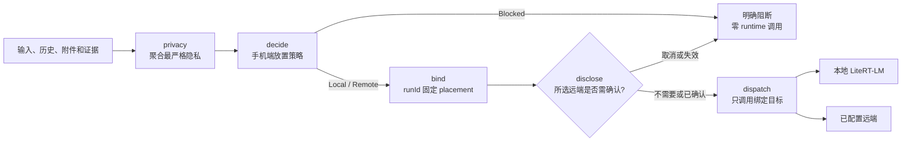

# 自适应端云推理阶段一：当前事实

日期：2026-07-19

事实基线：集成分支提交 `1ff31a8`

状态：阶段一代码已集成，尚未发布

执行开关：debug 为 `opt_in`；release-like 变体为 `off`

本文只记录上述基线已经合并的事实。目标合同见 [spec.md](spec.md)，实施拆分见
[plan.md](plan.md) 和 [tasks.md](tasks.md)。S1–S9 的代码与本地可执行门禁已经集成；
设备 instrumentation、JDK 21 完整 Gradle 门禁、真实 runtime trace 和人工发布证据仍未
完成。不能据此宣称真机已验收、release-like Auto 已开放或阶段一已经发布。

## 当前怎么使用

- **Local**：当前可选，强制使用已准备好的本地 LiteRT-LM 聊天模型；不自动改用远端。
- **Remote**：当前可选，强制使用用户已经配置的 OpenAI-compatible 远端；仍受现有
  隐私分类和远程发送披露约束，`LocalOnly` 内容不会因此获准出端，也不自动回退本地。
- **Auto**：debug 构建以 `opt_in` 暴露三态入口，仅供用户显式开启后的受控测试；
  远端仍须已配置、已授权并完成披露。release-like 变体保持 `Off`，不提供 Auto；
  启动时读到 Auto 会降级并保存为 Local。

因此，debug 可以显式选择 Auto 进行开发验证；release-like 变体的实际使用方式仍是
手动选择 Local，或先配置远端后手动选择 Remote。debug opt-in 不等于真机验收、
release 启用或已发布能力。

## Preference 与实际位置

`InferenceMode` 现在表示长期偏好，`RunPlacement` 表示一次 run 的实际 serving 位置；
两者不能互相替代。

| Preference | 已合并语义 | 当前开放状态 |
| --- | --- | --- |
| `Local` | 只允许 Local；本地不可用、能力不匹配或资源硬阻断时明确失败 | 可用 |
| `Auto` | 手机在合法候选中决定 `RunPlacement.Local` 或 `RunPlacement.Remote` | debug 显式 opt-in；release-like Off |
| `Remote` | 只允许已配置远端；隐私或远端条件不满足时明确失败 | 可用 |

未知、空白或未来版本的 preference 编码回落到 Local，升级迁移本身不会发起模型请求。

## 手机端如何做 Auto 决策

放置策略是手机上的确定性纯 Kotlin 策略，不把原始 prompt 交给路由器。它按以下顺序
处理：隐私和本地证据边界、能力需求、用户偏好、候选健康，再在两个合法候选之间依据
稳定资源与结构化问题复杂度取舍。

Remote 只有在内容为 `RemoteEligible`、不要求本地模型，并且远端已配置、已授权、
能力匹配、连接快照新鲜且为 `Reachable`、配置 revision 一致时，才会成为 Auto 候选。
状态未知、过期、鉴权失败或不可达都会把它排除；策略也能接收过载信号，但第一阶段
不实现远端负载协议。第一阶段只复用用户手工配置的 OpenAI-compatible 端点，不做
电脑发现或自动配对。

当 Local 与 Remote 都合法时，当前策略是：

- 图片请求且本地模型支持视觉输入时优先 Local，保持图片在端侧。
- 稳定低内存、最新低内存、稳定 Hot，或 Severe/Critical thermal 时选择 Remote。
- 结构化复杂度为 Complex 时选择 Remote；70% 以上本地上下文压力、Medium/High
  reasoning、多步计划、工具循环或至少 4,096 输出 token 都会形成复杂信号。
- 简单或信息不足的请求选择 Local。

资源状态使用手机进程内的稳定窗口，而不是单次 CPU 尖峰：10 秒窗口最多保留三次
采样，至少两票形成稳定档位，并对 Hot/本地硬阻断保留 15 秒冷却。资源和复杂度只在
隐私、能力、授权等硬门禁之后生效，不能把 `LocalOnly` 内容变成可远传内容。

## Run 级执行链

阶段一要求所有 serving-model 路径遵守同一顺序：

截至事实基线，首次 Chat 已通过 prepared run 执行 `privacy → decide → bind →
disclose → dispatch`，工具续写、重试、停止/取消和受限恢复也从 active binding 读取
实际 placement；三态 UI 已显示 preference 与 actual placement/reason。stop-before-
dispatch、首个远程事件前审计、失败/取消丢弃暂存审计等竞态已由聚焦回归覆盖。设备和
真实 release trace 尚未验证，所以这条链路仍不是发布保证。

## 同一 run 的 binding

已合并的 binding/dispatcher 合同把 `runId`、preference、实际 placement、原因码、
策略版本、资源/复杂度枚举和远端 profile revision 固定在一起：

- binding 先持久化并原子 reserve，dispatcher 再原子 claim；任一步失败都不得调用
  serving runtime。
- dispatcher 只根据已绑定 placement 选择本地或远端 adapter；另一 placement 不能
  claim 同一个 run。同目标后续 attempt 可以递增，但不能跨目标重试。
- trace/binding 只记录枚举化诊断和不透明 revision，不记录原始 prompt、API key、
  endpoint 或 IP。
- 首次调用、工具续写、重试、停止/取消和受限恢复已经迁移到 binding；275 项集成 JVM
  回归已通过。真机生命周期与 release trace 仍待验证。

## 实施与证据状态

| Slice | 当前事实 | 状态 |
| --- | --- | --- |
| T01–T07 / S1–S2 | preference、复杂度、稳定资源、放置策略和独立隐私计划已合并 | 已完成 |
| S3 | Room binding、CAS dispatcher 和 placement/invocation/receipt trace 基础已合并 | 已完成；connected 迁移证据 pending |
| S4 | rollout、Auto 授权、revision 校验和 app-scoped 资源/连接 wiring 已合并 | 已完成 |
| S5 | prepared run 与首次完整执行链已集成 | 已完成；stop-before-dispatch 与 deferred audit 回归通过 |
| S6 | 续写、retry、stop/cancel 和受限恢复读取 binding | 已完成；continuation audit 的 commit/discard 双审通过 |
| S7 | 三态配置和 actual placement/reason UI 已集成 | debug opt-in；release-like Off；设备 instrumentation pending |
| S8 | Audit/eval 从 invocation 读取实际位置并完成三方 fail-closed 对账 | 已完成 |
| S9 | capability/privacy/release 验证脚本强化与事实文档 | 代码已完成；本地可执行门禁通过，发布证据 pending |

当前本地证据：

- `compileDebugKotlin`、`compileDebugAndroidTestKotlin` 通过；最终聚焦 JVM 回归 275 项通过。
- `privacy_scan`、model capability profiles、严格 capability matrix、validation scripts 和
  40-case fixture behavior eval 通过；严格 capability 额外确认 release-like rollout 为 Off，
  serving source 未由 preference 推断实际 target。
- 当前机器只有 JDK 17。完整 `verify_local.sh` / 全量 `testDebugUnitTest` 需要 JDK 21，
  因 `localagents-rag:0.3.0` 含 classfile 65 依赖，不能把 JDK 17 的工具链失败写成代码通过。

以下证据仍为 pending：

- `connectedDebugAndroidTest` 的 Room 17→18 迁移，以及 S7 Auto/actual placement 设备
  instrumentation。
- JDK 21 环境下的 `verify_local.sh` 与全量 Gradle 回归。
- 真机上的 Auto 资源/复杂度路由、披露、续写、重试、停止/取消和 UI 解释。
- 30 天内的 `agent_loop_runtime` actual trace、placement reconciliation、release-like 构建
  门禁、性能基线、签名证书、隐私/安全/法务人工批准和正式发布记录。

本阶段尚未发布，也未获准用于广泛生产分发。设备验收要求见
[phone_acceptance.md](../../phone_acceptance.md)，发布状态仍以
[release_readiness.md](../../release_readiness.md) 为准。
